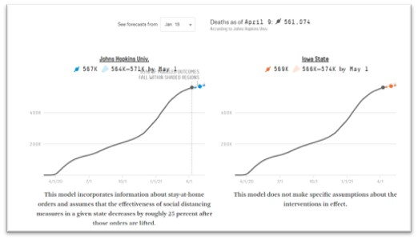
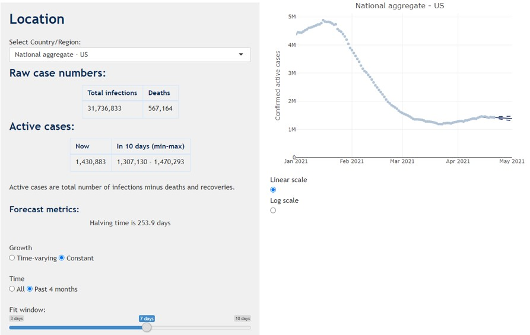
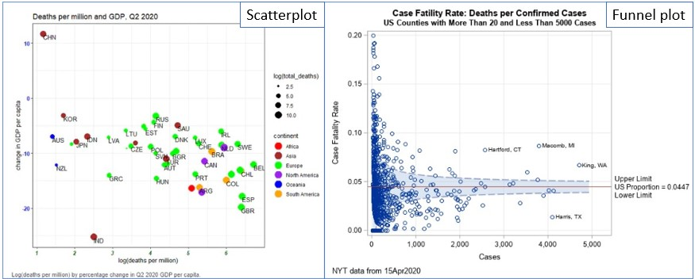
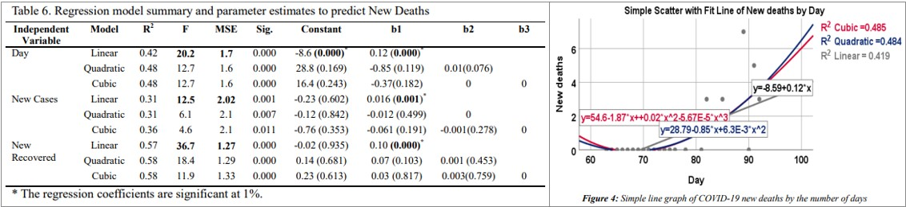
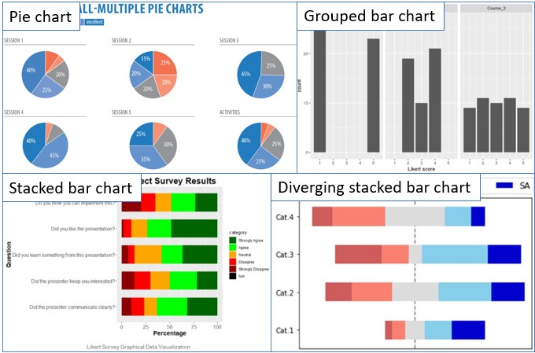
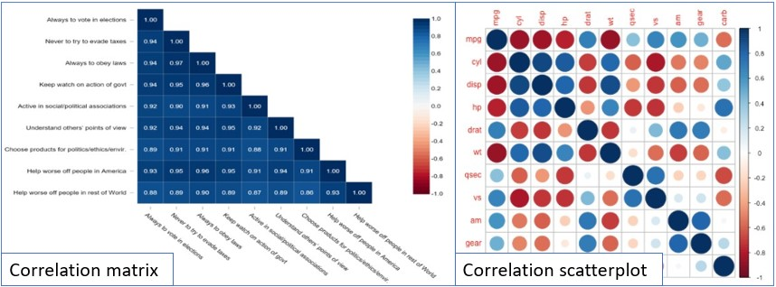
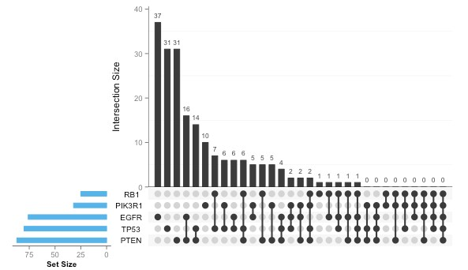

# Introduction 

The Coronavirus (COVID-19) has caught the world’s attention with the first COVID-19 cases reported in Wuhan, Hubei, China, in December 2019. In the global battle against the virus, countries seek to understand the virus, its spread, impact and more recently, receptivity towards the COVID-19 vaccination. We are currently living in the Data Age, where many COVID-19 related data are made available on the Internet. This has facilitated numerous, but not limited to, epidemiology and statistical studies across the globe. 

In the data science realm, many data-driven applications are developed to provide a one-stop information hub for the public. These applications are typically developed using programming languages such as HTML, Java and JavaScript. With the growing popularity of R, and its ability to create web applications using the R Shiny package, the creation of interactive visualisations without having in-depth web programming knowledge has been made possible. 

In this paper, we aim to leverage the richness of the COVID-19 data to provide an interactive experience in generating insights and analyses using R Shiny from three key aspects: (1) new cases; (2) deaths; and (3) vaccination receptivity.

# Motivation of the application

There are several one-stop applications that allow interactive visualisation of COVID-19 related data across time. These applications typically report number of events i.e. number of new cases/deaths/tests conducted, number of people vaccinated. Deeper exploration and analysis on COVID-19 trends and relationships with other factors or indicators are done in silos and majority of such studies report their findings based on pre-defined variables and specific analysis models. 

With this application, we hope to combine and provide an interactive experience for in-depth exploration and analysis of the COVID-19 data. The three key aspects selected for the application are:-

* Predictive analysis of new cases
* Bivariate and multivariate analysis of deaths and death rates with health, economic and population structure indicators
* Exploratory and bivariate analysis of vaccination receptivity with virus perception and demographics

Data is obtained from several sources: Center for Systems Science and Engineering (CSSE) at Johns Hopkins University for COVID-related data; Our World in Data, World Bank, UNdata, United Nations Development Programme (UNDP) for health, economic and population structure indicators; and Imperial College London YouGov COVID-19 Behaviour Tracker Data Hub for survey data on virus perception and vaccination receptivity.

# Review and critic on past works

As there are three components to the application, the discussion is done separately for each component.

## New cases

Most studies that forecast the number of new cases use time series charts with confidence interval of the predicted values. The use of the confidence interval shows the range in which the predicted values will fall within and provides a sense of the prediction variation. Most predictive models used and the model input parameters are usually pre-defined, with only a handful of studies comparing the results from different models. The visualisation in Figure 1 compares the time-series chart of different assumptions made in the predictive analysis, while not providing information on the predictive model used. The model input parameters is also limited to the starting month to based the forecast on.



Another predictive analysis (Figure 2) allows more flexibility to the users, whereby the user can select between two simple models (constant or time-varying growth) with model input parameters such as the time period to calculate the predicted values. Other parameters such as country and graph scales are also available for selection. In this visualisation, the available models are limited and simplistic and there is a lack of model assessment metrics e.g. Root Mean Square Error (RMSE).



Majority of the visualisations reviewed do not allow users to explore and understand the data before proceeding to the forecast. 

To allow user to have a more holistic predictive analysis of the new cases, the application will attempt to combine data exploration of the trend, seasonality and anomaly (if any) of the time-series data and predictive modeling. For the predictive modeling, users will be given the option to select and compare the predictive models, and define model parameters such as the date range to be used for the forecasting. Model assessment measures will also be included.

## Deaths and death rates

All the one-stop COVID-19 applications report the death toll by location using geo-spatial, time-series and/or in tabular form (see Figure 1). There are lesser analyses that study the relationship between deaths or death rates with other indicators, with the majority of them seeking to explain a causal relationship between the COVID-19 numbers and the indicators. The review will focus on the analysis and visualisations used in these analyses.

The scatterplot (Figure 3a) is useful in showing the relationship between two independent variables. Scales can be employed to encode useful variables not represented on the plot. However, it may be difficult to clearly differentiate points on the plot when the number of data points increases. 



The funnel plot (Figure 3b) is another graph that shows the relationship between two variables that are dependent on each other e.g. case fatality rate against the number of confirmed cases, where case fatality rate is calculated as a ratio of the number of deaths to the number of confirmed cases. It is similar to the scatterplot, and additionally seeks to highlight any anomalies from the expected range of the numerical values based on statistical concepts.

There are very few multivariate analysis done, and of those conducted, most of them are presented in tabular form or described in text. Only one study on regression models^[@argawu2020]^ presented its findings visually in a scatterplot with fit lines (Figure 4).



There are gaps in the current visualisations in supporting the intended analysis. The majority of interactive visualisations are univariate analysis presented on maps or in time series, while the bivariate and multivariate analysis of the country indicators and the number of deaths are largely static. The application will attempt to create interactive visualisations for bivariate (scatterplot and funnel plot) and multivariate analysis (multiple linear regression). The focus will be on the cumulative or total number of deaths, so that more meaningful relationships can be observed between the COVID-19 related data and national aggregate indicators.

## Vaccination receptivity

The review of current visual analytic techniques of survey data can be categorised into three areas: (1) representation of Likert scales; (2) visualising uncertainty; and (3) visualising correlation.

### Representation of Likert scales

Likert scales are most commonly presented in pie charts and variations of the bar chart, where proportion of response levels are used to describe the data. Salient points regarding each chart type (Figure 5) are highlighted:- 

* Pie charts: depict the proportions of responses to a question, but is difficult to compare and visualize the differences in proportion between the questions
* Grouped column/bar charts: allow easy comparison on frequency of response levels within a question, but is difficult to compare proportions of the response levels across questions
* Stacked bar charts: show proportion of various response levels for each question while allowing sufficient comparison of response levels across questions. Use of colour is important to facilitate user interpretation of the graph.
* Diverging stacked bar charts: similar to stacked bar chart, comparison of response level proportion across questions is made easier by aligning the neutral response along a vertical baseline.



### Visualising uncertainty

As surveys are usually conducted on a small sample, there is some degree of uncertainty that the survey results may deviate from the actual viewpoint of the population. Confidence intervals give an indication of that uncertainty and can be represented with error bars (Figure 6).


### Visualising correlation

Insights on the relationship between survey responses can be gained from studying the correlation to understand if there are certain determinants or factors that affect the response of certain questions. It would be useful to investigate if vaccination inclination is dependent on certain socio-demographical factors (e.g., age, gender, household size or number of children in the household) or certain attitudes or beliefs (e.g., confidence of vaccine efficacy, or concerns on the side effects of the vaccine).

Correlation matrix or correlation scatterplot are common methods used to depict the correlation between **continuous** variables (Figure 7). For correlations between **categorical** variables, the UpSet plot (Figure 8) allows users to see how frequently each combination or intersection of different factors takes place. Combinations that occur more frequently indicate a stronger correlation between the factors in the combination.





The application will employ the use of the diverging stacked bar chart to visualise the responses from a Likert scale survey, bar plot with error bars to show the uncertainty in survey data and the UpSet plot to understand associations between the categorical variables in the survey.

# Design framework

The purpose of the application is to provide users with an interactive visual experience for in-depth exploration and analysis of the COVID-19 data. With this in mind, the design focus would be centred on *user interaction* and *user experience* with the R Shiny application.

User interaction is not a new concept and has been applied in web-based learning as *learner-content interaction*^[@northrup2001]^ and product design as *interaction design*^[@idf2002]^ for many years. It is concerned with how the user interact with a product or application that meets the users' needs. Interaction design is closely linked to user experience (UX) design, where the design of the product is centred around the experience of the user. In the design of this application, the following areas are considered:-

* Who: the target audience and user of the application
* Why: the motivation behind using the application
* What: functionalities and features of the application
* How: interaction with the functionalities and features

The application is designed for users who wish to find out more about COVID-19 beyond the "standard" reported figures. These users are likely to be curious individuals with an inquisitive mind, and are likely to have some experience and knowledge in statistical analysis. As such, the application needs to be flexible to support exploration of the data while providing clear and easy-to-understand information with statistical metrics. 

Data visualisation is the quickest way to communicate information in a clear and easy-to-understand format. Statistical metrics would be presented visually, where appropriate and relevant. To meet the need of flexible data exploration, interactivity would be a key feature of the application, where by the user is able to (1) select and try different combination of variables and parameters to explore the data; and (2) interact with the visualisation to discover trends and insights. As with all applications, the user interface should be kept as simple as possible, and where not possible, to provide information or markers to direct how the user should interact with the application. Finer details of how the design framework is applied to each aspect (new cases, deaths and vaccination receptivity) is discussed in the next few sections.

*- take screenshot of main new case tab*
*- briefly explain the interactivity features and visualisation and statistical stuff*

## New cases

```{r}

```


## Deaths


## Vaccination receptivity


# Demonstration

*USE CASE*
**

## New cases

## Deaths

## Vaccination receptivity

# Discussion


# Future work

Due to resource constraints, 

# Conclusion

The use of interactive techniques

# References

---
references:
- id: pagano2021
  title: US - Covid-19 Modeling
  author: 
  - family: Pagano
    given: Bob
  type: misc
  note: 'https://bobpagano.com/us/'
  issued:
    year: 2021
    month: 4
- id: google2021
  title: U.S. COVID-19 Public Forecasts
  author:
  - family: Google
  type: misc
  note: 'https://doi.org/10.1038/nmat3283'
  issued:
    year: 2021
    month: 4
- id: unimelbourne2021
  title: United States of America Coronavirus 10-day forecast
  author: 
  - family: University of Melbourne
  type: misc
  note: 'http://us.covid19forecast.science.unimelb.edu.au/'
  issued:
    year: 2021
    month: 4
- id: bestboice2021
  title: Where the Latest COVID-19 Models Think We're Headed - And Why They Disagree
  author:
  - family: Best
    given: Ryan
  - family: Boice
    given: Jay
  journal: FiveThirtyEight
  type: misc
  note: 'https://projects.fivethirtyeight.com/covid-forecasts/'
  issued:
    year: 2021
    month: 4
- id: csse2020
  title: COVID-19 Data Repository
  author: 
  - family: Center for Systems Science and Engineering (CSSE)
  organisation: Center for Systems Science and Engineering (CSSE), John Hopkins University
  type: misc
  note: 'https://github.com/CSSEGISandData/COVID-19'
  issued:
    year: 2020
    month: 2
    day: 19
- id: smithson2020
  title: Data from 45 countries show containing COVID vs saving the economy is a false dichotomy
  author:
  - family: Smithson
    given: Michael
  journal: The Conversation
  type: misc
  URL: 'https://theconversation.com/data-from-45-countries-show-containing-covid-vs-saving-the-economy-is-a-false-dichotomy-150533'
  issued:
    year: 2020
    month: 11
    day: 26
- id: wicklin2020
  title: Visualize the case fatality rate for COVID-19 in US counties
  author:
  - family: Wicklin
    given: Rick
  journal: The DO Loop
  organisation: SAS
  type: misc
  URL: 'https://blogs.sas.com/content/iml/2020/04/22/funnel-plot-covid-us.html'
  issued:
    year: 2020
    month: 4
    day: 22
- id: argawu2020
  title: Regression Models for Predictions of COVID-19 New Cases and New Deaths Based on May/June Data in Ethiopia
  author:
  - family: Argawu
    given: Alemayehu Siffir
  journal: medRxiv
  publisher: Cold Spring Harbor Laboratory Press
  type: journal
  doi: 'https://doi.org/10.1101/2020.09.04.20188094'
  URL: 'https://www.medrxiv.org/content/10.1101/2020.09.04.20188094v1.full.pdf'
  issued:
    year: 2020
    month: 9
- id: owidcoronavirus2020
  title: Coronavirus Pandemic (COVID-19)
  author:
  - family: Roser
    given: Max
  - family: Ritchie
    given: Hannah
  - family: Ortiz-Ospina
    given: Esteban
  - family: Hasell
    given: Joe
  journal: Our World in Data
  note: 'https://ourworldindata.org/coronavirus'
  type: misc
  issued:
    year: 2020
- id: northrup2001
  title: A Framework for Designing Interactivity into Web-Based Instruction
  author:
  - family: Northrup
    given: Pam
  journal: Educational Technology
  volume: 41
  number: 2
  page: 31-39
  URL: 'http://www.jstor.org/stable/44428657'
  publisher: Educational Technology Publications, Inc.
  type: article
  issued:
    year: 2001
- id: idf2002
  title: User Experience (UX) Design
  author:
  - family: Interaction Design Foundation
  URL: 'https://www.interaction-design.org/literature/topics/ux-design'
  type: misc
  issued:
    year: 2002

...

