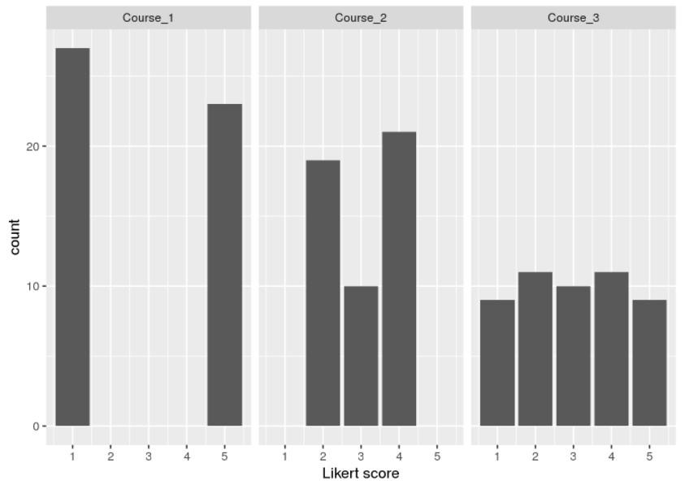
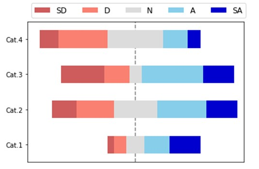
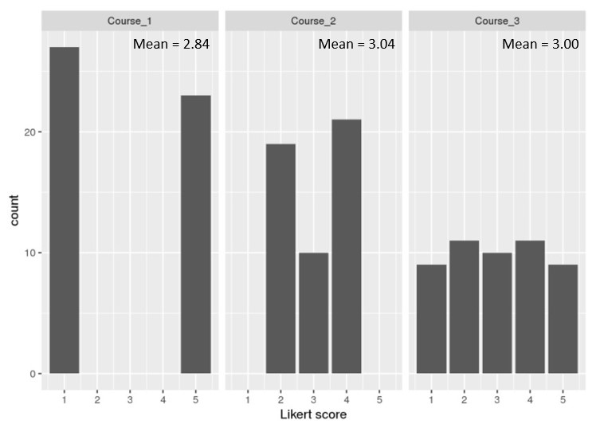

# Introduction 

The Coronavirus (COVID-19) has caught the world’s attention with the first COVID-19 cases reported in Wuhan, Hubei, China, in December 2019. In the global battle against the virus, countries seek to understand the virus, its spread, impact and more recently, receptivity towards the COVID-19 vaccination. In today's Data Age, there are many COVID-19 related data available across various platforms. We aim to leverage the richness of the available data to provide an interactive experience in generating insights and analyses from the key COVID-19 trends: (1) new cases; (2) deaths; and (3) vaccination receptivity.

# Motivation of the application

There are several one-stop applications that allow interactive visualisation of COVID-19 related data across time. These applications typically report number of events i.e. number of new cases/deaths/tests conducted, number of people vaccinated. Deeper exploration and analysis on COVID-19 trends and relationships with other factors or indicators are done in silos and majority of such studies report their findings based on pre-defined variables and specific analysis models. 

With this application, we hope to combine and provide an interactive experience for in-depth exploration and analysis of the COVID-19 data. The three key aspects selected for the application are:-

* Predictive analysis of new cases
* Bivariate and multivariate analysis of deaths and death rates with health, economic and population structure indicators
* Exploratory and bivariate analysis of vaccination receptivity with virus perception and demographics

Data is obtained from several sources: Center for Systems Science and Engineering (CSSE) at Johns Hopkins University for COVID-related data; Our World in Data, World Bank, UNdata, United Nations Development Programme (UNDP) for health, economic and population structure indicators; and Imperial College London YouGov COVID-19 Behaviour Tracker Data Hub for survey data on virus perception and vaccination receptivity.

# Review and critic on past works

The selected aspects have varying degrees of current and past works. The discussion is done separately for each aspect.

## New cases

Most studies that forecast the number of new cases use time series charts with confidence interval of the predicted values. The use of the confidence interval shows the range in which the predicted values will fall within and provides a sense of the prediction variation. Most predictive models used and the model input parameters are usually pre-defined, with only a handful of studies comparing the results from different models. The visualisation in Figure 1 compares the time-series chart of different assumptions made in the predictive analysis, while not providing information on the predictive model used. The model input parameters is also limited to the starting month to based the forecast on.

Another predictive analysis (Figure 2) allows more flexibility to the users, whereby the user can select between two simple models (constant or time-varying growth) with model input parameters such as the time period to calculate the predicted values. Other parameters such as country and graph scales are also available for selection. In this visualisation, the available models are limited and simplistic and there is a lack of model assessment metrics e.g. Root Mean Square Error (RMSE).

Majority of the visualisations reviewed do not allow users to explore and understand the data before proceeding to the forecast. 

To allow user to have a more holistic predictive analysis of the new cases, the application will attempt to combine data exploration of the trend, seasonality and anomaly (if any) of the time-series data and predictive modeling. For the predictive modeling, users will be given the option to select and compare the predictive models, and define model parameters such as the date range to be used for the forecasting. Model assessment measures will also be included.

## Deaths and death rates with health, economic and population structure indicators

All the one-stop COVID-19 applications report the death toll by location using geo-spatial, time-series and/or in tabular form (see Figure 1). There are lesser analyses that study the relationship between deaths or death rates with other indicators, with the majority of them seeking to explain a causal relationship between the COVID-19 numbers and the indicators. The review will focus on the analysis and visualisations used in these analyses.

### Scatterplot

The scatterplot is useful in showing the relationship between two independent variables. The scatterplot in Figure 3 uses size and colour scales to encode number of deaths and continent respectively. The size of the data points are not obvious from the graph and the overlap in data points belonging to the same continent also make it difficult to identify the data points. The strength of the relationship between the two variables can only be gleaned visually. There is also no interactivity provided for users to explore the data further.

### Funnel plot

The funnel plot is another graph that shows the relationship between two variables that are dependent on each other e.g. case fatality rate against the number of confirmed cases, where case fatality rate is calculated as a ratio of the number of deaths to the number of confirmed cases. There are two similar visualisations created specifically for COVID-19 case fatality rate for counties in the US by a SAS researcher Rick Wicklin (see Figure 4). The funnel plot seeks to highlight any anomalies from the expected range of the numerical values based on statistical concepts. The drawback of the visualisation is that the funnel plots are static with no interactivity: users are unable to identify the other data points that are not labelled and do further exploration with other variables.

### Multiple regression model

The visualisations discussed thus far are bivariate in nature: analysis of each factor with the number of deaths. There are very few multivariate analysis done, and of those conducted, most of them are presented in tabular form or described in text. There is one study on regression models to predict the number of COVID-19 new deaths, which presents its findings visually in the research paper (see Figure 5).

There are gaps in the current visualisations in supporting the intended analysis. The majority of interactive visualisations are univariate analysis presented on maps or in time series, while the bivariate and multivariate analysis of the country indicators and the number of deaths are largely static. The application will attempt to create interactive visualisations for bivariate (scatterplot and funnel plot) and multivariate analysis (multiple linear regression). The focus will be on the cumulative or total number of deaths, so that more meaningful relationships can be observed between the COVID-19 related data and national aggregate indicators.

## Vaccination receptivity

The review of current visual analytic techniques of survey data can be categorised into three areas: (1) representation of Likert scales; (2) visualising uncertainty; and (3) visualising correlation.

### Representation of Likert scales

There are several ways to visually represent Likert scales.

#### Grouped column/bar charts

Responses by questions (or other categories) can be grouped and represented as column or bar charts, with the Likert score represented by each column/bar, as shown in Figure 6.

While bar charts allow easy comparison on the count (frequency) of responses across the different Likert scores, they do not allow the easy comparison of proportions of the responses (e.g., proportion of respondents who strongly agree or agree to a question).

#### Pie charts

While pie charts depict the proportions of responses to a question, it is difficult to compare and visualize the differences in proportion between the questions (Figure 7).

#### Stacked bar charts

Stacked bar charts clearly shows the proportion of the various responses for each question asked in a survey (Figure 8). The use of different tones of colours (i.e. light green to dark green) provides the reader with an idea of increasing levels of responses (i.e. Agree to Strongly Agree). 

A benefit of stacked bar charts is that it allows readers to compare different proportions across different bars since each set of stacked bar sums up to 100%. In Figure 8, it is evident that while a large proportion agreed that they liked the presentation, a lower proportion actually felt that they learnt something from the presentation.

#### Diverging stacked bar chart

Another way of representing responses to a Likert scale survey is the diverging stacked bar chart (Figure 9). This visualization is similar to the Stacked Bar Chart but differs in that the bars have a common vertical baseline located in the the centre of the diagram. The lengths of the segments of the bar charts are proportional to the number of responses for each value of the Likert scale for each question. Segments which represent favourable responses are usually on the right of the baseline while those that are unfavourable are on the left. Neutral responses are located on the central baseline.

The diverging stacked bar chart is most appropriate to represent responses from Likert scale surveys as it allows easy interpretation and comparison of multiple categories. 

#### Comparing the mean Likert score

While it may seem appropriate to compare the mean Likert score of each category, there is a potential pitfall in doing so. Referring to Figure 10, the mean score for the three courses are similar, yet it is evident that the distribution and spread of the responses are very different.

It would be more appropriate to make comparisons based on the proportion of responses that meet a certain value (e.g. proportion of respondents who gave a 4 or 5 score).

### Visualising uncertainty

As surveys are usually conducted on a small sample, there is some degree of uncertainty that the survey results may deviate from the actual viewpoint of the population. Confidence intervals give an indication of that uncertainty and can be represented with error bars (Figure 11).

### Visualising correlation

Insights on the relationship between survey responses can be gained from studying the correlation to understand if there are certain determinants or factors that affect the response of certain questions. It would be useful to investigate if vaccination inclination is dependent on certain socio-demographical factors (e.g., age, gender, household size or number of children in the household) or certain attitudes or beliefs (e.g., confidence of vaccine efficacy, or concerns on the side effects of the vaccine).

*Correlation matrix* or *correlation scatterplot* are common methods used to depict the correlation between **continuous** variables (Figure 12 and Figure 13). For correlations between **categorical** variables, the UpSet plot can be used via the use of the UpSetR function (Figure 14).

The UpSet plot allows the user to see how frequently each combination or intersection of different factors takes place. Combinations that occur more frequently indicate a stronger correlation between the factors in the combination.

The application will employ the use of the diverging stacked bar chart to visualise the responses from a Likert scale survey, bar plot with error bars to show the uncertainty in survey data and the UpSet plot to understand associations between the categorical variables in the survey.

# Design framework

# Demonstration

# Discussion

# Future work

# Conclusion

# References

---
references:
- id: pagano2021
  title: US - Covid-19 Modeling
  author: 
  - family: Pagano
    given: Bob
  type: misc
  issued:
    year: 2021
  note: https://bobpagano.com/us/
- id: fenner2012a
  title: One-click science marketing
  author:
  - family: Fenner
    given: Martin
  container-title: Nature Materials
  volume: 11
  URL: 'https://doi.org/10.1038/nmat3283'
  DOI: 10.1038/nmat3283
  issue: 4
  publisher: Nature Publishing Group
  page: 261-263
  type: article-journal
  issued:
    year: 2012
    month: 3
- id: meier2012
  title: Professinal Android 4 Application Development
  author: 
  - family: Meier
    given: Reto
  type: book
  publisher: John Wiley & Sons, Inc.
  issued:
    year: 2012
    month: 5
- id: fenner2012a
  title: One-click science marketing
  author:
  - family: Fenner
    given: Martin
  container-title: Nature Materials
  volume: 11
  URL: 'https://doi.org/10.1038/nmat3283'
  DOI: 10.1038/nmat3283
  issue: 4
  publisher: Nature Publishing Group
  page: 261-263
  type: article-journal
  issued:
    year: 2012
    month: 3
- id: meier2012
  title: Professinal Android 4 Application Development
  author: 
  - family: Meier
    given: Reto
  type: book
  publisher: John Wiley & Sons, Inc.
  issued:
    year: 2012
    month: 5
- id: fenner2012a
  title: One-click science marketing
  author:
  - family: Fenner
    given: Martin
  container-title: Nature Materials
  volume: 11
  URL: 'https://doi.org/10.1038/nmat3283'
  DOI: 10.1038/nmat3283
  issue: 4
  publisher: Nature Publishing Group
  page: 261-263
  type: article-journal
  issued:
    year: 2012
    month: 3
- id: meier2012
  title: Professinal Android 4 Application Development
  author: 
  - family: Meier
    given: Reto
  type: book
  publisher: John Wiley & Sons, Inc.
  issued:
    year: 2012
    month: 5
- id: fenner2012a
  title: One-click science marketing
  author:
  - family: Fenner
    given: Martin
  container-title: Nature Materials
  volume: 11
  URL: 'https://doi.org/10.1038/nmat3283'
  DOI: 10.1038/nmat3283
  issue: 4
  publisher: Nature Publishing Group
  page: 261-263
  type: article-journal
  issued:
    year: 2012
    month: 3
...

