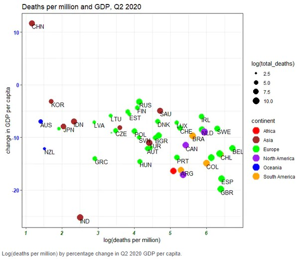
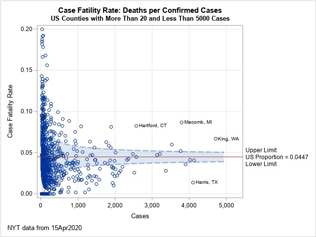

# Introduction 

The Coronavirus (COVID-19) has caught the world’s attention with the first COVID-19 cases reported in Wuhan, Hubei, China, in December 2019. In the global battle against the virus, countries seek to understand the virus, its spread, impact and more recently, receptivity towards the COVID-19 vaccination. In today's Data Age, there are many COVID-19 related data available across various platforms. We aim to leverage the richness of the available data to provide an interactive experience in generating insights and analyses from the key COVID-19 trends: (1) new cases; (2) deaths; and (3) vaccination receptivity.

# Motivation of the application

There are several one-stop applications that allow interactive visualisation of COVID-19 related data across time. These applications typically report number of events i.e. number of new cases/deaths/tests conducted, number of people vaccinated. Deeper exploration and analysis on COVID-19 trends and relationships with other factors or indicators are done in silos and majority of such studies report their findings based on pre-defined variables and specific analysis models. 

With this application, we hope to combine and provide an interactive experience for in-depth exploration and analysis of the COVID-19 data. The three key aspects selected for the application are:-

* Predictive analysis of new cases
* Bivariate and multivariate analysis of deaths and death rates with health, economic and population structure indicators
* Exploratory and bivariate analysis of vaccination receptivity with virus perception and demographics

Data is obtained from several sources: Center for Systems Science and Engineering (CSSE) at Johns Hopkins University for COVID-related data; Our World in Data, World Bank, UNdata, United Nations Development Programme (UNDP) for health, economic and population structure indicators; and Imperial College London YouGov COVID-19 Behaviour Tracker Data Hub for survey data on virus perception and vaccination receptivity.

# Review and critic on past works

The selected aspects have varying degrees of current and past works. The discussion is done separately for each aspect.

## Predictive analysis of new cases

Most studies that forecast the number of new cases use time series charts with confidence interval of the predicted values. The use of the confidence interval shows the range in which the predicted values will fall within and provides a sense of the prediction variation. The predictive model used and the model input parameters are usually pre-defined. Few studies compare the results from different models and there is also a lack of model assessment e.g., Root Mean Square Error (RMSE), for the predictive model used. 

In the visualisations that allow interactivity, the user interactivity is mainly limited to the choice of country. Only one visualisation reviewed provided the starting month to based the forecast on, while another allowed users to toggle between time-varying or constant growth for the predicted values, and to change the scale of the time-series graph. Most visualisations also do not allow users to explore and understand the data before proceeding to the forecast. 

To allow user to have a more holistic predictive analysis of the new cases, a section for users to explore the trend, seasonality and anomaly (if any) of the time-series data is created in the proposed application. For the predictive modeling, users will be given the option to select and compare the predictive models, and define model parameters such as the date range to be used for the forecasting. Model assessment measures will also be included.

## Bivariate and multivariate analysis of deaths and death rates with health, economic and population structure indicators

All the one-stop COVID-19 applications report the death toll by location using geo-spatial, time-series and/or in tabular form (see Figure 1). There are lesser analyses that study the relationship between deaths or death rates with other indicators, with the majority of them seeking to explain a causal relationship between the COVID-19 numbers and the indicators. The review will focus on the analysis and visualisations used in these analyses.

The scatterplot is useful in showing the relationship between two independent variables. In the scatterplot, size and colour scales are used to encode number of deaths and continent respectively. The size of the data points are not obvious from the graph due to the size range used, the 3-character country code labels and the choice of colour for Europe (the green stands out too much). The overlap in data points belonging to the same continent also make it difficult to identify the data points. There is no interactivity in this visualisation.

The funnel plot is another graph that shows the relationship between two variables that are dependent on each other e.g. case fatality rate against the number of confirmed cases, where case fatality rate is calculated as a ratio of the number of deaths to the number of confirmed cases. There are two similar visualisations created specifically for COVID-19 case fatality rate for counties in the US by a SAS researcher Rick Wicklin (see Figure 3). The funnel plot seeks to highlight any anomalies from the expected range of the numerical values based on statistical concepts. The drawback of the visualisations is that the funnel plots are static with no interactivity: users are unable to identify the other data points that are not labelled.

## Exploratory and bivariate analysis of vaccination receptivity with virus perception and demographics

The visualisations discussed thus far are bivariate in nature: analysis of each factor with the number of deaths. There are very few multivariate analysis done, and of those conducted, most of them are presented in tabular form or described in text. There is one study on regression models to predict the number of COVID-19 new deaths, which presents its findings visually in the research paper (see Figure 5).

# Design framework

# Demonstration

# Discussion

# Future work

# Conclusion

# References

---
references:
- id: meier2012
  title: Professinal Android 4 Application Development
  author: 
  - family: Meier
    given: Reto
  type: book
  publisher: John Wiley & Sons, Inc.
  issued:
    year: 2012
    month: 5
- id: fenner2012a
  title: One-click science marketing
  author:
  - family: Fenner
    given: Martin
  container-title: Nature Materials
  volume: 11
  URL: 'https://doi.org/10.1038/nmat3283'
  DOI: 10.1038/nmat3283
  issue: 4
  publisher: Nature Publishing Group
  page: 261-263
  type: article-journal
  issued:
    year: 2012
    month: 3
...

