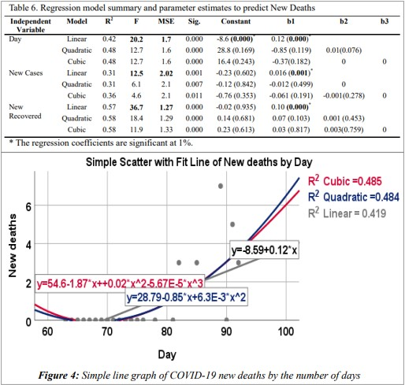
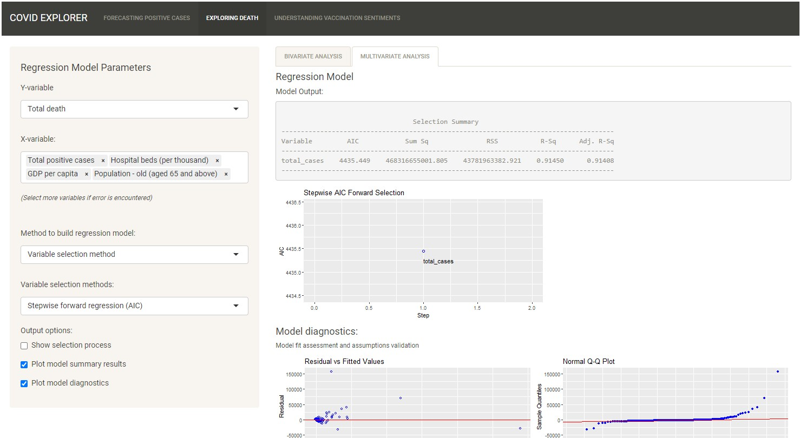
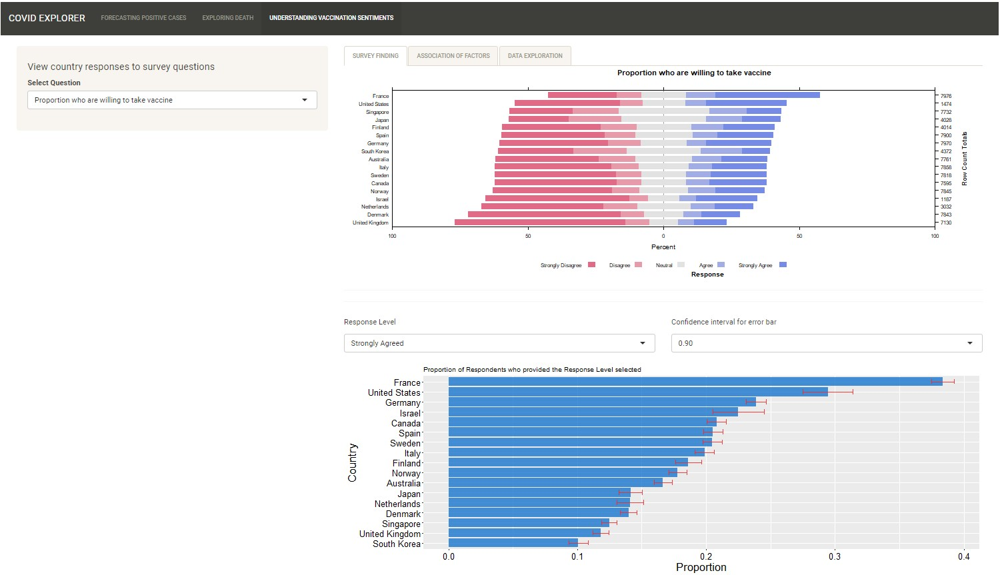

# Introduction 

The Coronavirus (COVID-19) has caught the world’s attention with the first COVID-19 cases reported in Wuhan, Hubei, China, in December 2019. In the global battle against the virus, countries seek to understand the virus, its spread, impact and more recently, receptivity towards the COVID-19 vaccination. We are currently living in the Data Age, where many COVID-19 related data are made available on the Internet. This has facilitated numerous, but not limited to, epidemiology and statistical studies across the globe. 

In the data science realm, many data-driven applications are developed to provide a one-stop information hub for the public. These applications are typically developed using programming languages such as HTML, Java and JavaScript. With the growing popularity of R, and its ability to create web applications using the R Shiny package, the creation of interactive visualisations without having in-depth web programming knowledge has been made possible. 

In this paper, we aim to leverage the richness of the COVID-19 data to provide an interactive experience in generating insights and analyses using R Shiny from three key aspects: (1) new cases; (2) deaths; and (3) vaccination receptivity.

# Motivation of the application

There are several one-stop applications that allow interactive visualisation of COVID-19 related data across time. These applications typically report number of events i.e. number of new cases/deaths/tests conducted, number of people vaccinated. Deeper exploration and analysis on COVID-19 trends and relationships with other factors or indicators are done in silos and majority of such studies report their findings based on pre-defined variables and specific analysis models. 

With this application, we hope to combine and provide an interactive experience for in-depth exploration and analysis of the COVID-19 data. The three key aspects selected for the application are:-

* Predictive analysis of new cases
* Bivariate and multivariate analysis of deaths and death rates with health, economic and population structure indicators
* Exploratory and bivariate analysis of vaccination receptivity with virus perception and demographics

Data is obtained from several sources: Center for Systems Science and Engineering (CSSE) at Johns Hopkins University for COVID-related data; Our World in Data, World Bank, UNdata, United Nations Development Programme (UNDP) for health, economic and population structure indicators; and Imperial College London YouGov COVID-19 Behaviour Tracker Data Hub for survey data on virus perception and vaccination receptivity.

# Review and critic on past works

As there are three components to the application, the discussion is done separately for each component.

## New cases

Most studies that forecast the number of new cases use time series charts with confidence interval of the predicted values. The use of the confidence interval shows the range in which the predicted values will fall within and provides a sense of the prediction variation. Most predictive models used and the model input parameters are usually pre-defined, with only a handful of studies comparing the results from different models. The visualisation in Figure 1 compares the time-series chart of different assumptions made in the predictive analysis, while not providing information on the predictive model used. The model input parameters is also limited to the starting month to based the forecast on.


Another predictive analysis (Figure 2) allows more flexibility to the users, whereby the user can select between two simple models (constant or time-varying growth) with model input parameters such as the time period to calculate the predicted values. Other parameters such as country and graph scales are also available for selection. In this visualisation, the available models are limited and simplistic and there is a lack of model assessment metrics e.g. Root Mean Square Error (RMSE).


Majority of the visualisations reviewed do not allow users to explore and understand the data before proceeding to the forecast. 

To allow user to have a more holistic predictive analysis of the new cases, the application will attempt to combine data exploration of the trend, seasonality and anomaly (if any) of the time-series data and predictive modeling. For the predictive modeling, users will be given the option to select and compare the predictive models, and define model parameters such as the date range to be used for the forecasting. Model assessment measures will also be included.

## Deaths and death rates

All the one-stop COVID-19 applications report the death toll by location using geo-spatial, time-series and/or in tabular form (see Figure 1). There are lesser analyses that study the relationship between deaths or death rates with other indicators, with the majority of them seeking to explain a causal relationship between the COVID-19 numbers and the indicators. The review will focus on the analysis and visualisations used in these analyses.

The scatterplot (Figure 3a) is useful in showing the relationship between two independent variables. Scales can be employed to encode useful variables not represented on the plot. However, it may be difficult to clearly differentiate points on the plot when the number of data points increases. 


The funnel plot (Figure 3b) is another graph that shows the relationship between two variables that are dependent on each other e.g. case fatality rate against the number of confirmed cases, where case fatality rate is calculated as a ratio of the number of deaths to the number of confirmed cases. It is similar to the scatterplot, and additionally seeks to highlight any anomalies from the expected range of the numerical values based on statistical concepts.

There are very few multivariate analysis done, and of those conducted, most of them are presented in tabular form or described in text. Only one study on regression models^[@argawu2020]^ presented its findings visually in a scatterplot with fit lines (Figure 4).



There are gaps in the current visualisations in supporting the intended analysis. The majority of interactive visualisations are univariate analysis presented on maps or in time series, while the bivariate and multivariate analysis of the country indicators and the number of deaths are largely static. The application will attempt to create interactive visualisations for bivariate (scatterplot and funnel plot) and multivariate analysis (multiple linear regression). The focus will be on the cumulative or total number of deaths, so that more meaningful relationships can be observed between the COVID-19 related data and national aggregate indicators.

## Vaccination receptivity

The review of current visual analytic techniques of survey data can be categorised into three areas: (1) representation of Likert scales; (2) visualising uncertainty; and (3) visualising correlation.

### Representation of Likert scales

Likert scales are most commonly presented in pie charts and variations of the bar chart, where proportion of response levels are used to describe the data. Salient points regarding each chart type (Figure 5) are highlighted:- 

* Pie charts: depict the proportions of responses to a question, but is difficult to compare and visualize the differences in proportion between the questions
* Grouped column/bar charts: allow easy comparison on frequency of response levels within a question, but is difficult to compare proportions of the response levels across questions
* Stacked bar charts: show proportion of various response levels for each question while allowing sufficient comparison of response levels across questions. Use of colour is important to facilitate user interpretation of the graph.
* Diverging stacked bar charts: similar to stacked bar chart, comparison of response level proportion across questions is made easier by aligning the neutral response along a vertical baseline.


### Visualising uncertainty

As surveys are usually conducted on a small sample, there is some degree of uncertainty that the survey results may deviate from the actual viewpoint of the population. Confidence intervals give an indication of that uncertainty and can be represented with error bars (Figure 6).


### Visualising correlation

Insights on the relationship between survey responses can be gained from studying the correlation to understand if there are certain determinants or factors that affect the response of certain questions. It would be useful to investigate if vaccination inclination is dependent on certain socio-demographical factors (e.g., age, gender, household size or number of children in the household) or certain attitudes or beliefs (e.g., confidence of vaccine efficacy, or concerns on the side effects of the vaccine).

Correlation matrix or correlation scatterplot are common methods used to depict the correlation between **continuous** variables (Figure 7). For correlations between **categorical** variables, the UpSet plot (Figure 8) allows users to see how frequently each combination or intersection of different factors takes place. Combinations that occur more frequently indicate a stronger correlation between the factors in the combination.


The application will employ the use of the diverging stacked bar chart to visualise the responses from a Likert scale survey, bar plot with error bars to show the uncertainty in survey data and the UpSet plot to understand associations between the categorical variables in the survey.

# Design framework

The purpose of the application is to provide users with an interactive visual experience for in-depth exploration and analysis of the COVID-19 data. With this in mind, the design focus would be centred on *user interaction* and *user experience* with the R Shiny application.

User interaction is not a new concept and has been applied in web-based learning as *learner-content interaction*^[@northrup2001]^ and product design as *interaction design*^[@idf2002]^ for many years. It is concerned with how the user interact with a product or application that meets the users' needs. Interaction design is closely linked to user experience (UX) design, where the design of the product is centred around the experience of the user. In the design of this application, the following areas are considered:-

* Who: the target audience and user of the application
* Why: the motivation behind using the application
* What: functionalities and features of the application
* How: interaction with the functionalities and features

The application is designed for users who wish to find out more about COVID-19 beyond the "standard" reported figures. These users are likely to be curious individuals with an inquisitive mind, and are likely to have some experience and knowledge in statistical analysis. As such, the design principle of the application is that the application should be flexible to support exploration of the data while providing clear and easy-to-understand information with statistical metrics. 

Data visualisation is the quickest way to communicate information in a clear and easy-to-understand format. Statistical metrics would be presented visually, where appropriate and relevant. To meet the need of flexible data exploration, interactivity would be a key feature of the application, where by the user is able to (1) select and try different combination of variables and parameters to explore the data; and (2) interact with the visualisation to discover trends and insights. As with all applications, the user interface should be kept as simple as possible, and where not possible, to provide information or markers to direct how the user should interact with the application. Finer details of how the design framework is applied to each aspect (new cases, deaths and vaccination receptivity) is discussed in the next few sections.

```{r packages, echo=FALSE, warning=FALSE, message=FALSE}
packages = c('tidyverse',
             'timetk', 'modeltime', 'tidymodels', 'tsibble', 'fpp3', 'earth', 'reactable',
             'UpSetR', 'dlookr', 'naniar',
             'ggstatsplot', 'ggExtra', 'olsrr', 'gridExtra',
             'plotly')
for(p in packages){
  if(!require(p, character.only = T)){
  install.packages(p)
  }
  library(p, character.only = T)
}
```

```{r importData, echo=FALSE, warning=FALSE, message=FALSE}
case_df <- read_csv("data/time_series_covid19_confirmed_global.csv")
death_df <- read_csv("data/deaths_tidy.csv")
vac_df <- read_csv("data/main_df.csv")

case_df <- case_df %>%
  gather(Date,Total_Cases,-'Province/State',-'Country/Region',-Lat,-Long) %>%
  group_by(`Country/Region`,Date) %>%
  summarize(total = sum(Total_Cases)) %>% 
     select(`Country/Region`, Date, total) %>%
     set_names(c("Country", "Date", "TotalCases")) %>%
  ungroup()

case_df$Date <- as.Date(case_df$Date,format="%m/%d/%y")

case_df <- case_df %>%
  group_by(Country) %>%
  arrange(Country,Date)%>%
  mutate(Daily_new_cases = TotalCases - lag(TotalCases, n =1))%>%
  drop_na()
```

## New cases

In the prediction of new cases, considerations of how the user would proceed with the analysis were included in the system architecture. In time-series forecasting, it is important to understand the characteristics of the time-series data, i.e. trend, cycle, seasonality etc., so as to better interpret and even improve the forecast results. The design also take into account the constantly evolving COVID-19 situation that users are in. New data is available on a daily basis and users would want to analyse the latest data. As such, two components on exploring the dataset (using the `timetk` package) and a function for user to upload the latest dataset are added to the predictive analysis of new confirmed COVID-19 cases.

In the exploratory time-series analysis, the time series plot is straight-forward and is interactive. Figure 9 shows the development of the base plot. The `timetk` package also provided diagnostic plots to study the trend, seasonality and remainder, anomalies and lag if present in the time-series. The UI is simple, whereby users need only to select the country of interest to commence their exploration (Figure 10).

```{r eval= FALSE, echo=FALSE, warning=FALSE, message=FALSE}
SG <- filter(case_df, Country == "Singapore")

ts1 <- SG %>%
   plot_time_series(Date, Daily_new_cases,
                   .interactive = TRUE)

ts2 <- SG %>%
   plot_time_series(Date, Daily_new_cases,
                   .interactive = TRUE,
                   .plotly_slider = TRUE)
```


The focus of the predictive analysis is to allow users to compare and assess the performance of the predictive models provided. The design caters to two types of users: (1) trained user with basic knowledge in predictive time-series analysis; and (2) trained user with good knowledge and experience in predictive time-series analysis. The first type of user would be more interested to know what are the available models for predictive time-series analysis and to compare these models, whereas the second type of user is better equipped to understand and change more advanced model parameters. 

Basic model parameters, such as country, date range in which the forecast is based on, and the forecast horizon, would be provided as a basic feature to explore the predictive time-series analysis. For the first type of users, the emphasis is on the comparison between models, and this comparison would be based on the same input parameters. The functionality to customise the input parameters for selected models would be provided for the more knowledgeable user (Table 1). For both groups of user, it is important to have evidence-based comparison based on established metrics such as the mean absolute error (MAE), root mean square error (RMSE), R-squared (RSQ) etc. Figure 11 shows the UI of the predictive time-series analysis.

\begin{table}[]
\begin{tabular}{@{}ll@{}}
\toprule
\textbf{Tool}              & \textbf{Input Parameters}     \\ \midrule
Exploratory time-series    & Country                       \\ \midrule
Predictive time-series     & Country, forecast date range, \\
                           & forecast horizon              \\
- model comparison         & Models                        \\
- advance analysis         & Selected models               \\
-- ETS model     & Error, trend, season          \\
-- Prophet model & Growth, change-point range,   \\
                           & season                        \\ \bottomrule
\end{tabular}
\caption{Parameters for the exploratory time-series and predictive time-series analyses}
\label{tab:my-table}
\end{table}


## Deaths and death rates

The bivariate and multivariate analyses employed to explore the relationship between total number of deaths, death rates, health, economic and population structure indicators are the scatterplot (`ggstatsplot` package), funnel plot (`ggplot2` package) and multiple linear regression (`olsrr` package). 

The key design principle behind this sub-module is to allow users to interactively explore the relationships of the number of deaths or death rates with the other variables, and to provide users with the flexibility to choose plot or model parameters. The scatterplot from the `ggstatsplot` package was chosen for the statistical tests conducted on the variables, to cater for the statistically trained user. For the scatterplot and funnel plot, additional considerations were made as to what information should be displayed in the base plot. Figure 12 shows the development process of the base scatterplot. The parameters for user selection were identified for each analysis (Table 2).

```{r echo=FALSE, warning=FALSE, message=FALSE, fig.cap="Development of the base scatterplot to include colour and size scales, and data labels"}
sp1 <- ggscatterstats(death_df,
                      x = hospital_beds_per_thousand,
                      y = total_deaths_log,
                      smooth.line.args = list(color = NA, 
                                         se = FALSE))
  
sp2 <- ggscatterstats(death_df,
                      x = hospital_beds_per_thousand,
                      y = total_deaths_log,
                      smooth.line.args = list(color = NA, 
                                         se = FALSE),
                      point.args = list(aes(colour=continent,
                                       size=population),
                                       alpha = 0.4),
                      ggtheme = theme(legend.position = "none"))

sp3 <- ggscatterstats(death_df,
                      x = hospital_beds_per_thousand,
                      y = total_deaths_log,
                      smooth.line.args = list(color = NA, 
                                         se = FALSE),
                      point.args = list(aes(colour=continent,
                                       size=population),
                                       alpha = 0.4),
                      ggtheme = theme(legend.position = "none"),
                      label.var = location,
                      label.expression = continent == "Oceania")

grid.arrange(sp1,sp2,sp3, ncol=2)
```

\begin{table}[]
\begin{tabular}{@{}lll@{}}
\toprule
\textbf{Analysis} & \textbf{Input Parameters} & \textbf{Output Options} \\ \midrule
Scatterplot               & Statistical test,         & Range of data           \\
                          & confidence level          & labels to display       \\
                          & used in test, marginal    &                         \\
                          & distribution type,        &                         \\
                          & regression smooth         &                         \\
                          & line                      &                         \\ \midrule
Funnel plot               & Confidence interval       & None as able to         \\
                          & for the expected          & achieve interactivity   \\
                          & range of values           &                         \\ \midrule
MLR                       & Regression model,         & Plot model results,     \\
                          & selection methods         & plot model diagnostics  \\ \bottomrule
\end{tabular}
\caption{Parameters for the scatterplot, funnel plot and multiple linear regression (MLR) analyses}
\label{tab:my-table}
\end{table}

For the Shiny app UI, careful considerations were made not to overwhelm the user. The output is dependent on the type of variables that the user selects i.e. funnel plot is more appropriate for death rate analysis, MLR is more appropriate for exploring relationship with multiple independent variables. The UI is designed based on how the user would conduct the analysis, instead of the type of output. The output is dependent on the variables that the user select, and the parameters are in turn dependent on the output that is to be shown. Due to the multiple layers of conditions, the `conditionalPanel` function is employed in the R Shiny code. The UIs of the three outputs are shown in figures 13-15.




It is possible to collapse the bivariate and multivariate analysis tabs and generate the output solely based on the variables that the user has chosen. It is also possible to build a regression model with only one independent variable. As such, the decision was made to separate the UI by the type of analysis. 

## Vaccination receptivity

This sub-module considers how the user would explore a survey data. Users would want to compare proportion of responses across countries for a particular survey question (diverging stacked bar chart and bar plot with error bar) and/or find out if certain profile of respondents (based on reported socio-demographic or perception questions in the survey) have an impact on vaccination receptivity (UpSet plot, density plot and mosaic plot). The parameters to support exploration differ for the two analyses (Table 3). 

\begin{table}[]
\begin{tabular}{@{}ll@{}}
\toprule
\textbf{Exploratory Tool} & \textbf{Input Parameters}         \\ \midrule
Diverging stacked         & Survey question                   \\
bar chart                 &                                   \\ \midrule
Bar plot with             & Response level                    \\
error bar                 & Confidence interval for error bar \\ \midrule
UpSet plot                & Country, response level,          \\
                          & survey question                   \\ \midrule
Density plot,             & Country, x- and y-variables       \\
mosaic plot               &                                   \\ \bottomrule
\end{tabular}
\caption{Parameters for the diverging stacked bar chart, bar plot with error bar, UpSet plot, density plot and mosaic plot analyses}
\label{tab:my-table}
\end{table}

Within the association analysis plots, the UpSet plot is able to support multiple variables, whereas the density plot and mosaic plot are more appropriate for bivariate association. As such, the UI is designed to have three separate tabs for each group of identified analysis (Figures 16-18). For interactive plots, all the plots except for 




# Demonstration

Vaccination is believed to play a key role in curbing the spread of COVID-19 and bringing an end to the global pandemic. However, vaccination rates are slow with some countries and it is important to understand the reasons of not wanting to be vaccinated, in order to develop targeted strategies to increase vaccination rates. We will demonstrate the use case of our application in understanding vaccination receptivity in more detail.

Under **Survey Finding** of the **Understanding Vaccination Sentiments** sub-module, we are able to visualize the responses to the different questions from the *diverging stacked bar chart*, and hence get a deeper understanding of the possible association and determinants behind the attitudes and inclination towards vaccination. The question on whether one is worried about the side effects of COVID-19 vaccines is selected.


From Figure ##, it is observed that South Korea and Japan have a relatively low proportion of people who strongly agreed and agree that they were worried about getting COVID-19. Comparing it to their vaccination rates taken from @owidcoronavirus2020, this could be one possible explanation for the low vaccination rate of South Korean and Japan (0.15% and 0.67% of population fully vaccinated as of 22 Apr 2021). From the bar plot with error bar, we are fairly confident that the proportion of responses for "Strongly Agree" would not change much due to the short error bar.

Let us take a closer look at Japan. Under the **Association of Factors** tab, we observe that the willingness to take the vaccine and the concern on vaccine side effects have the largest intersection size in the UpSet plot (Figure #). This hints at a strong association between the two questions. Other questions that have a moderate association would be willingness-concern-regret, willingness-concern-confidence in efficacy-regret and willingness-fear of COVID-confidence in efficacy-regret. We observe that the themes are similar for groups with moderate to strong association: the respondents who strongly agree to taking vaccines have high confidence in the vaccine efficacy and are not concerned on the vaccine side effects.


We can also take a look at the relationship between the willingness to take vaccine with the respondent's age in the **Data Exploration** tab. From Figure #, we observe that the majority of respondents are aged between 50 to 63, with more respondents having strong willingness to take the vaccine. However, as we move along to younger age groups, the proportion of these respondents who have strong willingness is the lowest.


## Discussion

In understanding vaccination sentiments, users are able to explore the survey responses of different countries by questions and the association between variables via the UpSet plot and the data exploration function. The insights gained from the exploration serves to inform on possible reasons behind willingness to take vaccine, which can in turn be used to drive policies and strategies to improve vaccination rates. We would like to caution users that the primary intention of the application is for users to explore in further detail the available COVID-19 data. Separate confirmatory data analysis is highly encouraged to validate the insights gained from our application.

Other use cases for our applications are (and not limited to):-

* Management of healthcare resources and government expenditure from the predictive analysis of confirmed COVID-19 cases
* Future preparation to handle a similar pandemic by understanding the relationship between a country's ranking in certain global indices and the number of deaths or death rate experienced by the country
* Management of vaccine supplies in anticipation of the intention and willingness of the country's residents in taking the COVID-19 vaccine

# Future work

Due to resource constraints, only three aspects of the COVID-19 data were selected for further exploration in our application. The application could be developed to include other aspects such as COVID-19 testing, hospitalisation and vaccination rates in the future. The ideal application would allow users to select the desired analysis (predictive, comparison with country indicators) for the variable(s) of interest. It would also be interesting to compare vaccination receptivity with other factors such as number of confirmed cases and deaths in the country and neighbouring countries.

In the current application, some functionalities were not included and may be considered for future works.

*New cases*

* Exploratory time-series analysis: explore and compare trends across different countries
* Predictive time-series analysis: compare two or more models based on different input parameters, and include more models for advance analysis

*Deaths and death rates*

* Inclusion of more global indicators
* Scatterplot: further customisation of statistical test to be used, customisation of scale encodings
* Funnel plot: customisation of scale encodings
* MLR: include more regression models

*Vaccination receptivity*

* Bar plot with error bars: include interactivity component
* UpSet plot: further customisation of the plot to include attribute plots and grouping by other factors

# Conclusion

The use of interactive techniques

# References

---
references:
- id: pagano2021
  title: US - Covid-19 Modeling
  author: 
  - family: Pagano
    given: Bob
  type: misc
  note: 'https://bobpagano.com/us/'
  issued:
    year: 2021
    month: 4
- id: google2021
  title: U.S. COVID-19 Public Forecasts
  author:
  - family: Google
  type: misc
  note: 'https://doi.org/10.1038/nmat3283'
  issued:
    year: 2021
    month: 4
- id: unimelbourne2021
  title: United States of America Coronavirus 10-day forecast
  author: 
  - family: University of Melbourne
  type: misc
  note: 'http://us.covid19forecast.science.unimelb.edu.au/'
  issued:
    year: 2021
    month: 4
- id: bestboice2021
  title: Where the Latest COVID-19 Models Think We're Headed - And Why They Disagree
  author:
  - family: Best
    given: Ryan
  - family: Boice
    given: Jay
  journal: FiveThirtyEight
  type: misc
  note: 'https://projects.fivethirtyeight.com/covid-forecasts/'
  issued:
    year: 2021
    month: 4
- id: csse2020
  title: COVID-19 Data Repository
  author: 
  - family: Center for Systems Science and Engineering (CSSE)
  organisation: Center for Systems Science and Engineering (CSSE), John Hopkins University
  type: misc
  note: 'https://github.com/CSSEGISandData/COVID-19'
  issued:
    year: 2020
    month: 2
    day: 19
- id: smithson2020
  title: Data from 45 countries show containing COVID vs saving the economy is a false dichotomy
  author:
  - family: Smithson
    given: Michael
  journal: The Conversation
  type: misc
  URL: 'https://theconversation.com/data-from-45-countries-show-containing-covid-vs-saving-the-economy-is-a-false-dichotomy-150533'
  issued:
    year: 2020
    month: 11
    day: 26
- id: wicklin2020
  title: Visualize the case fatality rate for COVID-19 in US counties
  author:
  - family: Wicklin
    given: Rick
  journal: The DO Loop
  organisation: SAS
  type: misc
  URL: 'https://blogs.sas.com/content/iml/2020/04/22/funnel-plot-covid-us.html'
  issued:
    year: 2020
    month: 4
    day: 22
- id: argawu2020
  title: Regression Models for Predictions of COVID-19 New Cases and New Deaths Based on May/June Data in Ethiopia
  author:
  - family: Argawu
    given: Alemayehu Siffir
  journal: medRxiv
  publisher: Cold Spring Harbor Laboratory Press
  type: journal
  doi: 'https://doi.org/10.1101/2020.09.04.20188094'
  URL: 'https://www.medrxiv.org/content/10.1101/2020.09.04.20188094v1.full.pdf'
  issued:
    year: 2020
    month: 9
- id: owidcoronavirus2020
  title: Coronavirus Pandemic (COVID-19)
  author:
  - family: Roser
    given: Max
  - family: Ritchie
    given: Hannah
  - family: Ortiz-Ospina
    given: Esteban
  - family: Hasell
    given: Joe
  journal: Our World in Data
  note: 'https://ourworldindata.org/coronavirus'
  type: misc
  issued:
    year: 2020
- id: northrup2001
  title: A Framework for Designing Interactivity into Web-Based Instruction
  author:
  - family: Northrup
    given: Pam
  journal: Educational Technology
  volume: 41
  number: 2
  page: 31-39
  URL: 'http://www.jstor.org/stable/44428657'
  publisher: Educational Technology Publications, Inc.
  type: article
  issued:
    year: 2001
- id: idf2002
  title: User Experience (UX) Design
  author:
  - family: Interaction Design Foundation
  URL: 'https://www.interaction-design.org/literature/topics/ux-design'
  type: misc
  issued:
    year: 2002

...

