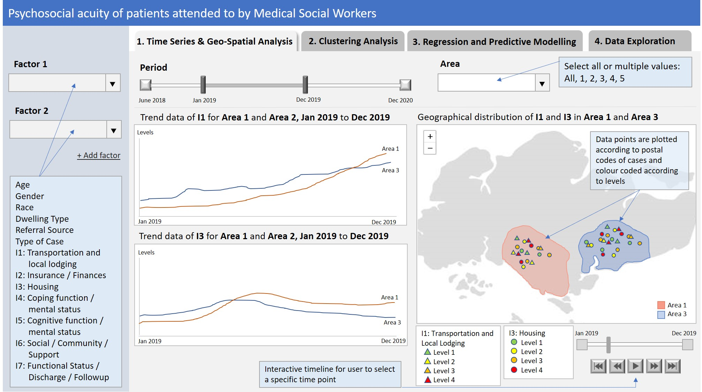
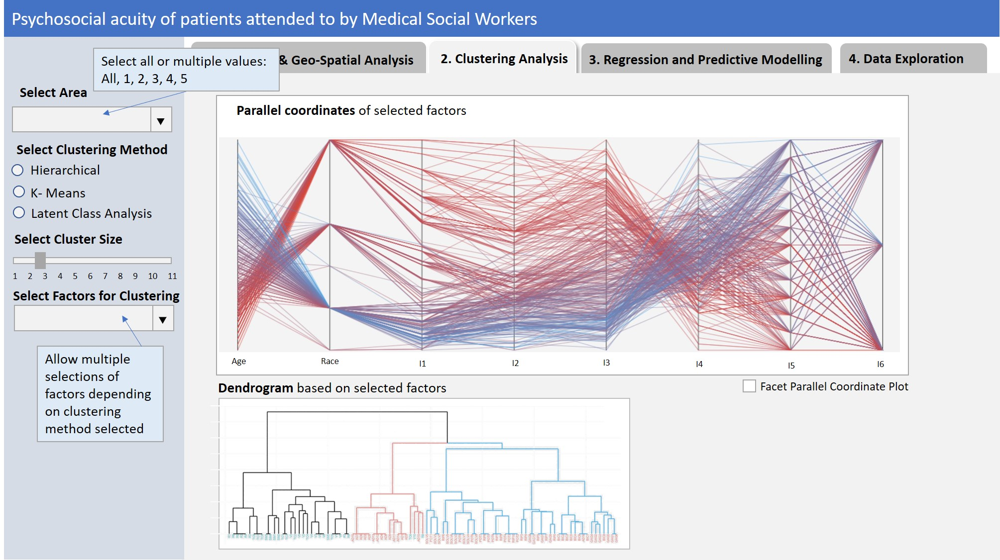
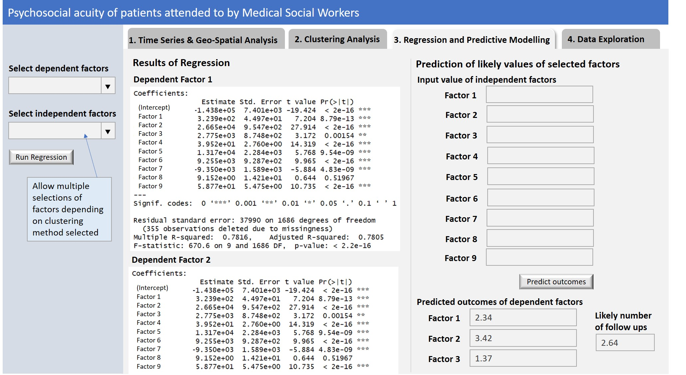
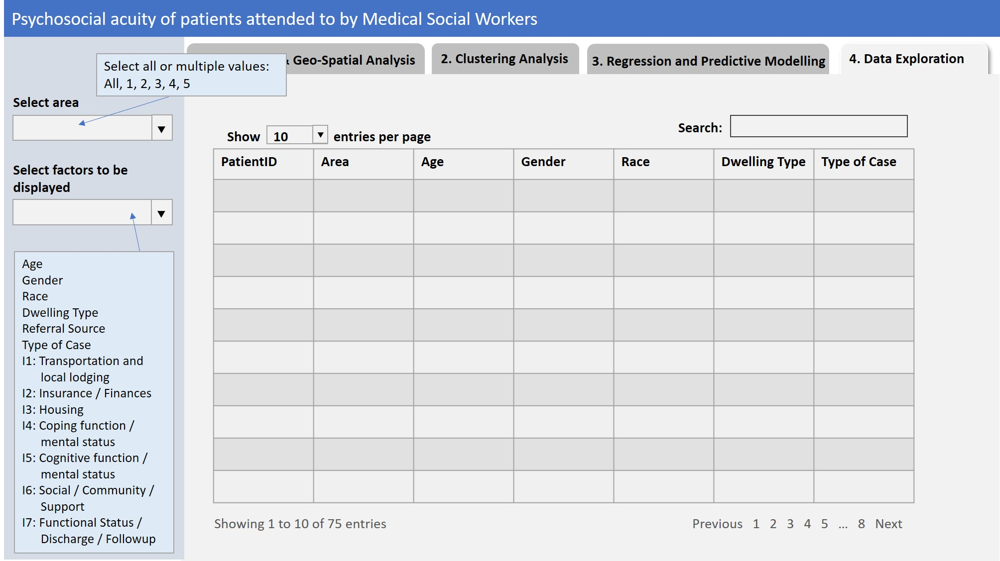

```{r setup, include=FALSE}
knitr::opts_chunk$set(echo = FALSE)
```
## Introduction

One of the three shifts that the Singapore government is making to keep healthcare affordable and sustainable is to bring healthcare closer to homes and support ageing in the community. To achieve this, public healthcare services are organised into three clusters overseeing a specific region: 

* Central region: National Healthcare Group (NHG)
* Eastern region: Singapore Health Services (SingHealth)
* Western region: National University Health System (NUHS)

This segregation would allow the clusters to better coordinate care delivery along the care continuum from primary, acute, intermediate to long-term care, in their respective regions (Ministry of Health, Singapore, 2018). 

In Singapore General Hospital, part of the SingHealth cluster, the Community Care Team (CCT), comprising of Medical Social Workers (MSWs), was formed in mid 2018. The aim of the CCT is to facilitate person-centred care in the community and to enable patients to remain in the community as long as possible. This is achieved through collaboration with community partners to meet patient psychosocial needs with health and social issues. 

In order to explore the breadth and depth of psychosocial needs in the community and to devise targeted intervention strategies to address them, the Psychosocial Acuity Scale (PAS), established in the University of Michigan Health System, Ann Arbor, was introduced and is being used to capture patient's data based on their psychosocial needs (Klett, Firn, Abney, Battles, Harrington & Vantine, 2014). The PAS is a clinical measure and tool used to assess the patient/family/community situation prior to any social work involvement. It consists of seven domains, with each domain having four acuity levels.

This project looks at providing an application to aid in the visualisation and analysis of the data collected by the CCT MSWs.

## Motivation

The project team is motivated to help the CCT MSWs to discover trends and gain insights on the psychosocial acuity of patients in the community. The analysis tool will enable the MSW team to identify current trends and service needs, which would in turn inform the MSWs on the potential intervention strategies required in the community. This would have both practice and health and social care policy implications on enabling patients to age well in the community.

While the dataset is meant for data analysis, it has been mainly used for case monitoring and workload statistics purposes. To enhance and facilitate the analysis task for the MSWs, the project team will attempt to provide an easy-to-use and interactive application. It is also an opportune time to start analysing their data, after allowing the CCT team's systems and processes to stabilise since its formation in mid 2018.

## Data

The data is split into three files, one for each MSW. The fields can be categorised into the following areas:

* Patient's sociodemographics and postal code
* Referral details
* MSW assessment details including the PAS levels

Each file contains the patient assessment records done by the respective MSW from mid 2018 to 2020. There could be repeated assessments for the same patient at different times.

## Methodology and Approach

The following is the proposed scope of the project.

1. Analysis and preparation of PAS dataset
2. Exploratory Data Analysis (EDA)
3. Time Series and Geospatial Analysis
4. Clustering Analysis
5. Multiple Linear Regression (MLR) and Predictive Modelling 
6. Development of R-Shiny mobile application for user interactivity

## Storyboard

There will be 4 sections in the final app. The first section will be on Time Series and Geo-spatial Analysis. The second section will be on Clustering Analysis and the third section will be on Regression and Prediction Modelling. The fourth section will allow the user to explore with the data used in the application.

Proposed layouts and features of the sections are as follow.

### Time Series & Geo-Spatial Analysis

```{r pressure1, echo=FALSE, fig.cap="Proposed screen for Time Series and Geo-Spatial Analysis", out.width = '100%'}

```

### Clustering Analysis

```{r pressure2, echo=FALSE, fig.cap="Proposed screen for Clustering Analysis", out.width = '100%'}

```

### Regression and Predictive Modelling

```{r pressure3, echo=FALSE, fig.cap="Proposed screen for Regression and Predictive Modelling", out.width = '100%'}

```

### Data Exploration

```{r pressure4, echo=FALSE, fig.cap="Proposed screen for Data Exploration", out.width = '100%'}

```


## References

Ministry of Health, Singapore (14 Aug 2018). Opening Address by Dr Amy Khor, Senior Minister of State, Ministry of Health, at the Singapore Healthcare Management Congress 2018, 14 August 2018. Retrieved from https://www.moh.gov.sg/news-highlights/details/opening-address-by-dr-amy-khor-senior-minister-of-state-ministry-of-health-at-the-singapore-healthcare-management-congress-2018-14-august-2018

Klett, S., Firn, J., Abney, N., Battles, A., Harrington, J., & Vantine, A. (2014). Developing a reliable and valid scale to measure psychosocial acuity. *Social work in health care, 53*(5), 503–517. https://doi.org/10.1080/00981389.2014.898726
