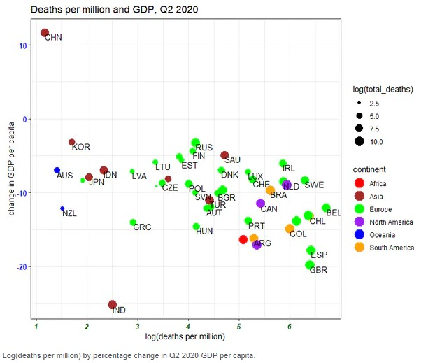

```{r setup, include=FALSE}
knitr::opts_chunk$set(message = FALSE,
                      warning = FALSE)
```

# Overview

In December 2019, the Coronavirus (COVID-19) has caught the world's attention with the first COVID-19 cases reported in Wuhan, Hubei, China. Since then, the virus has spread like wildfire across the globe, with countries struggling to contain the virus to curb further spread and resurgence.

Experts believe that COVID-19 is less deadly but more infectious than the Severe Acute Respiratory Syndrome (SARS) virus in 2003. Although the number of deaths due to COVID-19 reached a staggering 2.85 million worldwide, its case fatality ratio or rate (defined as the proportion of deaths among a defined population of interest, in this case, the number of COVID-19 cases) is estimated at 1.4% to 3.4%, a far cry from the 9.6% of SARS and 34.3% of the lesser known Middle East Respiratory Syndrome coronavirus (MERS-CoV). Of the 2.85 million deaths, how do countries compare against each other? This assignment aims to visualise the relationships between health, economic and population structure indicators with COVID-19 deaths across countries.

# Literature review of current visualisations on COVID-19 deaths

Most visualisations report the death toll by location using geo-spatial, time-series and/or in tabular form (see Figure 1).

![Figure 1: Current visualisations on COVID-19 deaths.<br>*(a)* Choropleth map of cumulative confirmed deaths per million people.<br>Source: https://ourworldindata.org/covid-deaths <br>*(b)* Proportional symbol map showing the case fatality ratio by location. Actual numbers are reported on the right side panel.<br>Source: https://coronavirus.jhu.edu/map.html <br>*(c)* Time-series of cumulative confirmed deaths per million people. Countries can be added or removed.<br>Source: https://ourworldindata.org/covid-deaths <br>*(d)* Table with horizontal bar charts and another time-series visualisation on the deaths reported per day.<br>Source: https://pandemic.internationalsos.com/2019-ncov/covid-19-data-visualisation](images/currviz.jpg)

These visualisations focus on comparing countries based on the number of deaths or case fatality rates. Comparisons are made based on visual encodings such as colour and size of data points. When used appropriately, users are able to perceive the information effectively (Figure 1-a to c). We can see that there is a lot of visual clutter when more countries are added, as seen in the time-series graph in Figure 1-d.

More details on number of deaths for individual countries are also provided via interactivity in some visualisations (see Figure 1-c for example). However, the comparisons are limited to the countries selected and it could be challenging to make comparisons when more countries are added. On the other hand, the table provides a single-view of the details across countries in descending order, but the numbers could be overwhelming for users to process even with the horizontal bar charts. Furthermore, a tabular layout makes it difficult to compare specific countries of interest.

There are lesser analyses that compare deaths or case fatality with other indicators. Some analyses study the impact of COVID-19 on the indicators while others study the impact of the indicators on the COVID-19 numbers. The review will focus on the analysis or visualisations used, which can potentially be employed to both types of analyses.

#### Scatterplot of economic indicators against number of deaths per million



The scatterplot is useful in showing the relationship between two independent variables. In this scatterplot, size and colour scales are used to encode number of deaths and continent respectively. The size of the data points are not obvious from the graph due to the size range used, the 3-character country code labels and the choice of colour for Europe (the green stands out too much). The overlap in data points belonging to the same continent also make it difficult to identify the data points. There is no interactivity in this visualisation.

#### Funnel plot of case fatality rate against number of confirmed cases

There are two similar visualisations created specifically for COVID-19 case fatality rate for counties in the US by a SAS researcher Rick Wicklin (see Figure 3). Unlike the time-series, geo-spatial and tabular visualisations where users make comparisons based on the face-value of the numbers, the funnel plot seeks to highlight any anomalies from the expected range of the numerical values based on statistical concepts. Note that the factors plotted on a funnel plot are dependent on each other, i.e. the number of confirmed cases is used to calculate the case fatality rate.


The drawback of the visualisations is that the funnel plots are static with no interactivity: users are unable to identify the other data points that are not labelled by the author.

#### Tabular presentation of correlation index between socio-economic indicators and number of deaths per million

The study "Rich at risk: socio-economic drivers of COVID-19 pandemic spread" by Gangemi, S., Billeci, L. & Tonacci, A. (2020) seeks to understand the spread of the COVID-19 virus driven by socio-economic factors and long-distance transportations. The results are presented in a table (see Figure 4). Although the presentation of the results are not visually appealing, this study sheds light on the current analysis performed for COVID-19 deaths. 


#### Scatterplot with fit line and regression model summary table to predict number of new deaths

The visualisations discussed thus far are bivariate in nature: analysis of each factor with the number of deaths. There are very few multivariate analysis done, and of those conducted, most of them are presented in tabular form or described in text. There is one study on regression models to predict the number of COVID-19 new deaths, which presents its findings visually in the research paper (see Figure 5).


Although the intention of the assignment is an exploratory analysis, we can still gain some insights from the visualisation used in this predictive regression analysis. It is noted that the regression models built are to predict the number of new deaths by day for a particular location, Ethiopia, solely based on COVID-19 related indicators. The scatterplot with fit lines allows users to visually compare the different regression models built. There is no interactivity in this graph as it is used for reporting purposes.

# Suggested visualisations and R packages

There are gaps in the current visualisations in supporting the intended analysis of this assignment. The majority of interactive visualisations are univariate presented on maps or in time series, while the bivariate and multivariate analysis of the country indicators and the number of deaths are largely static.

In this assignment, we will attempt to create interactive visualisations for bivariate (scatterplot and funnel plot) and multivariate analysis (multiple linear regression) of the number of deaths due to COVID-19 with selected health-socio-economic indicators across countries.

The following R packages will be explored:

| Visualisation | Packages |
|---------------|----------|
| Scatterplot   | *ggstatsplot*, *car*, *ggplot* |
| Funnel Plot   | *FunnelPlotR*, *funnelR*, *ggplot* |
| Multivariate Analysis | *olsrr* |
| Interactivity | *plotly* |

# Data Preparation

All data extraction and wrangling are done in R using the *tidyverse* suite of packages. 

## Install and load all necessary packages

Besides the mentioned packages, the following packages are also loaded:

* *mlr*: for data exploration with ```summarizeColumns()```
* *naniar*: for visualisation of missing values with ```gg_miss_upset()```
* *VIM*: for imputation of missing values with ```kNN()```
* *gridExtra*: for handling of multiple plots with ```grid.arrange()```
* *corrr*: for visualisation of correlation with ```correlate()``` and ```rplot()```
* *ggExtra* : for 

The code chunk below is used to install and load the packages.

```{r}
packages = c('tidyverse', 'mlr', 'naniar','VIM', 'gridExtra', 'corrr',
             'ggstatsplot', 'car', 'ggExtra',
             'FunnelPlotR', 'funnelR',
             'olsrr',
             'plotly')
for(p in packages){
  if(!require(p, character.only = T)){
  install.packages(p)
  }
  library(p, character.only = T)
}
```

## Import and extract relevant data

Data by country is obtained from various sources, as shown in the following table:

|  Data source |  Data |
|-------------|------|
| Our World in Data (owid) | COVID-19 tests, positive rates, country to latitude-longitude coordinates mapping |
| John Hopkins University (JHU) | COVID-19 cases, deaths |
| World Bank | Population age structure, GDP per capita, poverty indicator |
| UNdata | Health expenditure, healthcare facilities and capacity indicators |
| United Nations Development Programme (UNDP) | Human Development Index (HDI), international inbound tourists |

The data is stored across eight files and ```read_csv()``` is used to import and extract the relevant columns from each file into R.

```{r warning=FALSE}
covid <- read_csv("./data/owid-covid-latest.csv",
                         col_types = cols_only(
                           "iso_code" = "c",
                           "continent" = "c",
                           "location" = "c",
                           "last_updated_date" = "D",
                           "total_cases" = "n",
                           "total_deaths" = "n",
                           "total_tests" = "n",
                           "positive_rate" = "n",
                           "test_units" = "c",
                           "population" = "n",
                           "population_density" = "n",
                           "gdp_per_capita" = "n",
                           "extreme_poverty" = "n",
                           "handwashing_facilities" = "n",
                           "hospital_beds_per_thousand" = "n",
                           "human_development_index" = "n"),
                         locale = locale(date_format = "%Y-%m-%d")
                         )

health_exp <- read_csv("./data/UNdata_HealthExpenditure.csv",
                       skip = 2,
                       col_names = c("region/country/area","year_exp","series","percentage"),
                       col_types = "_cncn__")

health_personnel <- read_csv("./data/UNdata_HealthPersonnel.csv",
                       skip = 2,
                       col_names = c("region/country/area","year_personnel","series","value"),
                       col_types = "_cncn__")

pop_prop <- list.files(path="./data/", pattern="WorldBank_PopProp_", full.names = TRUE) %>%
  map_df(~read_csv(.,
                   skip = 4,
                   col_types = cols_only(
                     "Country Name" = "c",
                     "Indicator Name" = "c",
                     "2019" = "n")
                   )
         )

intl_tourists <- read_csv("./data/UNDP_Intl_inbound_tourists_(thousands).csv",
                          skip = 6,
                          col_types = "_c________________________n_",
                          na = c("..")
                          )

geo_lookup <- read_csv("./data/UID_ISO_FIPS_LookUp_Table.csv",
                       col_types = "c_c_____nn__") %>%
  filter(nchar(UID) <= 3) %>%
  select(iso3, Lat, Long_) %>%
  rename("lat" = "Lat", "long" = "Long_")
```

## Wrangle and combine the data

Before combining the data frames into one main data frame for analysis, we need to explore and prepare each data frame.

```{r}
pop_prop_cleaned <- pivot_wider(pop_prop, names_from = "Indicator Name", values_from = "2019") %>%
  rename("0_to_14(%)" = "Population ages 0-14 (% of total population)",
         "15_to_64(%)" = "Population ages 15-64 (% of total population)",
         "65_and_above(%)" = "Population ages 65 and above (% of total population)")
```

```{r}
intl_tourists_cleaned <- rename(intl_tourists,
                        "annual_intl_arrivals_thousands" = "2011-2018")
```

```{r}
health_personnel_phy <- health_personnel %>%
  group_by(`region/country/area`, `series`) %>%
  slice(which.max(`year_personnel`)) %>%
  filter(`series` == "Health personnel: Physicians (per 1000 population)") %>%
  pivot_wider(names_from = "series", values_from = "value") %>%
  rename("num_physicians_per_thousand" = "Health personnel: Physicians (per 1000 population)")
```

```{r}
health_exp_cleaned <- health_exp %>%
  group_by(`region/country/area`, `series`) %>%
  slice(which.max(`year_exp`)) %>%
  pivot_wider(names_from = "series", values_from = "percentage") %>%
  rename("current_health_exp_%gdp" = "Current health expenditure (% of GDP)",
         "govt_health_exp_%totalgovtexp" = "Domestic general government health expenditure (% of total government expenditure)")
```

After cleaning the individual data frames, we can now combine and store the data in a single data frame, and drop any unnecessary columns for subsequent analysis.

```{r}
covid_deaths <- covid %>%
  left_join(pop_prop_cleaned, by = c("location" = "Country Name")) %>%
  left_join(intl_tourists_cleaned, by=c("location" = "Country")) %>%
  left_join(health_personnel_phy, by=c("location" = "region/country/area")) %>%
  left_join(health_exp_cleaned, by=c("location" = "region/country/area")) %>%
  left_join(geo_lookup, by=c("iso_code" = "iso3")) %>%
  mutate(case_fatality_rate = total_deaths/total_cases) %>%
  filter(!is.na(continent)) %>%
  select(-c("iso_code","last_updated_date"))
```

As the data for number of physicians are taken across different years, the code chunk below extracts and presents the most recent year in which the number of physicians were available for each country.

```{r}
personnel_data <- covid_deaths %>%
  select(c("location", "year_personnel")) %>%
  pivot_wider(names_from = "year_personnel", 
              values_from = "location", 
              names_sep = ", ")

glimpse(personnel_data[,order(colnames(personnel_data))])
```

We will reorder the columns to group similar variables.

```{r}
col_order <- c("continent", "location",
               "total_cases", "total_deaths", "case_fatality_rate", "total_tests", "positive_rate",
               "hospital_beds_per_thousand", "num_physicians_per_thousand", "year_personnel", "handwashing_facilities",
               "gdp_per_capita", "current_health_exp_%gdp", "govt_health_exp_%totalgovtexp",
               "population", "population_density", "0_to_14(%)", "15_to_64(%)", "65_and_above(%)",
               "extreme_poverty", "human_development_index",
               "annual_intl_arrivals_thousands",
               "lat", "long")

covid_deaths <- covid_deaths[, col_order] %>% 
  select(-c("year_personnel"))

glimpse(covid_deaths)
```

The base dataset is ready for the next step on data exploration. Before we move on to the next step, we will clear the R environment to free up memory space with the following code chunk:

```{r}
rm(list = setdiff(ls(), "covid_deaths"))
```

## Explore the data

Let us take a look at a summary of the data.

```{r}
summarizeColumns(covid_deaths)
```

Note that there are a number of variables with missing values. As it is challenging to explore the data in numbers, we will employ visualisation to aid in data exploration in the following three areas:

* Missingness
* Distribution
* Outliers

### Missingness

*ggplot* is used to visualise missing values in the dataset with the code chunk below:

```{r}
missing_values <- covid_deaths %>%
  gather(key = "key", value = "val") %>%
  mutate(isna = is.na(val)) %>%
  group_by(key) %>%
  mutate(total = n()) %>%
  group_by(key, total, isna) %>%
  summarise(num.isna = n()) %>%
  mutate(pct = num.isna / total * 100)

levels <- (missing_values %>% 
             filter(isna == TRUE) %>%
             arrange(pct))$key

percentage_plot <- missing_values %>%
  ggplot() +
    geom_bar(aes(x = reorder(key, pct), y = pct, fill=isna),
             stat = "identity",
             alpha=0.8) +
    scale_x_discrete(limits = levels) +
    scale_fill_manual(name = "",
                      values = c("lightblue","rosybrown"),
                      labels = c("Present", "Missing")) +
    coord_flip() +
    labs(title = "Percentage of missing values", x = 'Variable', y = "% of missing values")

percentage_plot
```

From the above plot, **handwashing facilities** has the highest percentage of missing values, followed by **total tests** and **positive rate**. We can also use *gg_miss_upset* plot to understand how missing values are linked across variables.

```{r fig.height=10}
gg_miss_upset(covid_deaths, 
              nsets = n_var_miss(covid_deaths), 
              nintersects = NA, 
              text.scale = c(2,2,2,2,1.5,2),
              set_size.show = TRUE,
              set_size.numbers_size = 4)
```

From the UpSet plot, 35 of the records have only missing values in handwashing facilities, while there is one record with missing values across all variables. As the missing values would pose a problem later in the analysis, the missing values are imputed using the k-Nearest Neighbour (kNN) imputation, where k = 5. Key indicators of a country, such as the population, population density and Gross Domestic Product (GDP) per capita are used to estimate the imputation value. The continent in which the country falls under is also considered.

```{r}
covid_deaths_imputed_raw <- covid_deaths %>% 
  drop_na(population) %>%
  kNN(k=5,
      dist_var = c("continent", 
                   "population",
                   "population_density", 
                   "gdp_per_capita"))

covid_deaths_imputed <- covid_deaths_imputed_raw %>%
  select(continent:long)

summarizeColumns(covid_deaths_imputed)
```

There are no missing values after imputation as seen from the **na** column, and no zero values were imputed when compared to the previous summary table from the **min** column.

### Distribution

The distributions are examined from the density curves of the variables using ```ggplot()```. Both the distributions from before and after imputation of missing values are compared.

```{r results='hide', fig.height=10, fig.width=10}
check_distribution <- covid_deaths %>%
  pivot_longer(cols = total_cases:annual_intl_arrivals_thousands,
               names_to = "variable",
               values_to = "value") %>%
  ggplot(aes(x=value)) +
  geom_density() +
  facet_wrap(~variable, nrow = 5, ncol = 4, scales = "free") +
  ggtitle("Distribution before imputation") +
  theme_minimal() +
  theme(panel.border = element_rect(colour="grey60", fill = NA),
        strip.background = element_rect(fill = "grey80"))

check_distribution
```
```{r results='hide', fig.height=10, fig.width=10}
check_distribution_imputed <- covid_deaths_imputed %>%
  pivot_longer(cols = total_cases:annual_intl_arrivals_thousands,
               names_to = "variable",
               values_to = "value") %>%
  ggplot(aes(x=value)) +
  geom_density() +
  facet_wrap(~variable, nrow = 5, ncol = 4, scales = "free") +
  ggtitle("Distribution after imputation") +
  theme_minimal() +
  theme(panel.border = element_rect(colour="grey60", fill = NA),
        strip.background = element_rect(fill = "grey80"))

check_distribution_imputed
```
```{r echo=FALSE, fig.height=10, fig.width=20}
grid.arrange(check_distribution, check_distribution_imputed, ncol=2)
```

The distributions after imputation is similar to that before imputation, except for *handwashing_facilities* as it has the most missing values. We need to take note of this and explicitly mention it in the visualisation.

### Outliers

The outliers are also examined using ```ggplot()```.

```{r fig.height=10, fig.width=15}
check_outlier <- covid_deaths_imputed %>%
  pivot_longer(cols = total_cases:annual_intl_arrivals_thousands,
               names_to = "variable",
               values_to = "value") %>%
  ggplot(aes(x=variable, y=value)) +
    geom_boxplot() +
    facet_wrap(~variable, ncol = 7, scales = "free") +
    theme_minimal() +
    theme(panel.border = element_rect(colour="grey60", fill = NA),
          axis.text.x.bottom = element_blank())

check_outlier
```

Most of the outliers are valid as there are countries with very large numbers due to its population sizes. No further action is taken to treat outliers.

### Correlation

Variables that are correlated are highlighted with the below code chunk.

```{r}
check_correlation <- correlate(covid_deaths_imputed %>%
                                 select(total_cases:annual_intl_arrivals_thousands))

rplot(check_correlation,
      print_cor = TRUE) +
  scale_size_continuous(range = c(0,4)) +
  theme(axis.text.x = element_text(size=7, angle=45, hjust=0.95),
        axis.text.y = element_text(size=7))
```

We observe that *total_cases*, *total_deaths* and *total_tests* are positively correlated, as they are logically inter-dependent. Interestingly, *0_to_14(%)* and *human_development_index* are strongly negatively correlated. The Human Development Index (HDI) is a summary measure of four indicators: (1) life expectancy; (2) expected years of schooling; (3) mean of years of schooling; and (4) gross national income per capita. Another notable negative correlation is that between *handwashing_facilities* and *0_to_14(%)*. However, as the former is mostly imputed, the correlation may not reflect the true correlation.

Again, no further action to handle the high correlation as this is an exploratory analysis.

```{r echo=FALSE}
rm(list = setdiff(ls(), "covid_deaths_imputed"))
```
# Prototype

The next step would be to explore the packages to build the needed plots. Interactivity is also explored for each type of plot.

## Scatterplot

Three methods will be explored for the scatterplot

### 1) Use *ggstatsplot::ggscatterstats*

There are two key options that are available for users to select: the type of marginal distribution and the statistical test to be performed. The code chunk below shows the options for marginal distribution.

```{r fig.height=8, fig.width=10}
scatter_ggscatterstats_histogram <- ggscatterstats(covid_deaths_imputed,
                                                   x = hospital_beds_per_thousand,
                                                   y = total_deaths,
                                                   marginal.type = "histogram",
                                                   title = "Histogram",
                                                   ggplot.component = list(scale_y_log10()))

scatter_ggscatterstats_density <- ggscatterstats(covid_deaths_imputed,
                                                 x = hospital_beds_per_thousand,
                                                 y = total_deaths,
                                                 marginal.type = "density",
                                                 title = "Density",
                                                 ggplot.component = list(scale_y_log10()))

scatter_ggscatterstats_densigram <- ggscatterstats(covid_deaths_imputed,
                                                   x = hospital_beds_per_thousand,
                                                   y = total_deaths,
                                                   marginal.type = "densigram",
                                                   title = "Density + Histogram",
                                                   ggplot.component = list(scale_y_log10()))

scatter_ggscatterstats_boxplot <- ggscatterstats(covid_deaths_imputed,
                                                 x = hospital_beds_per_thousand,
                                                 y = total_deaths,
                                                 marginal.type = "boxplot",
                                                 title = "Boxplot",
                                                 ggplot.component = list(scale_y_log10()))

scatter_ggscatterstats_violin <- ggscatterstats(covid_deaths_imputed,
                                                x = hospital_beds_per_thousand,
                                                y = total_deaths,
                                                marginal.type = "violin",
                                                title = "Violin",
                                                ggplot.component = list(scale_y_log10()))

combine_plots(plotlist = list(scatter_ggscatterstats_histogram,
                              scatter_ggscatterstats_density,
                              scatter_ggscatterstats_densigram,
                              scatter_ggscatterstats_boxplot,
                              scatter_ggscatterstats_violin),
              annotation.args = list(title="Comparing types of marginal distribution"),
              plotgrid.args = list(nrow=2))
```

The next block of code lists the options for the statistical tests to be performed.

```{r fig.height=8, fig.width=10}
scatter_ggscatterstats_parametric <- ggscatterstats(covid_deaths_imputed,
                                                    x = hospital_beds_per_thousand,
                                                    y = total_deaths,
                                                    type = "parametric",
                                                    marginal.type = "boxplot",
                                                    title = "Parametric: Pearson's correlation coefficient",
                                                    ggplot.component = list(scale_y_log10()))

scatter_ggscatterstats_nonparametric <- ggscatterstats(covid_deaths_imputed,
                                                       x = hospital_beds_per_thousand,
                                                       y = total_deaths,
                                                       type = "non-parametric",
                                                       marginal.type = "boxplot",
                                                       title = "Non-parametric: Spearman's rank correlation coefficient",
                                                       ggplot.component = list(scale_y_log10()))

scatter_ggscatterstats_robust <- ggscatterstats(covid_deaths_imputed,
                                                x = hospital_beds_per_thousand,
                                                y = total_deaths,
                                                type = "robust",
                                                marginal.type = "boxplot",
                                                title = "Robust: Winsorized Pearson correlation coefficient",
                                                ggplot.component = list(scale_y_log10()))

scatter_ggscatterstats_bayes <- ggscatterstats(covid_deaths_imputed,
                                               x = hospital_beds_per_thousand,
                                               y = total_deaths,
                                               type = "bayes",
                                               marginal.type = "boxplot",
                                               title = "Bayesian: Pearson's correlation coefficient",
                                               ggplot.component = list(scale_y_log10()))

combine_plots(plotlist = list(scatter_ggscatterstats_parametric,
                              scatter_ggscatterstats_nonparametric,
                              scatter_ggscatterstats_robust,
                              scatter_ggscatterstats_bayes),
              annotation.args = list(title="Comparing types of test"),
              plotgrid.args = list(nrow=2))
```

The above graphs are visually appealing in terms of the usage of aesthetic features such as position, colour and opacity. Little effort is needed to customise the plots. The plots are also informative to the more statistically-inclined. Another nice feature of the package is that it has a simple to use function to combine the plots into a grid.

However, there is no support for interactivity for the output of ```ggscatterstats()```, despite claims from the authors that the *ggstatplot* functions are compatible with the *plotly* package.

### 2) Use *car::scatterplot*

Unlike *ggstatsplot*, the key options for users to select includes the method for the regression line and smoothing. ```scatterplot()``` supports the display of marginal distribution but is limited to the boxplot only. Users can however select the axis in which the marginal boxplot is to be displayed. 

The code chunk below shows the scatterplots with marginal boxplot for different regression line methods. Much customisation can be done within the function, but they are limited. For example, we can add labels to the data points by setting ```id=TRUE```, but only for the top two values.

```{r message=FALSE, eval=FALSE, echo=TRUE}
x_variable <- covid_deaths_imputed$hospital_beds_per_thousand
y_variable <- covid_deaths_imputed$total_deaths

scatter_scatterplot_lm <- scatterplot(y_variable ~ x_variable,
                                   covid_deaths_imputed,
                                   boxplots = "xy",
                                   id = TRUE,
                                   log = "y",
                                   pch=16,
                                   main = "regression line method: lm",
                                   xlab = "hospital beds per thousand",
                                   ylab = "total deaths",
                                   regLine = list(method=lm, lty=1, lwd=1),
                                   smooth = list(smoother=loessLine,lty.var=2, lwd.var=0.5))

scatter_scatterplot_loess <- scatterplot(y_variable ~ x_variable,
                                   covid_deaths_imputed,
                                   boxplots = "xy",
                                   id = TRUE,
                                   log = "y",
                                   pch=16,
                                   main = "regression line method: loess",
                                   xlab = "hospital beds per thousand",
                                   ylab = "total deaths",
                                   regLine = list(method=loess, lty=1, lwd=1),
                                   smooth = list(smoother=loessLine,lty.var=2, lwd.var=0.5))
```
```{r eval=TRUE, echo=FALSE}
x_variable <- covid_deaths_imputed$hospital_beds_per_thousand
y_variable <- covid_deaths_imputed$total_deaths

scatter_scatterplot_lm <- scatterplot(y_variable ~ x_variable,
                                   covid_deaths_imputed,
                                   boxplots = "xy",
                                   id = TRUE,
                                   log = "y",
                                   pch=16,
                                   main = "regression line method: lm",
                                   xlab = "hospital beds per thousand",
                                   ylab = "total deaths",
                                   regLine = list(method=lm, lty=1, lwd=1),
                                   smooth = list(smoother=loessLine,lty.var=2, lwd.var=0.5))

scatter_scatterplot_loess <- scatterplot(y_variable ~ x_variable,
                                   covid_deaths_imputed,
                                   boxplots = "xy",
                                   id = TRUE,
                                   log = "y",
                                   pch=16,
                                   main = "regression line method: loess",
                                   xlab = "hospital beds per thousand",
                                   ylab = "total_deaths",
                                   regLine = list(method=loess, lty=1, lwd=1),
                                   smooth = list(smoother=loessLine,lty.var=2, lwd.var=0.5))
```

The options available for the different smoothing methods are shown below.

```{r eval=FALSE, echo=TRUE}
scatter_scatterplot_loessline <- scatterplot(y_variable ~ x_variable,
                                   covid_deaths_imputed,
                                   boxplots = "xy",
                                   id = TRUE,
                                   log = "y",
                                   pch=16,
                                   main = "smoother: loessLine",
                                   xlab = "hospital beds per thousand",
                                   ylab = "total_deaths",
                                   regLine = list(method=loess, lty=1, lwd=0.5),
                                   smooth = list(smoother=loessLine,lty.var=2, lwd.var=0.5))

scatter_scatterplot_gamline <- scatterplot(y_variable ~ x_variable,
                                   covid_deaths_imputed,
                                   boxplots = "xy",
                                   id = TRUE,
                                   log = "y",
                                   pch=16,
                                   main = "smoother: gamLine",
                                   xlab = "hospital beds per thousand",
                                   ylab = "total deaths",
                                   regLine = list(method=mgcv::gam, lty=1, lwd=0.5),
                                   smooth = list(smoother=gamLine,lty.var=2, lwd.var=0.5))

scatter_scatterplot_quantregline <- scatterplot(y_variable ~ x_variable,
                                   covid_deaths_imputed,
                                   boxplots = "xy",
                                   id = TRUE,
                                   log = "y",
                                   pch=16,
                                   main = "smoother: quantregLine",
                                   xlab = "hospital beds per thousand",
                                   ylab = "total deaths",
                                   regLine = list(method=quantreg::rqss, lty=1, lwd=0.5),
                                   smooth = list(smoother=quantregLine,lty.var=2, lwd.var=0.5))
```
```{r eval=TRUE, echo=FALSE}
scatter_scatterplot_loessline <- scatterplot(y_variable ~ x_variable,
                                   covid_deaths_imputed,
                                   boxplots = "xy",
                                   id = TRUE,
                                   log = "y",
                                   pch=16,
                                   main = "smoother: loessLine",
                                   xlab = "hospital beds per thousand",
                                   ylab = "total deaths",
                                   regLine = list(method=loess, lty=1, lwd=0.5),
                                   smooth = list(smoother=loessLine,lty.var=2, lwd.var=0.5))

scatter_scatterplot_gamline <- scatterplot(y_variable ~ x_variable,
                                   covid_deaths_imputed,
                                   boxplots = "xy",
                                   id = TRUE,
                                   log = "y",
                                   pch=16,
                                   main = "smoother: gamLine",
                                   xlab = "hospital beds per thousand",
                                   ylab = "total deaths",
                                   regLine = list(method=mgcv::gam, lty=1, lwd=0.5),
                                   smooth = list(smoother=gamLine,lty.var=2, lwd.var=0.5))

scatter_scatterplot_quantregline <- scatterplot(y_variable ~ x_variable,
                                   covid_deaths_imputed,
                                   boxplots = "xy",
                                   id = TRUE,
                                   log = "y",
                                   pch=16,
                                   main = "smoother: quantregLine",
                                   xlab = "hospital beds per thousand",
                                   ylab = "total deaths",
                                   regLine = list(method=quantreg::rqss, lty=1, lwd=0.5),
                                   smooth = list(smoother=quantregLine,lty.var=2, lwd.var=0.5))
```
The regression line and smoother options are useful.

The plots created from the *car* package are less appealing than from *ggstatsplot*. Although much flexibility is given to customise the plots, it requires much effort to make the changes. Similar to ```ggscatterstats()```, there is no interactivity support for the output from ```scatterplot()```, either within the package itself or from external interactivity packages.

### 3) Draw from scratch with *ggplot*

```{r warning=FALSE}

x_variable <- covid_deaths_imputed$hospital_beds_per_thousand
y_variable <- covid_deaths_imputed$total_deaths

scatter_ggplot_loess <- ggplot(covid_deaths_imputed, 
                               aes(x=x_variable, y=y_variable, size=population)) +
                          geom_point(aes(colour=continent)) +
                          scale_y_log10() +
                          ggtitle("loess") +
                          xlab("hospital beds per thousand") +
                          ylab("total deaths") +
                          geom_smooth(method = "loess")

scatter_ggplot_lm <- ggplot(covid_deaths_imputed, 
                            aes(x=x_variable, y=y_variable, size=population)) +
                      geom_point(aes(colour=continent)) +
                      scale_y_log10() +
                      ggtitle("lm") +
                      xlab("hospital beds per thousand") +
                      ylab("total deaths") +
                      geom_smooth(method = "lm")

scatter_ggplot_glm <- ggplot(covid_deaths_imputed, 
                             aes(x=x_variable, y=y_variable, size=population)) +
                        geom_point(aes(colour=continent)) +
                        scale_y_log10() +
                        ggtitle("glm") +
                        xlab("hospital beds per thousand") +
                        ylab("total deaths") +
                        geom_smooth(method = "glm")

scatter_ggplot_gam <- ggplot(covid_deaths_imputed, 
                             aes(x=x_variable, y=y_variable, size=population)) +
                        geom_point(aes(colour=continent)) +
                        scale_y_log10() +
                        ggtitle("gam") +
                        xlab("hospital beds per thousand") +
                        ylab("total deaths") +
                        geom_smooth(method = "gam")

combine_plots(plotlist = list(scatter_ggplot_loess,
                              scatter_ggplot_lm,
                              scatter_ggplot_glm,
                              scatter_ggplot_gam),
              annotation.args = list(title="Comparing types of smoothing method"),
              plotgrid.args = list(nrow=2))
```

```{r fig.height=5, fig.width=15}
scatter_ggplot_base <- ggplot(covid_deaths_imputed, 
                              aes(x=x_variable, y=y_variable, size=population)) +
                        geom_point(aes(colour=continent)) +
                        scale_y_log10() +
                        xlab("hospital beds per thousand") +
                        ylab("total deaths") +
                        geom_smooth() +
                        theme(legend.position = "none")

scatter_ggplot_histogram <- ggMarginal(scatter_ggplot_base, 
                                       type="histogram",
                                       fill="lightblue")

scatter_ggplot_density <- ggMarginal(scatter_ggplot_base, 
                                       type="density")

scatter_ggplot_boxplot <- ggMarginal(scatter_ggplot_base, 
                                       type="boxplot")

combine_plots(plotlist = list(scatter_ggplot_histogram,
                              scatter_ggplot_density,
                              scatter_ggplot_boxplot),
              annotation.args = list(title="Comparing types of marginal distribution"),
              plotgrid.args = list(nrow=1))

```


```{r warning=FALSE}
ggplotly(scatter_ggplot_lm)
```


### Summary of R packages for scatterplot

```{r echo=FALSE, fig.height=5, fig.width=10}

scatter_ggstatsplot <- ggscatterstats(covid_deaths_imputed,
                                      x = hospital_beds_per_thousand,
                                      y = total_deaths,
                                      marginal.type = "densigram",
                                      title = "ggstatsplot::ggscatterstats with densigram",
                                      ggplot.component = list(scale_y_log10()))

scatter_ggplot_base <- ggplot(covid_deaths_imputed, 
                              aes(x=x_variable, y=y_variable, size=population)) +
                        geom_point(aes(colour=continent)) +
                        scale_y_log10() +
                        ggtitle("ggplot with marginal boxplot") +
                        xlab("hospital beds per thousand") +
                        ylab("total deaths") +
                        geom_smooth() +
                        theme(legend.position = "none")

scatter_ggplot <- ggMarginal(scatter_ggplot_base, type = "boxplot")
                        
combine_plots(plotlist = list(scatter_ggstatsplot,
                              scatter_ggplot),
              annotation.args = list(title="Comparison of scatterplots"),
              plotgrid.args = list(nrow=1))

```
```{r eval=TRUE, echo=FALSE, fig.height=5}
scatter_scatterplot_loessline <- scatterplot(y_variable ~ x_variable,
                                   covid_deaths_imputed,
                                   boxplots = "xy",
                                   id = TRUE,
                                   log = "y",
                                   pch=16,
                                   main = "car::scatterplot with marginal boxplot",
                                   xlab = "hospital beds per thousand",
                                   ylab = "total deaths",
                                   regLine = list(method=loess, lty=1, lwd=0.5),
                                   smooth = list(smoother=loessLine,lty.var=2, lwd.var=0.5))
```

Criteria:
Ease of use
Ease of understanding
Interactivity
Shiny app integration


Good practice to clear the environment before the next phase.
```{r}
rm(list = setdiff(ls(), "covid_deaths_imputed"))
```
## Funnel Plot

### Use *FunnelPlotR::funnel_plot*


```{r}
covid_deaths_fpR <- funnel_plot(numerator = covid_deaths_imputed$total_deaths,
                                denominator = covid_deaths_imputed$total_cases,
                                group = covid_deaths_imputed$location,
                                data_type = "PR",
                                limit = 99,
                                label_outliers = TRUE,
                                Poisson_limits = TRUE,
                                title = "Case Fatality Rate by Total Number of COVID-19 Cases",
                                x_label = "Total Number of COVID-19 Cases",
                                y_label = "Case Fatality Rate",
                                xrange = c(0, 32000000),
                                yrange = c(0, 0.25))
```

### Use *funnelR::funplot*
 

```{r eval=FALSE, echo=TRUE}

covid_deaths_fR <- covid_deaths_imputed %>% 
                          rename(n = total_deaths, d = total_cases) %>% 
                          select(continent, location, n, d) %>%
                          filter(continent == "South America")

funnelR_limits <- fundata(input = covid_deaths_fR,
                          alpha = 0.95,
                          method = 'approximate', # exact or approximate
                          )

funplot(covid_deaths_funnelR, funnelR_limits)
```
```> Error: memory exhausted (limit reached?)```
```> Error: cannot allocate vector of size 91.3 Mb```

### 


```{r}
location <- covid_deaths_imputed$location
rate <- covid_deaths_imputed$case_fatality_rate
number <- log(covid_deaths_imputed$total_cases)

rate.se <- sqrt((rate*(1-rate)) / (number))
df <- data.frame(location, rate, number, rate.se)

# common effect (fixed effect model)
rate.fem <- weighted.mean(rate, 1/rate.se^2)

# lower and upper limits for 95% and 99.9% CI
number.seq <- seq(1, max(number), 1)
number.ll95 <- rate.fem - 1.96 * sqrt((rate.fem*(1-rate.fem)) / (number.seq)) 
number.ul95 <- rate.fem + 1.96 * sqrt((rate.fem*(1-rate.fem)) / (number.seq)) 
number.ll999 <- rate.fem - 3.29 * sqrt((rate.fem*(1-rate.fem)) / (number.seq)) 
number.ul999 <- rate.fem + 3.29 * sqrt((rate.fem*(1-rate.fem)) / (number.seq)) 
dfCI <- data.frame(number.ll95, number.ul95, number.ll999, number.ul999, number.seq, rate.fem)

# draw plot
fp <- ggplot(aes(x = number, y = rate), data = df) +
    geom_point(shape = 1) +
    geom_line(aes(x = number.seq, y = number.ll95), data = dfCI) +
    geom_line(aes(x = number.seq, y = number.ul95), data = dfCI) +
    geom_line(aes(x = number.seq, y = number.ll999), linetype = "dashed", data = dfCI) +
    geom_line(aes(x = number.seq, y = number.ul999), linetype = "dashed", data = dfCI) +
    geom_hline(aes(yintercept = rate.fem), data = dfCI) +
    geom_text(aes(label=ifelse(rate>0.08, location,'')),hjust=-0.2, vjust=-0.5)+
    scale_x_continuous(labels = scales::comma) +
    xlab("Total Number of COVID-19 Cases") + ylab("Case Fatality Rate") 

fp
```


## Multivariate Analysis

There is a Shiny app for the *mlr* package available.

### Using *olsrr*

```{r}
model1 <- ols_regress(total_deaths ~ total_cases + positive_rate + hospital_beds_per_thousand, data = covid_deaths_imputed)

model1
```

```{r}

covid_deaths_mlr <- covid_deaths_imputed %>% select(-c(continent,
                                               location,
                                               case_fatality_rate,
                                               lat,
                                               long))

model <- lm(total_deaths ~., data = covid_deaths_mlr)

mlr_model <- ols_step_both_p(model)

mlr_model
```

```{r}
plot(mlr_model)
```

Able to choose variable selection methods:

* ols_step_all_possible()
* ols_step_best_subset()
* ols_step_forward_p()
* ols_step_backward_p()
* ols_step_both_p()
* ols_step_forward_aic()
* ols_step_backward_aic()
* ols_step_both_aic()

Collinearity assessment

* ols_vif_tol()

have plots to assess model fit
* ols_plot_resid_fit_spread()

also have plots for residual diagnostics

* ols_plot_resid_qq()
* ols_test_normality() and ols_plot_resid_hist()
* ols_plot_resid_fit()


```{r}

```


# Storyboard
