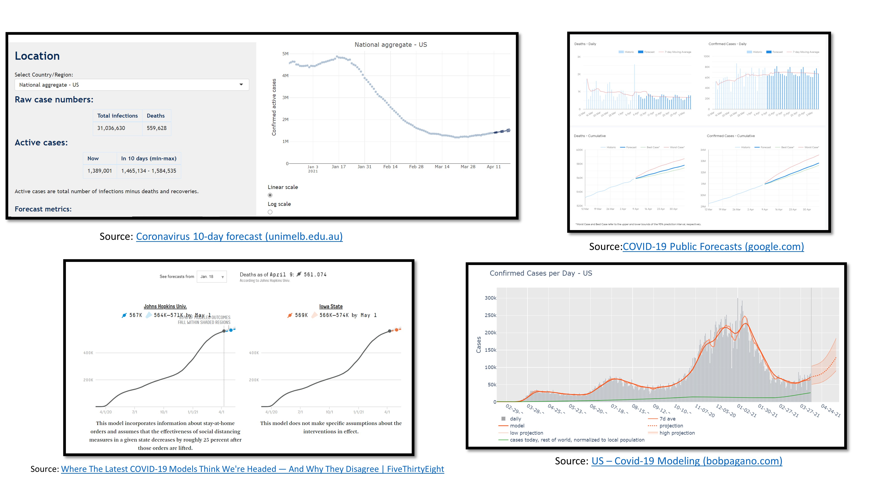
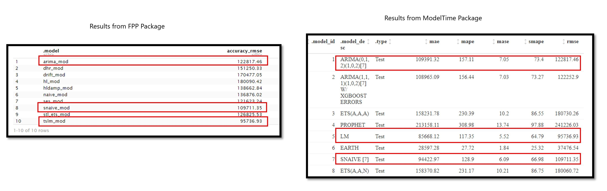

```{r setup, include=FALSE}
knitr::opts_chunk$set(echo = TRUE)
```

# Overview
The purpose of this assignment is to provides estimates of COVID-19 near-future case load in each country, based on global data collated by Johns Hopkins University. Generally, the data is a sequence of observations stored in time orders (Time Series Data). 

Time series analysis aim to analyse the time series data to extract meaningful characteristics of data and generate useful insights. For our case, we will attempt to forecast the near-future number of confirmed cases. Time series may have several characteristics that make their analysis different from other types of data, namely: 

* The time series variable may have a trend over time.
* The variable may exhibit seasonality. 
* The data may have serial correlation between observations.
* The data will have an irregular component (White Noise). This is the random variation not explained by any other factor. 

These characteristics will affect the outcome of the forecasting models. Decomposing a time series into its components (trend, cycle, seasonality, and random (stationary)) is an important part of time series analysis. We do this to help understand the time series better and also to improve the forecast result.

# Literature Review ofCcurrent Visualisations on COVID-19 Confirmed Cases
Most of the sites that forecast the near-future case load uses time series charts and/or putting values in tabular form in white papers (See Fig 1). The site/papers will give detailed explanation of the mathematical models, without letting the users to explore the dataset.

{width=150%}

### Proposed Enhancement

* These visualisations focus on showing the result of the chosen models, without allowing users to change any of the parameters of the models. Most of the time, users are also not given the choice on which forecasting models to use. If possible, to have a few models so that users can make a comparison and to allow the users to choose the models he/she wants.

* As with all forecasting/prediction models, most of the forecast models do show the Confidence Interval of the outcome. This will show the users the range in which the forecast will fall in. We will continue to maintain this in our application.

* Most forecasting site do not allow users to explore the dataset. Will be good if users are able to observe the "characteristics" of the dataset before proceeding to the forecast. Also, should explore allowing the users to select the date range to be used for the forecast. 

* Most site only show the Time Series plot of the forecast, without the values of the result (RMSE etc). Will be good to show the users the results so that users can gauge the accuracy of the models.

# Suggested Visualisations and R packages

Most of the visualisations for the forecast of Covid-19 confirmed cases are time series charts, without much interactivity with the users. Most of the time, only 1 model result is shown.

In this assignment, we will attempt to create an interactive visualisation. Firstly, the application will have a page to allow users to explore the time-series chart (see the trend, seasonality, anomaly etc). Subsequently, at the forecasting page, will allow users to choose the date range to be used for the forecasting. Countries are seeing spikes in the Covid-19 confirmed cases and had different measures to control the spread. As such, allowing users to choose the range of date will result in different outcome that can best suit the users' requirement. Different Models will also be shown so that users can compare the outcome.


The following R packages will be explored:

| Visualisation | Packages |
|---------------|----------|
| EDA of Time Series Data   | *ggplot*, *TimeTK* |
| Forecasting   | *Forecast*, *ModelTime* |


# Data Source
The COVID-19 dataset is a timeseries dataset (with observations recorded daily). The dataset used is sourced from the Center for Systems Science and Engineering (CSSE) at Johns Hopkins University. CSSE had collated the location and number of confirmed COVID-19 cases, deaths, and recoveries for all affected countries. The data used for this assignment is the cumulative confirmed daily cases for all affected countries and can be downloaded at https://github.com/CSSEGISandData/COVID-19/blob/master/csse_covid_19_data/csse_covid_19_time_series/time_series_covid19_confirmed_global.csv.


## Installing and launching R packages
A list of packages are required for this assignment. This code chunk installs the required packages and loads them onto RStudio environment.

```{r message=FALSE, warning=FALSE}

packages = c('xgboost','tidymodels','modeltime','tidyverse','lubridate','timetk','earth','tseries','forecast',
             'viridis','plotly','tidyverse','tsibble','tsintermittent','randomForest',
             'fpp3','Metrics','gghighlight')

for(p in packages){
  if(!require(p, character.only = T)){
    install.packages(p)
  }
  library(p, character.only = T)
}

```

## Loading the dataset onto R
Data import was accomplished using read_csv() from readr package.


```{r message=FALSE, warning=FALSE}
confirmed_cases_raw <- read_csv("data/time_series_covid19_confirmed_global.csv") 
confirmed_cases_raw

```

The following are observed from the dataset:

* The date are recorded as variables and number of cases are recorded as observations, there is a need to collect all the date variables into a single date variable. 

* The date variable is currently in "double" format. Need to recode into Date format.

* The dataset contained cases at
  - the province level in China 
  - the city level in the USA, Australia, and Canada 
  - the country level otherwise
there is a need to aggregate the province/state, city level data into Country/Region.

# Data Cleaning

The following code helps to convert the data to the correct format for subsequently analysis.

* Create a "confirmed_cases_country_level" variable to store cumulative confirmed cases for the country (aggregating the province/state, city level data to Country/Region)

* We are interested in the daily new confirmed cases. Current data record the cumulative daily total. Need to calculate the "daily new confirmed cases" using the lag function.

* Selecting only Country, Date, TotalCases and Daily_new_cases to be stored.Dropping all other variables (e.g Lat and Long).


```{r message=FALSE, warning=FALSE }
confirmed_cases_country_level <- confirmed_cases_raw %>%
  gather(Date,Total_Cases,-'Province/State',-'Country/Region',-Lat,-Long) %>%    #collecting all the date variables into a single date variable.
  group_by(`Country/Region`,Date) %>%
  summarize(total = sum(Total_Cases)) %>% 
     select(`Country/Region`, Date, total) %>%
     set_names(c("Country", "Date", "TotalCases")) %>%   #rename the variables
  ungroup()

confirmed_cases_country_level$Date <- as.Date(confirmed_cases_country_level$Date,format="%m/%d/%y")  #converting the Date variable to Date format

# finding the daily new confirmed cases.
confirmed_cases_country_level <- confirmed_cases_country_level %>%
  group_by(Country) %>%
  arrange(Country,Date)%>%
  mutate(Daily_new_cases = TotalCases - lag(TotalCases, n =1))%>%
  drop_na()

confirmed_cases_country_level

```


# EDA - Visualise the Distribution of the Daily Confirmed Cases for each Country - Using TimeTK package. 

To allow users to explore / visualise the time series data for the countries, time series charts would be plotted. Since our dataset contains many different countries, will be good to show the distribution of various countries, for comparison. The following section help to explore what is the optimal number of charts that can be displayed at any point of time, using the TimeTK package.

### South East Asia - 11 Countries in 4 rows of 3 countries each

Create Time Series Plots for South East Asia (Brunei, Burma, Cambodia, Timor-Leste, Indonesia, Laos, Malaysia, Philippines, Singapore, Thailand, Vietnam).

Setting .facet_ncol =3 to have 4 rows of 3 countries.

```{r message=FALSE, warning=FALSE}

#selecting only the south east asia countries from the dataset.
SEA <- filter(confirmed_cases_country_level,Country == c("Brunei", "Burma", "Cambodia", "Timor-Leste", "Indonesia", "Laos", "Malaysia", "Philippines","Singapore", "Thailand", "Vietnam")) #11 countries

SEA%>%
   plot_time_series(Date, Daily_new_cases,
                   .facet_ncol =3, .facet_scales = "free",
                   .interactive = TRUE,)


```
### South East Asia - 11 Countries in 6 rows of 2 countries each

Setting .facet_ncol =2 to have 6 rows of 2 countries.


```{r message=FALSE, warning=FALSE}
SEA%>%
   plot_time_series(Date, Daily_new_cases, 
                   .facet_ncol =2, .facet_scales = "free",
                   .interactive = TRUE)
```
### Europe - 15 Countries in 4 rows of 4 countries each

Create Time Series Plots for European Countries (Austria, Belgium, Denmark, Finland,France, Germany, Greece, Ireland, Italy, Luxembourg, Netherlands, Portugal,Spain, Sweden, United Kingdom)

Setting .facet_ncol =4 to have 4 rows of 4 countries.


```{r message=FALSE, warning=FALSE}

#choosing the european countries
EU <- filter(confirmed_cases_country_level,Country == c("Austria", "Belgium", "Denmark", "Finland","France", "Germany", "Greece", "Ireland","Italy", "Luxembourg", "Netherlands", "Portugal","Spain", "Sweden", "United Kingdom"))

EU%>%
   plot_time_series(Date, Daily_new_cases, 
                   .facet_ncol =4, .facet_scales = "free",
                   .interactive = TRUE)

```

### Europe - 15 Countries in 5 rows of 3 countries each

Setting .facet_ncol =3 to have 5 rows of 3 countries.


```{r message=FALSE, warning=FALSE}

EU%>%
   plot_time_series(Date, Daily_new_cases, 
                   .facet_ncol =3, .facet_scales = "free",
                   .interactive = TRUE)

```


### US, China,  - 2 Countries with sliders charts

Setting .plotly_slider = TRUE to try out the slider function. Sliders can be used to change the data displayed.

```{r message=FALSE, warning=FALSE}

Other1 <- filter(confirmed_cases_country_level,Country == c("US","China"))

Other1%>%
   plot_time_series(Date, Daily_new_cases, 
                   .facet_ncol =2, .facet_scales = "free",
                   .interactive = TRUE,
                   .plotly_slider = TRUE)
```

### US  - 1 Country with sliders chart

```{r message=FALSE, warning=FALSE}

US_Confirmed_Cases <- filter(confirmed_cases_country_level,Country == "US")

US_Confirmed_Cases%>%
   plot_time_series(Date, Daily_new_cases, 
                   .facet_ncol =2, .facet_scales = "free",
                   .interactive = TRUE,
                   .plotly_slider = TRUE)
```

### STL Diagnostics - included in TimeTK package - Determining the Trend and Seasonality of the data

The plot_stl_diagnostics generates a Seasonal-Trend-Loess decomposition. Allow the users to view the three components in time series, namely: the trend, seasonality and remainder. 

```{r message=FALSE, warning=FALSE}
#STL Diagnostics

#Using US dataset
US_Confirmed_Cases %>%
    plot_stl_diagnostics(
        Date, Daily_new_cases,
        .frequency = "auto", .trend = "auto",
        .feature_set = c("observed", "season", "trend", "remainder"),
        .interactive = TRUE)

```

### Anomaly Diagnostics - included in TimeTK package - Determining any anomalities in the dataset.

plot_anomaly_diagnostics is an interactive and scalable function for visualizing anomalies in time series data.

```{r message=FALSE, warning=FALSE}

US_Confirmed_Cases %>%
  plot_anomaly_diagnostics(Date, Daily_new_cases, .facet_ncol = 2)

```
### Lag Diagnostics - included in TimeTK package - Determining the Correlation in the dataset

Autocorrelation is the presence of correlation that is connected to lagged versions of a time series. plot_acf_diagnostics() returns the ACF and PACF of a target and optionally CCF’s of one or more lagged predictors in interactive plotly plots.

```{r  message=FALSE, warning=FALSE}
US_Confirmed_Cases %>%
    plot_acf_diagnostics(Date, Daily_new_cases, 
                     .facet_ncol = 2, 
                     .facet_scale = "free",
                     .interactive = TRUE)


```

# EDA - Visualise the daily confirmed cases for each country - Using ggplot package. 
We will explore using ggplot to plot the time series charts for different countries.

The following code will plot the chart for South East Asia.


```{r}
ggplot(SEA, aes(Date,Daily_new_cases, color=Country)) +
  geom_path(color='blue', lineend = "round", size=1) +
  facet_wrap(~Country, scales="free") +
  geom_smooth()

```

Trying out the gghighlight() function and removing the smooth line.


```{r}
ggplot(SEA, aes(Date,Daily_new_cases, color=Country)) +
  geom_path(color='blue', lineend = "round", size=1) +
  gghighlight() +
  facet_wrap(~Country, scales="free") 


```
Decomposing time series in Trend, Seasonality and Remainder.

<i>(the following code return an error: Error in decompose(.): time series has no or less than 2 periods)</i>

```{r eval = FALSE}

US_Confirmed_Cases %>%
  decompose() %>%
  autoplot()

```

## Obervations for Packages that support EDA

Both the TIMETK and GGPLOT packages do have functions to support EDA.

From the visualisation, the following can be observed:

* For most optimal view, to have maximum of 12 countries to be plot (4 rows of 3 countries each) to view the distribution of the data. If not, the chart will be too "squeeze". However, the scale of the Y axis would be different and this might confused users. 

* TIMETK package allow interactivity such as PAN, ZOOM etc to be incorporated into the charts by a single argument (.interactive = TRUE). For ggplot, would need to incorporate the use of plotly package to achieve the same effect.

* TIMETK allow Slider to be incorporated by a single arguement (.plotly_slider = TRUE). For ggplot, need to incorporate with plotly package. 

* TIMETK package incorporated function to view the STL and Anomaly and are flexible with the amount of data. For ggplot, the time series need a minimum of 2 periods for the data to be shown.

In conclusion, TIMETK package is more customizable and flexible to be used. Therefore, we will be using the TIMETK package for EDA.


*****************************************************************


# Building Time Series Forecasting Model, using Forecast packages

For a start, the US dataset would be used to build the forecasting models.

### Creating the Training and Test dataset

We will first create a Training and Test dataset.

A training set is implemented to build up a model, while a test set is used to validate the model. Usually, data points in the training set are excluded from the test set.

The following code will break the US dataset into Training (80%) and Test dataset (20%).

```{r}
US_train_tbl <- training(initial_time_split(US_Confirmed_Cases, prop = 0.8)) # 80% training and 20% test
US_test_tbl <- testing(initial_time_split(US_Confirmed_Cases, prop = 0.8))

US_train_tbl %>% mutate(type = "train") %>%
  bind_rows(US_test_tbl%>%mutate(type="test"))%>%
  ggplot(aes(x=Date,y=Daily_new_cases,color=type)) +
  geom_line() +  ggtitle("US")

US_train_tbl
US_test_tbl

```

### Fitting the Training data into the respective Models - FPP3 Packages.

A total of 10 models are created, namely: NAIVE Model, SNAIVE Model, DRIFT Model, SES Model, Holt's Linear Model, Damped Holt's Linear Model, STL ETS Model, ARIMA, Dynamic Harmonic Regression Model and TSLM.

```{r message=FALSE, warning=FALSE}

US_tsbl <- as_tsibble(US_train_tbl)

fpp3_model_table <- US_tsbl %>%
  model(
    ## Model 1: Naive ----
    naive_mod = NAIVE(Daily_new_cases),
    ## Model 2: Snaive ----
    snaive_mod = SNAIVE(Daily_new_cases),
    ## Model 3: Drift ----
    drift_mod = RW(Daily_new_cases ~ drift()),
    ## Model 4: SES ----
    ses_mod = ETS(Daily_new_cases ~ error("A") + trend("N") + season("N"), opt_crit = "mse"),
    ## Model 5: Holt's Linear ----
    hl_mod = ETS(Daily_new_cases  ~ error("A") + trend("A") + season("N"), opt_crit = "mse"),
    ## Model 6: Damped Holt's Linear ----
    hldamp_mod = ETS(Daily_new_cases  ~ error("A") + trend("Ad") + season("N"), opt_crit = "mse"),
    ## Model 7: STL decomposition with ETS ----
    stl_ets_mod = decomposition_model(STL(Daily_new_cases), ETS(season_adjust ~ season("N"))),
    ## Model 8: ARIMA ----
    arima_mod = ARIMA(Daily_new_cases),
    ## Model 9: Dynamic harmonic regression ----
    dhr_mod = ARIMA(Daily_new_cases ~ PDQ(0,0,0) + fourier(K=2)),
    ## Model 10: TSLM ----
    tslm_mod = TSLM(Daily_new_cases ~ Date)
  )


```
### Forecast and calibrate using the Test Data and display the RMSE for each of the model.

```{r }
US_tsbl_test <- as_tsibble(US_test_tbl)

forecast_tbl <- fpp3_model_table %>%
  forecast(US_tsbl_test, times = 0)%>%
   as_tibble() %>%
   select(Date, Daily_new_cases, .model, fc_qty = .mean)

forecast_tbl <- US_Confirmed_Cases %>%
  as_tibble() %>% # change tsibble -> tibble
  select(Date, Daily_new_cases) %>%
  right_join(forecast_tbl, by = c("Date"))%>% # join forecast values
  mutate(fc_qty = ifelse(fc_qty < 0, 0, fc_qty)) # change negative & NA orders

accuracy_tbl <- forecast_tbl %>%
  group_by(.model) %>%
  summarise(accuracy_rmse = Metrics::rmse(Daily_new_cases.x, fc_qty)) # calculate RMSE
  
  accuracy_tbl

```


************************************************************************************

# Building Time Series Forecasting Model, using the ModelTime packages.

For comparison, we will be building forecasting models using the ModelTime package as well.

### Creating the Training and Test dataset

SImilarly to previous model, we will create a Training and Test dataset.

```{r message=FALSE, warning=FALSE}
US_train_data <- training(initial_time_split(US_Confirmed_Cases, prop = 0.8)) # 80% training and 20% test
US_test_data <- testing(initial_time_split(US_Confirmed_Cases, prop = 0.8))

US_train_tbl %>% mutate(type = "train") %>%
  bind_rows(US_test_data%>%mutate(type="test"))%>%
  ggplot(aes(x=Date,y=Daily_new_cases,color=type)) +
  geom_line() +  ggtitle("US")

```

### Fitting the Training data into the respective Models - ModelTime Packages.

```{r message=FALSE, warning=FALSE}

USmodel_fit_arima_no_boost <- arima_reg() %>%
    set_engine(engine = "auto_arima") %>%
    fit(Daily_new_cases ~ Date, data = US_train_data)

USmodel_fit_arima_no_boost


USmodel_fit_arima_boosted <- arima_boost(
    min_n = 2,
    learn_rate = 0.015
) %>%
    set_engine(engine = "auto_arima_xgboost") %>%
    fit(Daily_new_cases ~ Date + as.numeric(Date) + factor(month(Date, label = TRUE), ordered = F),
        data = US_train_data)

USmodel_fit_arima_boosted


USmodel_fit_ets <- exp_smoothing() %>%
    set_engine(engine = "ets") %>%
    fit(Daily_new_cases ~ Date , data = US_train_data)

USmodel_fit_ets


USmodel_fit_prophet <- prophet_reg() %>%
    set_engine(engine = "prophet") %>%
    fit(Daily_new_cases ~ Date, data = US_train_data)

USmodel_fit_prophet


USmodel_fit_lm <- linear_reg() %>%
    set_engine("lm") %>%
    #fit(Daily_new_cases ~ as.numeric(Date) + factor(month(Date, label = TRUE), ordered = FALSE),
    fit(Daily_new_cases ~ as.numeric(Date),
        data = US_train_data)

USmodel_fit_lm


USmodel_spec_mars <- mars(mode = "regression") %>%
    set_engine("earth") 

USrecipe_spec <- recipe(Daily_new_cases ~ Date, data = US_train_data) %>%
    step_date(Date, features = "month", ordinal = FALSE) %>%
    step_mutate(date_num = as.numeric(Date)) %>%
    step_normalize(date_num) %>%
    step_rm(Date)
  
USwflw_fit_mars <- workflow() %>%
    add_recipe(USrecipe_spec) %>%
    add_model(USmodel_spec_mars) %>%
    fit(US_train_data)

USwflw_fit_mars


USmodel_snaive <- naive_reg() %>%
    set_engine(engine = "snaive") %>%
    fit(Daily_new_cases ~ Date, data = US_train_data)

USmodel_snaive


USmodel_ETS <- exp_smoothing( 
    error = "additive",
    trend = "additive",
    season = "none",) %>%
    set_engine(engine = "ets") %>%
    fit(Daily_new_cases ~ Date , data = US_train_data)

USmodel_ETS


# adding the models to table

USmodels_tbl <- modeltime_table(
    USmodel_fit_arima_no_boost,
    USmodel_fit_arima_boosted,
    USmodel_fit_ets,
    USmodel_fit_prophet,
    USmodel_fit_lm,
    USwflw_fit_mars,
    USmodel_snaive,
    USmodel_ETS
)

USmodels_tbl


```

### Calibrate the model using test data


```{r message=FALSE, warning=FALSE}
UScalibration_tbl <- USmodels_tbl %>%
    modeltime_calibrate(new_data = US_test_data)

UScalibration_tbl %>%
    modeltime_accuracy() %>%
    table_modeltime_accuracy(
        .interactive = TRUE,
        .title = "US Accuracy Table",
        .searchable = FALSE
    )

UScalibration_tbl
```


# Comparing ModelTime and Forecast Packages

From the result, it was observed that Forecast and Modeltime packages are able to create similar models (e.g ARIMA, ETS etc). However, it is easier to code using ModelTime package. Moreover, the results for the models are identical, See image below (highlighted 3 models in which the parameters are aligned and it returned same results.)
{width=150%}


Upon further investigation, it was observed that ModelTime packages included models from Forecast and Prophet packages. Therefore, ModelTime package would be able to support more models. It also integrated well with TimeTK package. Therefore, we will be using ModelTime package for the model building.


### Showing visualisation of the forecast (calibrate with Test Data)

Fitting the forecast with the Test Data and plot the visualisation. The visualisation allow users to choose the models it wish to view by clicking on the legend. It also allows users to zoom into the specific time period.

```{r}
UScalibration_tbl %>%
    modeltime_forecast(
        new_data    = US_test_data,
        actual_data = US_Confirmed_Cases
    ) %>%
    plot_modeltime_forecast(
      .interactive      = TRUE
    )
```


### Forecasting US next 10 days of confirmed cases
To re-calibrate the model using the full dataset and forecast the next 10 days of confirmed cases. The time series chart will show the forecast outcome and the accuracy table will show the values of each of the reading (MAE, MASE etc).

```{r}

USrefit_tbl <- UScalibration_tbl %>%
    modeltime_refit(data = US_Confirmed_Cases)

USrefit_tbl %>%
    modeltime_forecast(h = "10 days", actual_data = US_Confirmed_Cases) %>%
    plot_modeltime_forecast(
      .legend_max_width = 25, # For mobile screens
      .interactive      = TRUE,
      .title = "US"
    )

USrefit_tbl %>%
    modeltime_accuracy() %>%
    table_modeltime_accuracy(
        .interactive = TRUE,
      .title = "US"
    )
```

### Using Shorter Time Period for the Forecast (Calibrate the Models)

As discussed earlier, we should allow users to choose the period to forecast. Therefore, we need to explore the minimum period that the models accept.

Observed that the US dataset have a spike of confirmed cases from Nov 2020 to Feb 2021. This "anomaly" might affect the accuracy of the forecast. Explore using only data from May 2020 to Oct 2020 (6 month data) to see if the forecast result improves.

The following code choose only May 2020 to Oct 2020 US data. Subsequently, breaking the data into Training and Test Set.

```{r}
chosendata <- confirmed_cases_country_level%>%
  filter(Country == "US")%>%
  filter_by_time(Date, "2020-05", "2020-10")

traindata <- training(initial_time_split(chosendata, prop = 0.8)) # 80% training and 20% test
testdata <- testing(initial_time_split(chosendata, prop = 0.8))

traindata %>% mutate(type = "train") %>%
  bind_rows(testdata%>%mutate(type="test"))%>%
  ggplot(aes(x=Date,y=Daily_new_cases,color=type)) +
  geom_line() +  ggtitle("US")

```
### Fitting the Train Data into the Models


```{r}

 model_fit_arima_no_boost <- arima_reg() %>%
    set_engine(engine = "auto_arima") %>%
    fit(Daily_new_cases ~ Date, data = traindata)

model_fit_arima_no_boost


model_fit_arima_boosted <- arima_boost(
    min_n = 2,
    learn_rate = 0.015
) %>%
    set_engine(engine = "auto_arima_xgboost") %>%
    fit(Daily_new_cases ~ Date + as.numeric(Date) + factor(month(Date, label = TRUE), ordered = F),
        data = traindata)

model_fit_arima_boosted


model_fit_ets <- exp_smoothing() %>%
    set_engine(engine = "ets") %>%
    fit(Daily_new_cases ~ Date , data = traindata)

model_fit_ets


model_fit_prophet <- prophet_reg() %>%
    set_engine(engine = "prophet") %>%
    fit(Daily_new_cases ~ Date, data = traindata)

model_fit_prophet


#Multivariate Adaptive Regression Spline model

model_spec_mars <- mars(mode = "regression") %>%
   set_engine("earth") 

recipe_spec <- recipe(Daily_new_cases ~ Date, data = traindata) %>%
    step_date(Date, features = "month", ordinal = FALSE) %>%
    step_mutate(date_num = as.numeric(Date)) %>%
    step_normalize(date_num) %>%
    step_rm(Date)
  
wflw_fit_mars <- workflow() %>%
    add_recipe(recipe_spec) %>%
    add_model(model_spec_mars) %>%
    fit(traindata)

wflw_fit_mars


model_fit_lm <- linear_reg() %>%
    set_engine("lm") %>%
    #fit(Daily_new_cases ~ as.numeric(Date) + factor(month(Date, label = TRUE), ordered = FALSE),
    fit(Daily_new_cases ~ as.numeric(Date),
        data = traindata)

model_fit_lm


models_tbl <- modeltime_table(
    model_fit_arima_no_boost,
    model_fit_arima_boosted,
    model_fit_ets,
    model_fit_prophet,
    model_fit_lm,
    wflw_fit_mars
)

```

```{r}

calibration_tbl <- models_tbl %>%
    modeltime_calibrate(new_data = testdata)


calibration_tbl %>%
    modeltime_forecast(
        new_data    = testdata,
        actual_data = chosendata
    ) %>%
    plot_modeltime_forecast(
      .interactive      = TRUE
    )

 calibration_tbl %>%
    modeltime_accuracy() %>%
    table_modeltime_accuracy(
        .interactive = TRUE,
        .title = " Accuracy Table",
        .searchable = FALSE
    )
```
### Choosing only 1 Month data

To check if the models allow input of 1 month data only. May 2020 data is chosen for this test. 

The outcome shows that the certain models (e.g SNAIVE) do require long date period to do the forecasting. As a result, it is unable to give any forecast. 

```{r}
chosendata <- confirmed_cases_country_level%>%
  filter(Country == "US")%>%
  filter_by_time(Date, "2020-05", "2020-05")

traindata <- training(initial_time_split(chosendata, prop = 0.8)) # 80% training and 20% test
testdata <- testing(initial_time_split(chosendata, prop = 0.8))

traindata %>% mutate(type = "train") %>%
  bind_rows(testdata%>%mutate(type="test"))%>%
  ggplot(aes(x=Date,y=Daily_new_cases,color=type)) +
  geom_line() +  ggtitle("US")


 model_fit_arima_no_boost <- arima_reg() %>%
    set_engine(engine = "auto_arima") %>%
    fit(Daily_new_cases ~ Date, data = traindata)

model_fit_arima_no_boost


model_fit_arima_boosted <- arima_boost(
    min_n = 2,
    learn_rate = 0.015
) %>%
    set_engine(engine = "auto_arima_xgboost") %>%
    fit(Daily_new_cases ~ Date + as.numeric(Date) + factor(month(Date, label = TRUE), ordered = F),
        data = traindata)

model_fit_arima_boosted


model_fit_ets <- exp_smoothing() %>%
    set_engine(engine = "ets") %>%
    fit(Daily_new_cases ~ Date , data = traindata)

model_fit_ets


model_fit_prophet <- prophet_reg() %>%
    set_engine(engine = "prophet") %>%
    fit(Daily_new_cases ~ Date, data = traindata)

model_fit_prophet


#Multivariate Adaptive Regression Spline model

model_spec_mars <- mars(mode = "regression") %>%
   set_engine("earth") 

recipe_spec <- recipe(Daily_new_cases ~ Date, data = traindata) %>%
    step_date(Date, features = "month", ordinal = FALSE) %>%
    step_mutate(date_num = as.numeric(Date)) %>%
    step_normalize(date_num) %>%
    step_rm(Date)
  
wflw_fit_mars <- workflow() %>%
    add_recipe(recipe_spec) %>%
    add_model(model_spec_mars) %>%
    fit(traindata)

wflw_fit_mars


model_fit_lm <- linear_reg() %>%
    set_engine("lm") %>%
    fit(Daily_new_cases ~ as.numeric(Date),
        data = traindata)

model_fit_lm


models_tbl <- modeltime_table(
    model_fit_arima_no_boost,
    model_fit_arima_boosted,
    model_fit_ets,
    model_fit_prophet,
    model_fit_lm,
    wflw_fit_mars
)

calibration_tbl <- models_tbl %>%
    modeltime_calibrate(new_data = testdata)


calibration_tbl %>%
    modeltime_forecast(
        new_data    = testdata,
        actual_data = chosendata
    ) %>%
    plot_modeltime_forecast(
      .interactive      = TRUE
    )

 calibration_tbl %>%
    modeltime_accuracy() %>%
    table_modeltime_accuracy(
        .interactive = TRUE,
        .title = " Accuracy Table",
        .searchable = FALSE
    )


```

To do forecast of next 10 days in Mar 2021, using the May 2020 dataset. 

The outcome shows that the models require the date to be continuous. As seen from the plot, despite putting in the full US data set to predict the Mar 2021 data, the model calculated the outcome for Jun 2020. This will be limitation for the models. Users have to include the latest date in the period.


```{r}
 
refit_tbl <- calibration_tbl %>%
    modeltime_refit(data = US_Confirmed_Cases)

refit_tbl %>%
    modeltime_forecast(h = "10 days", actual_data = US_Confirmed_Cases) %>%
    plot_modeltime_forecast(
      .legend_max_width = 25, # For mobile screens
      .interactive      = TRUE,
      .title = "US"
    )

refit_tbl %>%
    modeltime_accuracy() %>%
    table_modeltime_accuracy(
        .interactive = TRUE,
      .title = "US"
    )


```


# Observations - Shorten Time Periods

From the result, it suggested that the "anomaly" in the dataset do affect the forecast result. For example, the Prophet result is 33675.32 (RMSE) for Jul to Oct 2020 dataset and result is 241226.03 (RMSE) for the full set of US data. To improve the accuracy of the models, the application should allow the users to choose the period to be used for the forecasting. From the test, it also show that the models is able to accommodate as little as 1 month data to do the forecast. However, some of the models do require longer dataset and could not be used if a short date range is chosen. This will be the limitation for the date range. It was also observed that we are not able to use May 2020 modelling to forecast for Mar 2021. Therefore, most recent data have to be included in the forecast.


# Explore other parameters for Prophet Model.

Currently, all the models are using the default setting. Parameters within each of the model could actually be changed, to change the forecast outcome. 
The subsequent section will explore the parameter setting for the Prophet Model.

Prophet is an open source library published by Facebook that is based on decomposable (trend+seasonality+holidays) models. It provides us with the ability to make time series predictions with good accuracy using simple intuitive parameters and has support for including impact of custom seasonality and holidays.

### Prophet Model

Default setting

```{r}
model_fit_prophet <- prophet_reg() %>%
    set_engine(engine = "prophet") %>%
    fit(Daily_new_cases ~ Date, data = traindata)

modeltime_table(
    model_fit_prophet
) %>%
    modeltime_calibrate(new_data = testdata) %>%
    modeltime_forecast(
        new_data      = testdata,
        actual_data   = chosendata,
        conf_interval = 0.95
    ) %>%
    plot_modeltime_forecast(.interactive = FALSE)


modeltime_table(
    model_fit_prophet
) %>%modeltime_calibrate(new_data = testdata) %>%
    modeltime_accuracy() %>%
    table_modeltime_accuracy(
        .interactive = TRUE,
        .title = " Accuracy Table",
        .searchable = FALSE
    )

```


Since the US data shows changing variance over time, we can stabilize the variance by applying log transformation using the log() function.


```{r}
model_fit_prophet <- prophet_reg() %>%
    set_engine(engine = "prophet") %>%
    fit(log(Daily_new_cases) ~ Date, data = traindata)

modeltime_table(
    model_fit_prophet
) %>%
    modeltime_calibrate(new_data = testdata) %>%
    modeltime_forecast(
        new_data      = testdata,
        actual_data   = chosendata,
        conf_interval = 0.95
    ) %>%
    plot_modeltime_forecast(.interactive = FALSE)


modeltime_table(
    model_fit_prophet
) %>%modeltime_calibrate(new_data = testdata) %>%
    modeltime_accuracy() %>%
    table_modeltime_accuracy(
        .interactive = TRUE,
        .title = " Accuracy Table",
        .searchable = FALSE
    )

```
Changing seasonality to Daily and change it to a Multiplicative model.


```{r}
model_fit_prophet <- prophet_reg(seasonality_daily=TRUE,season = 'multiplicative') %>%
    set_engine(engine = "prophet") %>%
    fit(Daily_new_cases ~ Date, data = traindata)

modeltime_table(
    model_fit_prophet
) %>%
    modeltime_calibrate(new_data = testdata) %>%
    modeltime_forecast(
        new_data      = testdata,
        actual_data   = chosendata,
        conf_interval = 0.95
    ) %>%
    plot_modeltime_forecast(.interactive = FALSE)


modeltime_table(
    model_fit_prophet
) %>%modeltime_calibrate(new_data = testdata) %>%
    modeltime_accuracy() %>%
    table_modeltime_accuracy(
        .interactive = TRUE,
        .title = " Accuracy Table",
        .searchable = FALSE
    )

```

### Observations - Changing Parameters for Prophet Model

Changing the parameters for the model do change the forecast outcome. Users should explore the dataset and change the parameters of the model to find the best forecast outcome. The application will allow the users to change the parameter of the models.


# Conclusion

In this Sub-module, the Shiny App will allows users to (1) explore the dataset and (2) have different models for forecasting. We will be using the TimeTK and ModelTime packages for the development. For EDA, users will be able to view the time series plot, STL plot, Anomaly Plot and ACF/PACF plot. Using these plots, the users will have better understanding of the dataset and can choose the right time period and parameters for the forecast.

# StoryBoard

### Sketch of Proposed Story Board

There will be a total of 2 pages under Time Series Analysis tab.

Page 1 will allow users to explore the time series dataset. Page 2 will show the forecast result.


<br><br>


### Suggested Interactivity for the Proposed Visualisation

* For EDA, 
  - users are able to choose the country of his/her choice to see the details of the dataset (Anomaly, Trend etc).
  - Users are able to zoom, pan the time series chart to view more details.

* For Forecasting,
  - Users are allow to choose the period (date range) to use for the forecasting
  - Users are able to zoom, pan the time series chart to compare the result of the different models.
  
  


