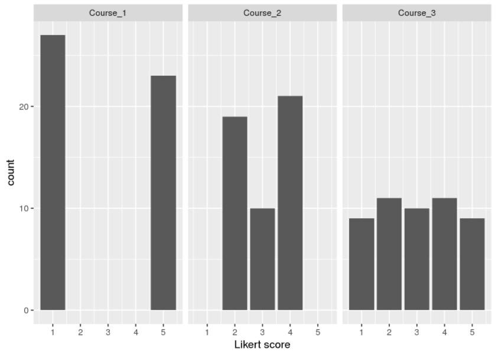
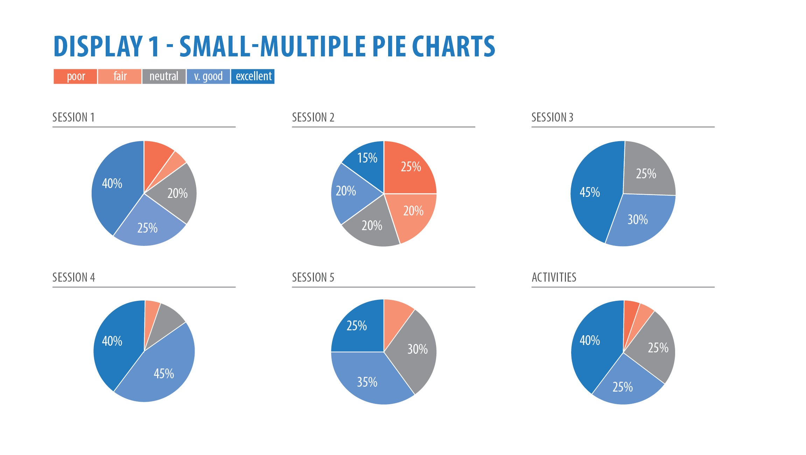
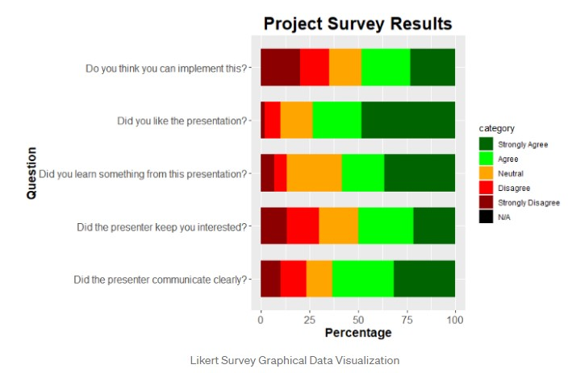
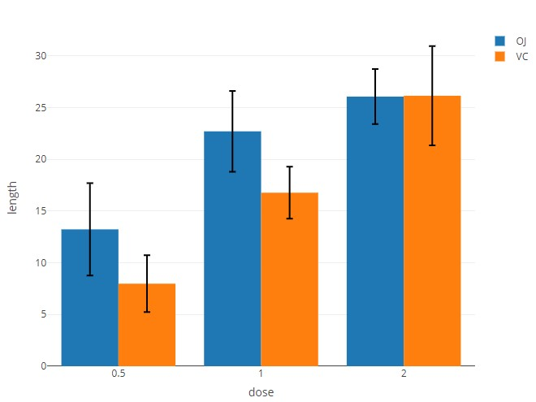
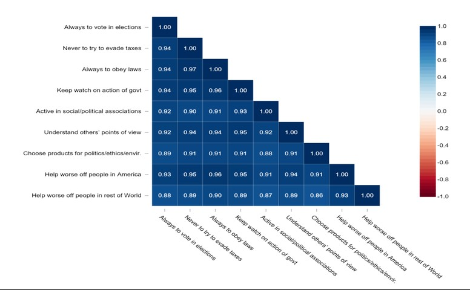
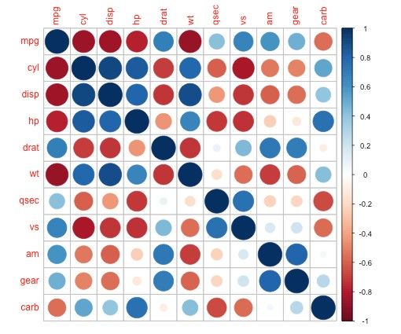
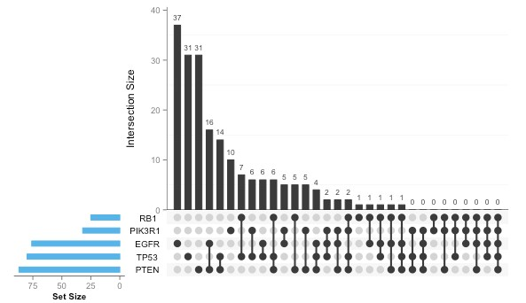

<style>
body {
text-align: justify}
</style>

## Overview

The project focuses on leveraging the richness of COVID-19 data available across various countries to glean interesting insights and analyses. Some of the key aspects of COVID-19 in focus include trends and patterns in new cases of COVID-19, deaths arising and attitudes towards vaccination, across the different countries.

This post is a sub-module of the project and focuses on analysing countries' attitudes towards COVID-19 vaccination. Data for the analyses is obtained from the Imperial College London YouGov Covid 19 Behaviour Tracker Data Hub. 

YouGov has partnered with the Institute of Global Health Innovation (IGHI) at Imperial College London to gather global insights on people’s behaviours in response to COVID-19. The survey covers 29 countries and interviews around 21,000 people each week and datasets can be obtained from https://github.com/YouGov-Data/covid-19-tracker/tree/master/data.

Relevant questions relating to public's attitudes towards vaccination have been extracted for the analyses in this post. 

<a name="Top"></a>

The scope of this post is as follows.

[1. Preparation of Data](#Part1)<br>
[2. Exploratory Data Analysis](#Part2)<br>
[2. Review of visual analytic techniques](#Part2)<br>
[3. Evaluation of Packages for Visualization](#Part3)<br>
[4. Storyboard for the Shiny Visual Analytics Application](#Part4)<br>

<a name="Part1"></a>

## 1. Exploration and Preparation of Data

The following code is first input to define Global Settings for code chunks in this post.

```{r setup, include=TRUE}

knitr::opts_chunk$set(fig.retina=3,
                      echo = TRUE,
                      eval = TRUE,
                      message = TRUE,
                      warning = FALSE)
```

### Installation and loading of required packages

The relevant packages required in the analysis are then installed and loaded with the following code.

```{r message=FALSE,warning=FALSE,echo=TRUE}
packages = c('tidyverse','dplyr','readr','HH',
             'plotly','UpSetR','ggplot2',
             'naniar','dlookr','ggridges','forcats')
for (p in packages){
  if(!require(p, character.only = T)){
  install.packages(p)
  }
  library(p,character.only = T)
}
```

### Importing of datasets and creation of combined dataset

The survey responses of the different countries were stored in separate csv files. Data for the first country was first imported to examine the available variables of interest. This was done with reference to the data dictionary for the datasets (available at https://github.com/YouGov-Data/covid-19-tracker/blob/master/codebook.xlsx).

```{r}
# Read in 1st csv (Australia)
australia_df <- read_csv("data/australia.csv",col_types = cols(
  age = col_integer(), .default = col_character()
  ))

head(australia_df,5)
```

While the dataset had 398 variables, only variables which were of interest (i.e.socio-demographic variables and variables related to vaccination attitudes) were retained.

```{r}
# Create main_df with selected variables from Australia dataset
fieldNames <- c("endtime", "age", "gender", "household_size",
                "household_children", "vac_1", "vac2_1", "vac2_2",
                "vac2_3", "vac2_4", "vac2_5", "vac2_6", "vac_3",
                "vac4", "vac5", "vac6", "vac7")

main_df <- australia_df %>%
  select(any_of(fieldNames)) %>%      # select required variables
  mutate(country = "Australia") %>%   # Add column to store country name
    drop_na(vac_1)                    # remove all records which did not 
                                      # answer vac_1 - willing to take vaccine

glimpse(main_df)
```

The other country datasets were then imported and merged to the main dataset created (*main_df*). 
As the main focus of the sub-module is to gain insights on countries' attitudes towards vaccination, non-responses (NA) to vac_1 are excluded from *main_df*.

```{r}
countrylist <- c("Canada","Denmark","Finland",
                 "France","Germany","Israel",
                 "Italy","Japan","Netherlands",
                 "Norway","Singapore","South-Korea",
                 "Spain","Sweden","United-Kingdom",
                 "United-States")

for(ctry in countrylist){ 
  # loop to read individual country datasets and append to main_df
  fileName <- paste0("data/",ctry,".csv")
  df <- read_csv(fileName,col_types = cols(
    age = col_integer(),
    .default = col_character() 
  ))

  tableName <- paste0(ctry,"_df")
  tableName <- df %>%
  select(any_of(fieldNames)) %>%
  mutate(country = ctry) %>%
    drop_na(vac_1)  
  # main purpose of analysis is to look at vaccination attitudes
  # so records with no response to vac_1 is filtered out
  
  main_df <- bind_rows(main_df,tableName)
}
```

### Recoding of variables

For some of the responses, recoding needs to be done to assign numerical values to allow for easier manipulation of the data. As the responses to the survey are categorical, the numerical values stored in the variables are recoded and stored as characters.

```{r}
#recode variables
main_df <- main_df %>% mutate(vac_1 = case_when(
  vac_1 == "1 - Strongly agree" ~ "1",
  vac_1 == "5 – Strongly disagree" ~ "5",
  TRUE ~ as.character(vac_1)))

main_df <- main_df %>% mutate(vac2_1 = case_when(
  vac2_1 == "1 - Strongly agree" ~ "1",
  vac2_1 == "5 – Strongly disagree" ~ "5",
  TRUE ~ as.character(vac2_1)))

main_df <- main_df %>% mutate(vac2_2 = case_when(
  vac2_2 == "1 - Strongly agree" ~ "1",
  vac2_2 == "5 – Strongly disagree" ~ "5",
  TRUE ~ as.character(vac2_2)))

main_df <- main_df %>% mutate(vac2_3 = case_when(
  vac2_3 == "1 - Strongly agree" ~ "1",
  vac2_3 == "5 – Strongly disagree" ~ "5",
  TRUE ~ as.character(vac2_3)))

main_df <- main_df %>% mutate(vac2_4 = case_when(
  vac2_4 == "1 - Strongly agree" ~ "1",
  vac2_4 == "5 – Strongly disagree" ~ "5",
  TRUE ~ as.character(vac2_4)))

main_df <- main_df %>% mutate(vac2_5 = case_when(
  vac2_5 == "1 - Strongly agree" ~ "1",
  vac2_5 == "5 – Strongly disagree" ~ "5",
  TRUE ~ as.character(vac2_5)))

main_df <- main_df %>% mutate(vac2_6 = case_when(
  vac2_6 == "1 - Strongly agree" ~ "1",
  vac2_6 == "5 – Strongly disagree" ~ "5",
  TRUE ~ as.character(vac2_6)))

main_df <- main_df %>% mutate(vac_3 = case_when(
  vac_3 == "1 - Strongly agree" ~ "1",
  vac_3 == "5 – Strongly disagree" ~ "5",
  TRUE ~ as.character(vac_3)))

main_df <- main_df %>% mutate(vac4 = case_when(
  vac4 == "Not at all important" ~ "1",
  vac4 == "A little important" ~ "2",
  vac4 == "Moderately important" ~ "3",
  vac4 == "Very important" ~ "4"))

main_df <- main_df %>% mutate(vac5 = case_when(
  vac5 == "Yes" ~ "1",
  vac5 == "No" ~ "2",
  vac5 == "Not sure" ~ "99"))

main_df <- main_df %>% mutate(vac6 = case_when(
  vac6 == "Yes" ~ "1",
  vac6 == "No" ~ "2",
  vac6 == "Not sure" ~ "99"))

main_df <- main_df %>% mutate(vac7 = case_when(
  vac7 == "Not at all" ~ "1",
  vac7 == "A little" ~ "2",
  vac7 == "Moderately" ~ "3",
  vac7 == "Very much" ~ "4"))

main_df <- main_df %>% replace_with_na(replace = list(vac5 = "99", vac6 = "99" ))
# declare responses with "Not Sure" as missing values
```

[Return to Top](#Top)<br>

<a name="Part2"></a>

## 2. Exploratory Data Analysis (EDA)

After preparing the data, it would be timely to carry out EDA to further understand distribution of the variables, correlation and relationships between variables. This can be done using the *dlookr* package.

### Univariate data EDA

For the *main_df*, there is only 1 variable that is numerical, *age*. We use the *describe()* function to compute descriptive statistics for *age*.

```{r}
describe(main_df)
```

The density plot of *age* can also be plotted to investigate the mean age and age distribution of respondents who respondents to vac_1.

```{r}
a <- ggplot(main_df, aes(x=age))
a + geom_density(aes(y=..count..), fill = "slategrey") +
  geom_vline(aes(xintercept = mean(age)),
             linetype = "dashed", size = 0.8,
             color = "red")
```
To investigate the age distribution by country, we could use the package *ggridges* to do a comparison.

```{r}
# need to install ggridges package
theme_set(theme_ridges())

ggplot(main_df, aes(x = `age`, y = `country`)) +
  geom_density_ridges_gradient(aes(fill = ..x..), scale = 3, size = 0.3) +  
  scale_fill_gradientn(colours = c("#0D0887FF", "#CC4678FF", "#F0F921FF"),
                       name = "Age")+
  labs(title = 'Age Distribution by Country') 
```
From the plot, we observe that countries like Sweden, Israel and Finland had a greater proportion of younger respondents, whereas countries like Singapore, Norway and Netherlands had a relatively even distribution of respondents across all ages.

```{r}

main_df %>%
  mutate(CountryFct = fct_rev(as.factor(country))) %>%
  ggplot(aes(y = CountryFct)) +
  geom_density_ridges(
    aes(x = age, fill = paste(CountryFct, gender)), 
    alpha = .5, color = "white", from = 0, to = 100) +
  labs(x = "Age (years)",y = "Country",
       title = "Age Distribution of Respondents by Gender and Country") +
  scale_y_discrete(expand = c(0, 0)) +
  scale_x_continuous(expand = c(0, 0)) +
  scale_fill_cyclical(
    breaks = c("Male", "Female"),
    labels = c(`Male` = "Male", `Female` = "Female"),
    values = c("#ff0000", "#0000ff", "#ff8080", "#8080ff"),
    name = "Gender", guide = "legend") +
  coord_cartesian(clip = "off") +
  theme_ridges(grid = FALSE)

```
From the plots, it is observed that in general, most countries have similar proportions of male and females (purple areas), except for Finland, France, Germany, Italy and Spain where there is a slightly higher proportion of female (red areas)at the older age bands.

For Categorical data, we could use *table* to carry out Univariate EDA.

```{r}
table(main_df$vac_1)
table(main_df$vac2_1)
table(main_df$vac2_2)
```

### Bivariate EDA for Categorical Data

For Bivariate Categorical EDA, we could use the following to find the frequencies or proportions between 2 categorical variables. 

```{r}
my_table_0 <- table(main_df$vac_1, main_df$gender)
print.table(my_table_0)
my_table_01 <- addmargins(my_table_0)
print.table(my_table_01)
```

```{r}
my_table_3 <- prop.table(my_table_0, margin = 2) %>% 
  as.data.frame.matrix() 
print.data.frame(my_table_3, digits = 2)

```
From the above, we are able to observe that males form a greater proportion of those who disagreed or strongly disagreed (responded 2 or 1) while females form a greater proportion of those who agreed or strongly agreed.

### Bivariate EDA between categorical and continuous variable

To investigate the relationship between a categorical and continuous variable, we can use the *relate* function as shown below. The user is able to select the 2 variables for investigation as shown.

```{r}
# User to select target variable and predictor numerical 
# variables (i.e. vac_1, and Age)

variable_selected <- "vac_1"   # to be selected by user
pred_var <- "age"              # to be selected by user

categ <- target_by(main_df, variable_selected)
cat_num <- relate(categ, pred_var)
cat_num
plot(cat_num)
```
It can be observed that respondents who responded 2,3,4 or 5 have similar age distribution patterns. However, for those that strongly disagreed that they are keen on vaccination, a large proportion come from the older age groups.

The above is a density plot that is plotted when a categorical variable is plotted with a continuous variable. For relationship between 2 categorical variables, the following would be a good plot for visualization.

```{r}
# User to select target variable and predictor numerical 
# variables (i.e. vac_1, and vac2_1)

variable_selected <- "vac_1"   # to be selected by user
pred_var <- "vac2_1"              # to be selected by user

categ <- target_by(main_df, variable_selected)
cat_num <- relate(categ, pred_var)
cat_num
plot(cat_num)
```
It can be observed that a large proportion of respondents who responded 1 in *vac_1* also responded 1 for *vac2_1*. The same is observed for those who responded 5 in *vac_1*, where many of them also responded 5 for *vac2_1*.

```{r}
Cat3 <- main_df %>%                       
  select(gender, vac_1, vac2_1, household_size) %>%             
  ftable()                                            
Cat3   

```

[Return to Top](#Top)<br>

<a name="Part3"></a>

## 3. Review of visual analytic techniques

### 3.1 Representation of Likert Scales

For Likert responses, there are several ways in which they can be represented for visualization. The following are some ways.

**3.1.1 Grouped Column / Bar Charts**
One way is to group responses by questions (or other categories) and to represent the responses as column or bar charts in terms of the Likert scale as shown below.

```{r pressure2, echo=FALSE, fig.cap="Grouped Bar Chart representing responses to a Likert Scale survey", out.width = '100%'}

```
While Bar Charts allow easy comparison on the count (frequency) of responses across the different Likert Scores, they do not allow the easy comparison of proportions of the responses (e.g., what is the proportion who strongly agree or agree to a question?)

**3.1.2 Multiple Pie Charts**
While Pie Charts depict the proportions of each type of response to a question (as shown below), it is difficult to compare and visualize the differences in proportion between the questions.

```{r pressure3, echo=FALSE, fig.cap="Multiple Pie Charts representing responses to a Likert Scale survey", out.width = '100%'}

```

**3.1.3 Stacked Bar Charts**

Stacked bar charts such as the below chart shows clearly the proportion of the various responses for each question asked in a survey. The use of different tones of colours (i.e. Light Green to Dark Green) provide the reader with an idea of increasing levels of responses (i.e. Agree to Strongly Agree). 

```{r pressure1, echo=FALSE, fig.cap="Stacked Bar Charts representing responses to Likert Scale survey", out.width = '100%'}

```

A benefit of Stacked Bar Charts is that it allows readers to compare different proportions across different bars since each set of stacked bar sums up to 100%. For the example above, it is evident that while a large proportion agreed that they liked the presentation, a lower proportion actually felt that theu learnt something from the presentation.

**3.1.4 Diverging Stacked Bar Chart**

Another way of representing responses to a Likert Scale survey is Diverging Stacked Bar Chart. This visualization is similar to the Stacked Bar Chart but differs in that the bars have a common vertical baseline located in the the centre of the diagram. The lengths of the segments of the bar charts are proportional to the number of responses for each value of the Likert scale for each question. Segments which represent favourable responses are usually on the right of the baseline while those that are unfavarouble are on the left. Neutral responses are located on the central baseline.

```{r pressure4, echo=FALSE, fig.cap="Diverging Stacked Bar Charts representing responses to Likert Scale survey", out.width = '100%'}
knitr::include_graphics("DivergingStackedBarChart.jpg")
```
The Diverging Stacked Bar Chart is most appropriate to represent responses from Likert Scale Surveys as it allows easy interpretation and comparison of multiple categories. 

**3.1.5 Comparing the mean Likert Score**

While it may seem appropriate to compare the mean Likert Score of each category, there is a potential pitfall in doing so.

Using the below column graph that depicts the responses to a survey on 3 different courses, it is evident that the responses for each of the 3 courses are very different. However when the mean score of responses is computed for each course, the mean appears similar.

```{r pressure5, echo=FALSE, fig.cap="Column Bar Charts with responses for 3 different courses", out.width = '100%'}

```
Mean values of the above responses for each course are as shown.

|Course   | Mean  |
|:--------|:-----:|
|Course_1 |2.84|
|Course_2 |3.04|
|Course_3 |3.00|

To mitigate this issue, it would be better to find the proportion of responses that meet a certain value (e.g. proportion of respondents who gave a 4 or 5 score).

### 3.2 Visualizing Uncertainty

As the results of a survey are usually used to represent a population, the sample (survey) proportion should be represented with confidence intervals to allow readers an indication of the confidence level that the actual population proportion will be within the confidence interval.

**3.2.1 Bar plots with Error Bars**

One of the ways to represent the confidence intervals of sample data is with the use of error bars as shown below.

```{r pressure6, echo=FALSE, fig.cap="Bar Plots with Error Bars", out.width = '100%'}

```

### 3.3 Visualizing Correlation

For surveys, it is useful to study the correlation and relationship between responses to understand if there are certain determinants or factors that affect the response of certain questions.

For this project, while we examine the inclination of countries towards vaccination. It would be useful to investigate if that inclination is dependent on certain socio-demographical factors (e.g., age, gender, household size or number of children in the household) or certain attitudes or beliefs (e.g., confidence of vaccine efficacy, or concerns on the side effects of the vaccine).

To visualize the correlation between factors, one of the methods usually used is to build a *correlation matrix* or *correlation scatterplot*. However this is usually used to depict the correlation between **continuous** variables. 

```{r pressure7, echo=FALSE, fig.cap="Correlation Matrix", out.width = '100%'}

```

```{r pressure8, echo=FALSE, fig.cap="Correlation Scatterplot", out.width = '100%'}

```

For correlations between **categorical** variables, one way to visualize correlation is via the use of the UpSet plot via the use of the UpSetR function (see next section).

An UpSet plot (seen below) allows the reader to see how frequently each combination or intersection of different factors takes place. Combinations that occur more frequently indicate a stronger correlation between the factors in the combination.

```{r pressure9, echo=FALSE, fig.cap="Upset plot", out.width = '100%'}

```

[Return to Top](#Top)<br>

<a name="Part4"></a>

## 4. Packages and Functions for Visualization

### 4.1 Diverging Stacked Bar Chart

As discussed in Section 3.1.4, a Diverging Stacked Bar Chart is the most suitable for visualization of the responses from a Likert Scale survey. The following steps involves steps needed to create a Diverging Stacked Bar Chart from the dataset created.

To prepare the dataset for use by the *likert* function subsequently, the *gather* function is used to consolidate the variables and the corresponding responses into 2 columns.

```{r}
# Make the table long - Gather question data from columns to rows
main_gathered <- gather(main_df, measure, response, c(6:17))
```

To see responses for the different questions, users will be able to select different variables for *qn_selected* in the eventual Shiny app. For now, we can manually change the values for *qn_selected* to simulate the selection.

```{r}
# Obtain dataset with only responses for selected question

qn_selected <- "vac_1"    # variable of question selected

vac_1 <- filter(main_gathered, measure == qn_selected)

# Obtain contingency table for vac_1
vac_1_df <- table(vac_1$country,vac_1$response) %>% as.data.frame.matrix()

```

```{r}
# Change column names, now labelled as 1-5
colnames(vac_1_df) <- c("Strongly Disagree",
                        "Disagree",
                        "Neutral",
                        "Agree",
                        "Strongly Agree")

rownames(vac_1_df) <- c("Australia","Canada","Denmark",
                        "Finland","France","Germany",
                        "Israel","Italy","Japan",
                        "Netherlands","Norway","Singapore",
                        "South Korea","Spain","Sweden",
                        "United Kingdom","United States")
```

```{r}
# Remove other columns containing other responses (for other questions)
vac_1_df <- vac_1_df[,c(1:5)]

# Add a column with rownames
vac_1_df <- tibble::rownames_to_column(vac_1_df, var="Country")

```

```{r}
# Matching appropriate graph titles to qn_selected
if (qn_selected == "vac_1") {
  div_chart_title <- "Proportion who are willing to take vaccine"
} else if (qn_selected == "vac2_1") {
  div_chart_title <- "Proportion worried about getting COVID-19"
} else if (qn_selected == "vac2_2") {
  div_chart_title <- "Proportion worried about side effects of COVID-19 vaccines"
} else if (qn_selected == "vac2_3") {
  div_chart_title <- "Proportion confident government will provide effective COVID-19 vaccines"
} else if (qn_selected == "vac2_4") {
  div_chart_title <- "Proportion confident vaccine will completely protect recipients from health effects of COVID-19"
} else if (qn_selected == "vac2_5") {
  div_chart_title <- "Proportion confident vaccine will completely prevent transmission of COVID-19 from recipient to others"
} else if (qn_selected == "vac2_6") {
  div_chart_title <- "Proportion who feel they will regret if they do not take the vaccine"
} else if (qn_selected == "vac_3") {
  div_chart_title <- "Proportion who will take the vaccine if available in 1 year"
}
```

The *likert* function from the *HH* package is used to plot the Diverging Stacked Bar Chart in the following code chunk.

```{r}
# Plot diverging bar chart

likert(Country ~ .,data = vac_1_df, ylab = NULL,
       RefernceZero = 3, as.percent=TRUE,
       positive.order=TRUE,
       main = list(div_chart_title, 
                   x =unit(.55,"npc")),
       sub = list("Response", x=unit(.57,"npc")),
       xlim = c(-100,-80,-60,-40,-20,0,20,40,60,80,100),
       strip = FALSE,
       par.strip.text=list(cex=.7)
       )

```
From the Diverging Stacked Bar Chart plotted, we are able to observe the various responses for respective countries. For the above example where "vac_1" was selected as *qn_selected*, we observe that France, followed by the United States and Singapore, were the most receptive to vaccination among the other countries.

By changing the value of *qn_selected* to other questions (e.g. vac2_1, vac4), we will be able to visualize the responses to the different questions and hence get a deeper understanding of the possible association and determinants behind the attitudes and inclination towards vaccination.

For illustration, when *qn_selected* is changed to "vac2_1" and the below code chunk is run, the corresponding Diverging is also produced below.

```{r}
# Obtain dataset with only responses for selected question

qn_selected <- "vac2_1"    # variable of question selected

vac_1 <- filter(main_gathered, measure == qn_selected)

# Obtain contingency table for vac_1
vac_1_df <- table(vac_1$country,vac_1$response) %>% as.data.frame.matrix()

```

```{r}
# Change column names, now labelled as 1-5
colnames(vac_1_df) <- c("Strongly Disagree",
                        "Disagree",
                        "Neutral",
                        "Agree",
                        "Strongly Agree")

rownames(vac_1_df) <- c("Australia","Canada","Denmark",
                        "Finland","France","Germany",
                        "Israel","Italy","Japan",
                        "Netherlands","Norway","Singapore",
                        "South Korea","Spain","Sweden",
                        "United Kingdom","United States")
```

```{r}
# Remove other columns containing other responses (for other questions)
vac_1_df <- vac_1_df[,c(1:5)]

# Add a column with rownames
vac_1_df <- tibble::rownames_to_column(vac_1_df, var="Country")

```

```{r}
# Matching appropriate graph titles to qn_selected
if (qn_selected == "vac_1") {
  div_chart_title <- "Proportion who are willing to take vaccine"
} else if (qn_selected == "vac2_1") {
  div_chart_title <- "Proportion worried about getting COVID-19"
} else if (qn_selected == "vac2_2") {
  div_chart_title <- "Proportion worried about side effects of COVID-19 vaccines"
} else if (qn_selected == "vac2_3") {
  div_chart_title <- "Proportion confident government will provide effective COVID-19 vaccines"
} else if (qn_selected == "vac2_4") {
  div_chart_title <- "Proportion confident vaccine will completely protect recipients from health effects of COVID-19"
} else if (qn_selected == "vac2_5") {
  div_chart_title <- "Proportion confident vaccine will completely prevent transmission of COVID-19 from recipient to others"
} else if (qn_selected == "vac2_6") {
  div_chart_title <- "Proportion who feel they will regret if they do not take the vaccine"
} else if (qn_selected == "vac_3") {
  div_chart_title <- "Proportion who will take the vaccine if available in 1 year"
}
```

```{r}
# Plot diverging bar chart

likert(Country ~ .,data = vac_1_df, ylab = NULL,
       RefernceZero = 3, as.percent=TRUE,
       positive.order=TRUE,
       main = list(div_chart_title, 
                   x =unit(.55,"npc")),
       sub = list("Response", x=unit(.57,"npc")),
       xlim = c(-100,-80,-60,-40,-20,0,20,40,60,80,100),
       strip = FALSE,
       par.strip.text=list(cex=.7)
       )

```
From the 2nd chart, it is observed that United States had a relatively high proportion of people agreeing that they were worried about getting COVID-19 which could explain why United States was one of the countries that were more inclined to vaccination. 

Singapore on the other hand, had most respondents disagreeing that there were worried about getting COVID-19. Closer examination would be needed to understand the factors that could be affecting different countries' inclination towards vaccination.

### 4.2 Bar plot with Error Bars

As discussed in Section 3.1.5, we will use a sample statistic such as the proportion of respondents who strongly agree that they are keen on vaccination (i.e. vac_1 = 5). The statistic will also be plotted with confidence intervals as discussed in Section 3.2.

The following code chunk plots the bar plot and error bars. User will be able to vary and select the following variables to explore the different bar plots.

**(1) responseLevel** 

- possible values depend on the responses to the question selected
- determines the cut off for the computation of the sample statistic.
- E.g., if responseLevel = 5, the bar plot will reflect proportion of respondents who "Strongly Agreed". If responseLevel = 4, the bar plot will reflect proportion who "Agreed".

**(2) confidence level**

- possible values are 0.90, 0.95, 0.98, 0.99
- determines the width of the confidence interval (error bars) that are plotted.

```{r}
responseLevel <- 5

vac_1 <- vac_1 %>% mutate(countSA = case_when(
  response == responseLevel ~ 1,
  TRUE ~ as.double(0)
))

vac_1 <- vac_1 %>% mutate(countResponse = 1)
```

```{r}
# Obtain contingency table for Prop of SA
propSA_df <- table(vac_1$country,vac_1$countSA) %>% as.data.frame.matrix()
countResponse_df <- table(vac_1$country,vac_1$countResponse) %>% as.data.frame.matrix()

# Change column names, now labelled as 1-5
colnames(propSA_df) <- c("NotSA","SA")

# Compute proportion of SA
propSA_df$propSA <- (propSA_df$SA / (propSA_df$SA + propSA_df$NotSA))

# Compute SE
propSA_df$SE <- sqrt((propSA_df$propSA*(1 - propSA_df$propSA))/ (propSA_df$SA + propSA_df$NotSA))

# compute z-value

confidence_level <- "0.95"  # to select between 0.9, 0.95, 0.98, 0.99

if (confidence_level == "0.9") {
  z_value <- 1.645
} else if (confidence_level == "0.95") {
  z_value <- 1.96
} else if (confidence_level == "0.98") {
  z_value <- 2.33
} else if (confidence_level == "0.99") {
  z_value <- 2.58
}

# Compute Upper and Lower Limits
propSA_df$UppLim <- propSA_df$propSA + z_value*propSA_df$SE
propSA_df$LowLim <- propSA_df$propSA - z_value*propSA_df$SE

```

```{r}
propSA_df$country <- c("Australia","Canada","Denmark",
                        "Finland","France","Germany",
                        "Israel","Italy","Japan",
                        "Netherlands","Norway","Singapore",
                        "South Korea","Spain","Sweden",
                        "United Kingdom","United States")
```

```{r}
#vertical bar chart with error plots
ggplot(propSA_df) +
 geom_bar(aes(reorder(country,propSA),y = propSA), stat = "identity", fill ="dodgerblue3", alpha = 0.8) +
 geom_errorbar(aes(x = country, ymin = LowLim, ymax = UppLim), width = 0.5, colour = "firebrick2",
               alpha = 0.9, size = 0.6) +
  coord_flip()
  theme(legend.position = "top")
```
From the above bar plot, we can observe the countries which have the highest proportions of Strongly Agreed to vac2_1 as well as the correspondig confidence intervals.

For Singapore, we can see that it has a lower proportion of people who Strongly Agree to vac2_1 ("worried about COVID19") than Spain. However as their confidence intervals overlap, this difference may not be statistically significant. However when Singapore is compared to Italy, we are 95% confident that Singapore's proportion is lower than Italy's since the confidence intervals do not overlap.

### 4.3 UpSet plots with UpSetR package

To understand the association between categorical variables as discussed in Section 3.3, we will explore the creation of an UpSet plot.

To start, the user will be able to select / input the following variables.

**(1) countrySelected**

- Possible values include all countries in the following list 
Canada, Denmark, Finland, France, Germany, Israel, Italy, Japan, Netherlands, Norway, Singapore, South Korea, Spain, Sweden, United Kingdom, United States
- The UpSet plot will show association for responses and variables for the country selected.

**(2) strength**
- Possible values are dependent on the responses to the individual questions
- This will determine the level of agreement which will be used to categorise the responses.
- E.g. if Strength is 4, responses 4 and 5 (on a scale of 1 to 5) will be considered as 1, while 1 to 3 will be considered 0.

```{r}
# Select country - User to input selected country
countrySelected = "Australia"   
strength = 4  # For user to determine level of agreement - 4 Agree, 5 Strongly agree

upset_df <- filter(main_df, country == countrySelected)
```

```{r}
# vac_1 - willing to get vaccine
upset_df <- upset_df %>% mutate(vac_1_ag = case_when(
  vac_1 >= strength ~ as.integer(1),
  TRUE ~ as.integer(0)
)
)

# vac2_1 - worried about getting COVID19
upset_df <- upset_df %>% mutate(vac2_1_ag = case_when(
  vac2_1 >= strength ~ as.integer(1),
  TRUE ~ as.integer(0)
))

# vac2_2 - worried about side effects of vaccine (inv relationship)
upset_df <- upset_df %>% mutate(vac2_2_ag = case_when(
  vac2_2 <= (6-strength) ~ as.integer(1),   # when strength 4, equivalent is 2. When strength 5, equiv is 1
  TRUE ~ as.integer(0)
))

# vac2_3 - confidence in government providing effective vaccine
upset_df <- upset_df %>% mutate(vac2_3_ag = case_when(
  vac2_3 >= strength ~ as.integer(1),   
  TRUE ~ as.integer(0)
))

# vac2_4 - confident vaccine protects recipient from COVID19 effects
upset_df <- upset_df %>% mutate(vac2_4_ag = case_when(
  vac2_4 >= strength ~ as.integer(1),   
  TRUE ~ as.integer(0)
))

# vac2_5 - confidence in vaccine preventing recipient from spreading COVID19
upset_df <- upset_df %>% mutate(vac2_5_ag = case_when(
  vac2_5 >= strength ~ as.integer(1),   
  TRUE ~ as.integer(0)
))

# vac2_6 - will regret if do not take vaccine
upset_df <- upset_df %>% mutate(vac2_6_ag = case_when(
  vac2_6 >= strength ~ as.integer(1),   
  TRUE ~ as.integer(0)
))

# vac_3 - keen to get vaccine 1 year later
upset_df <- upset_df %>% mutate(vac_3_ag = case_when(
  vac_3 >= strength ~ as.integer(1),   
  TRUE ~ as.integer(0)
))

# vac4 - how important vaccine is for health
upset_df <- upset_df %>% mutate(vac4_ag = case_when(
  vac4 >= (strength-1) ~ as.integer(1),
  TRUE ~ as.integer(0)
))

# vac5 - will get vaccine if available
upset_df <- upset_df %>% mutate(vac5_ag = case_when(
  vac5 == 1 ~ as.integer(1),   
  TRUE ~ as.integer(0)
))

# vac6 - will get vaccine if available
upset_df <- upset_df %>% mutate(vac6_ag = case_when(
  vac6 == 1 ~ as.integer(1),  
  TRUE ~ as.integer(0)
))

# vac7 - trust COVID19 vaccines
upset_df <- upset_df %>% mutate(vac7_ag = case_when(
  vac7 >= (strength-1) ~ as.integer(1),
  TRUE ~ as.integer(0)
))

```

```{r}
# create combination matrix

combiMatrix <- select(upset_df,vac_1_ag,vac2_1_ag,vac2_2_ag,
                      vac2_3_ag,vac2_4_ag,vac2_5_ag,
                      vac2_6_ag,vac_3_ag,vac4_ag,
                      vac5_ag,vac6_ag,vac7_ag,)

combiMatrix <- filter(combiMatrix, vac_1_ag == 1) 
# UpSetR cannot have 0 length argument (i.e. 0 0 0 0 0) so investigate only vac_1 = 1 cases

```

```{r}
upset(combiMatrix, sets = c("vac_1_ag","vac2_1_ag","vac2_2_ag",
                            "vac2_3_ag","vac2_4_ag","vac2_5_ag",          
                            "vac2_6_ag","vac_3_ag","vac4_ag",
                            "vac5_ag","vac6_ag","vac7_ag"),
      mb.ratio = c(0.55,0.45), order.by = "freq")

```

In addition to the UpSet plot, queries can be used to identify specific combinations. For example, if we want to know what the strength of association is like for vac_1 and vac2_1, we can input them in the code below. The corresponding UpSet plot with the required combination will be highlighted (in blue).

```{r}
upset_df_filtered <- filter(upset_df, vac_1_ag == 1) 
```

```{r}
upset(upset_df_filtered, main.bar.color = "black",
      shade.color = "slategray",
      sets = c("vac_1_ag","vac2_1_ag","vac2_2_ag",
                "vac2_3_ag","vac2_4_ag","vac2_5_ag",          
                "vac2_6_ag","vac_3_ag","vac4_ag",
                "vac5_ag","vac6_ag","vac7_ag"),
      mb.ratio = c(0.55,0.45), order.by = "freq",
      queries = list(
        list(query = intersects, params = list("vac_1_ag","vac2_1_ag"), active = T)
        ))

```
In addition to queries, the UpSet plot can also be plotted with attribute plots below which allow the user to visualize the distribution of the selected combination in relation to other variables in the attribute plots.

```{r}
myplot <- function(mydata, x, y) {
    plot <- (ggplot(data = mydata, aes_string(x = x, y = y, colour = "color")) + 
        geom_point() + scale_color_identity() + theme(plot.margin = unit(c(0, 
        0, 0, 0), "cm")))
}

upset(upset_df_filtered, main.bar.color = "black",
      shade.color = "slategray",
      sets = c("vac_1_ag","vac2_1_ag","vac2_2_ag",
                "vac2_3_ag","vac2_4_ag","vac2_5_ag",          
                "vac2_6_ag","vac_3_ag","vac4_ag",
                "vac5_ag","vac6_ag","vac7_ag"),
      mb.ratio = c(0.55,0.45), order.by = "freq",
      queries = list(
        list(query = intersects, params = list("vac_1_ag","vac2_1_ag"), active = T)),
      attribute.plots = list(gridrows = 40,
                             plots = list(list(plot = myplot, 
                                               x = "household_children",
                                               y = "household_size", queries = T))))
                                            
```

[Return to Top](#Top)<br>

<a name="Part5"></a>