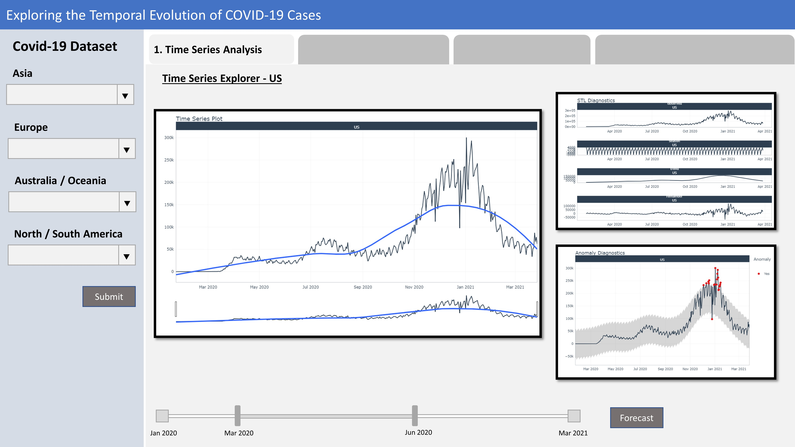
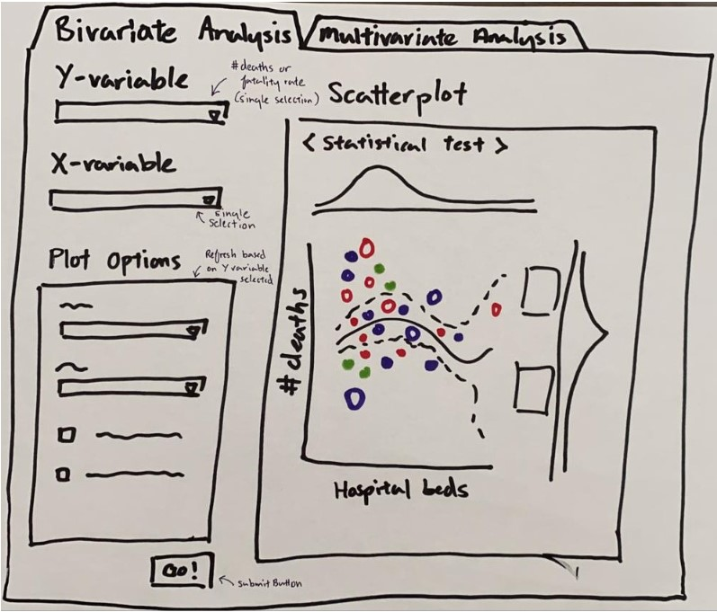
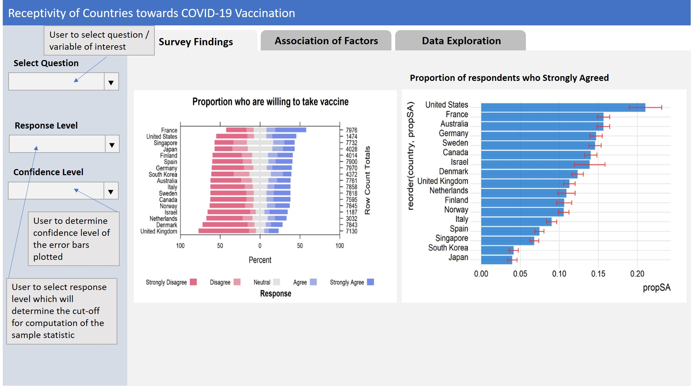
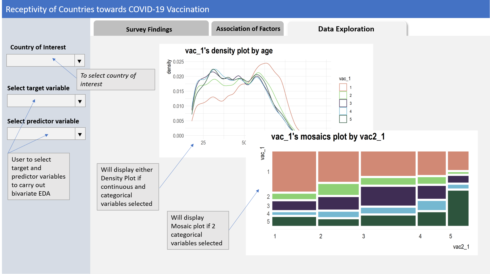
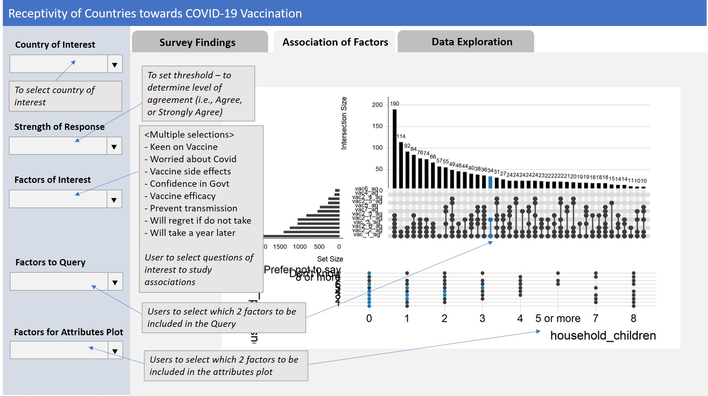
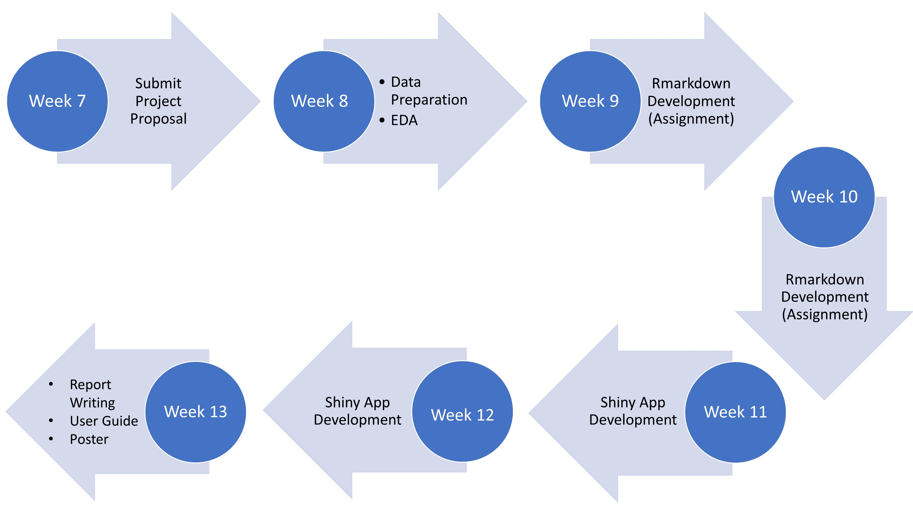

```{r setup, include=FALSE}
knitr::opts_chunk$set(echo = FALSE)
```

## Introduction

The Coronavirus (COVID-19) has caught the world's attention with the first COVID-19 cases reported in Wuhan, Hubei, China, in December 2019. In the global battle against the virus, countries seek to understand the virus, its spread,impact and more recently, receptivity towards the COVID-19 vaccination. We are currently living in the Data Age,where many COVID-19 related data are made available on
the Internet. This has facilitated numerous, but not limited to epidemiology and statistical studies across the globe.

In the data science realm, many data-driven applications are developed to provide a one-stop information hub for the public. These applications are typically developed using programming languages such as HTML, Java and JavaScript. With the growing popularity of R, and its ability to create web applications using the R Shiny package, the creation of interactive visualisations without having in-depth web programming knowledge has been made possible.

This project looks to leverage the richness of the COVID-19 data to provide an interactive experience in generating insights and analyses using R Shiny from three key aspects: (1) new cases; (2) deaths; and (3) vaccination receptivity.

## Motivation

There are several one-stop applications that allow interactive visualisation of COVID-19 related data across time. These applications typically report number of events i.e. number of new cases/deaths/tests conducted, number of people vaccinated. Deeper exploration and analysis on COVID-19 trends and relationships with other factors or indicators are done in silos and majority of such studies report their findings based on pre-defined variables and specific analysis models. With this application, we hope to combine and provide an
interactive experience for in-depth exploration and analysis of the COVID-19 data.

## Data

The data is obtained from several sources: 

- Center for Systems Science and Engineering (CSSE) at Johns Hopkins University for COVID-related data 
- Our World in Data, World Bank 
- UNdata, United Nations Development Programme (UNDP) for health, economic and population structure indicators 
- Imperial College London YouGov COVID-19 Behaviour Tracker Data Hub for survey data on virus perception and vaccination receptivity

## Methodology and Approach

The following is the proposed scope of the project.

 - Predictive analysis of new cases
 - Bivariate and multivariate analysis of deaths and death rates with health, economic and population structure indicators
 - Exploratory and bivariate analysis of vaccination receptivity with virus perception and demographics

The following methodology would be employed:

1. Analysis and preparation of dataset
2. Exploratory Data Analysis (EDA)
3. Time Series Analysis
4. Multiple Linear Regression (MLR) and Predictive Modelling 
5. Development of R-Shiny mobile application for user interactivity

## Storyboard

There will be three sections in the final app. The first section will be on Predictive analysis of new cases. Under this section, users should be allowed to compare the result of different prediction models and view the characteristics of the time series data.

The second section will be on Bivariate and multivariate analysis of deaths and death rates with health, economic and population structure indicators. Users will be allowed to choose and compare each of the parameters. 

The third section will be on Exploratory and bivariate analysis of vaccination receptivity with virus perception and demographics. Users are allow to explore the survey results for each of the countries and do comparison.

Proposed layouts and features of the sections are as follow.

### Predictive analysis of new cases

```{r pressure1, echo=FALSE, fig.cap="Proposed screen for Time Series Analysis", out.width = '100%'}

```
<br>
```{r pressure2, echo=FALSE, fig.cap="Proposed screen for Time Series Analysis", out.width = '100%'}
knitr::include_graphics("images/pg2.jpg")
```
### Bivariate and multivariate analysis of deaths and death rates

```{r pressure3, echo=FALSE, fig.cap="Proposed screen for Bivariate and multivariate analysis of deaths and death rates", out.width = '100%'}

```
<br>
```{r pressure4, echo=FALSE, fig.cap="Proposed screen for Bivariate and multivariate analysis of deaths and death rates", out.width = '100%'}
knitr::include_graphics("images/multivariate.jpg")
```
### Exploratory and bivariate analysis of vaccination receptivity

```{r pressure5, echo=FALSE, fig.cap="Proposed screen for Exploratory and bivariate analysis of vaccination receptivity", out.width = '100%'}

```
<br>
```{r pressure6, echo=FALSE, fig.cap="Proposed screen for Exploratory and bivariate analysis of vaccination receptivity", out.width = '100%'}

```
<br>
```{r pressure7, echo=FALSE, fig.cap="Proposed screen for Exploratory and bivariate analysis of vaccination receptivity", out.width = '100%'}

```
## Project Timeline

```{r pressure8, echo=FALSE, fig.cap="Project Timeline", out.width = '100%'}

```

## Software Tool

The application will be written in R using RStudio.

### R Packages

The following R packages would be used:


- DT: https://cran.r-project.org/web/packages/DT
- ggplot2: https://cran.r-project.org/web/packages/ggplot2/index.html
- leaflet: https://cran.r-project.org/web/packages/leaflet
- lubridate: https://cran.r-project.org/web/packages/lubridate/index.html
- plotly: https://cran.r-project.org/web/packages/plotly
- readr: https://cran.r-project.org/web/packages/readr
- shiny: https://shiny.rstudio.com
- shinythemes: https://cran.r-project.org/web/packages/shinythemes
- shinyWidgets: https://cran.r-project.org/web/packages/shinyWidgets
- tidyverse: https://www.tidyverse.org
- corrplot: https://cran.r-project.org/web/packages/corrplot
- rgdal: https://cran.r-project.org/web/packages/rgdal
- rgeos: https://cran.r-project.org/web/packages/rgeos
- dendextend https://cran.r-project.org/web/packages/dendextend
- MASS: https://cran.r-project.org/web/packages/MASS/index.html
- UpSetR: https://cran.r-project.org/web/packages/UpSetR/index.html
- timetk: https://cran.r-project.org/web/packages/timetk/index.html
- modeltime: https://cran.r-project.org/web/packages/modeltime/index.html
- tidymodels: https://cran.r-project.org/web/packages/tidymodels/index.html
- fpp3: https://cran.r-project.org/web/packages/fpp3/index.html
- earth: https://cran.r-project.org/web/packages/earth/index.html
- olsrr: https://cran.r-project.org/web/packages/olsrr/index.html
- naniar: https://cran.r-project.org/web/packages/naniar/index.html
- dlookr: https://cran.r-project.org/web/packages/dlookr/index.html

