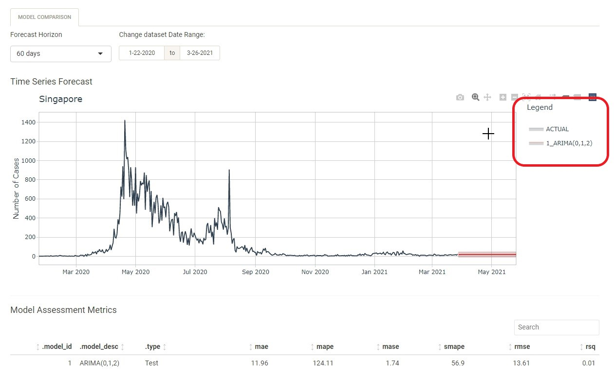
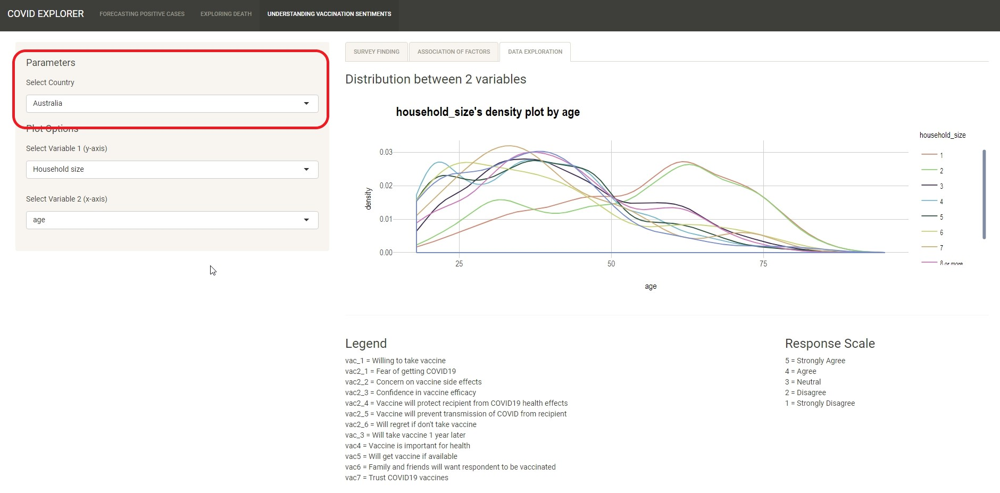

```{r setup, include=FALSE}
knitr::opts_chunk$set(echo = FALSE)
```

# Forecasting Postive Cases

Use this tab to forecast the number of positive cases.

### Explore Country Data Tab

1. Use this tab to explore and visualise the characteristics of the time series dataset.

2. User to select the dataset to use. 3 datasets were downloaded and stored in the data folder for quick reference. More datasets can be downloaded from https://github.com/CSSEGISandData/COVID-19/tree/master/csse_covid_19_data/csse_covid_19_time_series

3. If user did not upload any dataset, the default dataset will be used (covid information caa 27 Mar 2021).<br>

{width=100%} <br> 


4. Users can choose the country that they wish to explore further. The default country chosen is Singapore.

{width=100%} <br> 

5. The following chart would be plotted.
  - Time Series Plot: Allow users to visualise the time series dataset.
  - Anomaly Diagnostics: Allow users to view the anomalies of the data.
  - ACF and PACF Plot: Allow users to detect the ACF and PACF.
  - STL Decomposition Plot. Allow users to visualise the STL Decompostion.
  
  
  
#### Time Series Plot

1. The sliders for the time series plot allow users to navigate the time series chart.

{width=100%} <br>

2. Users are able to view the value of the datapoint by hovering over the record.

{width=100%} <br>

3. The chart also support pan, zoom and toggle spike line functions to allow more interactivity with users.

{width=100%} <br>

#### Anomaly Diagnostics

1. Users are able to view the value of the datapoint by hovering over the record.

{width=100%} <br>
2.  The chart also support pan, zoom, box select, lasso select and toggle spike line functions to allow more interactivity with users.

{width=100%} <br>

#### ACF and PACF Plot


1. Users are able to view the value of the datapoint by hovering over the record.

{width=100%} <br>


2.  The chart also support pan, zoom and toggle spike line functions to allow more interactivity with users.

{width=100%} <br>


### Prediction Tab

1. Use this tab to select models to do forecasting of confirm cases.

2. As per previous tab, Users are able to upload the dataset to be explored and choose the country.

3. If user did not upload any dataset, the default dataset will be used (covid information caa 27 Mar 2021).<br>

4. Users can choose the country that they wish to explore further. The default country chosen is Singapore.

5. Users can choose the models to do the forecasting. After checking the check box of the model, click on Go. The application will calculate the forecast using the dataset and its predefined parameters.

6. A time series plot with the forecast result would be shown. A table on the outcome whould be shown as well.

{width=100%} <br>

7. On the Time Series Forecast chart, the forecasted result is plotted in red. 

{width=100%} <br>

8. User can explore/interact the details by using the zoom, pan and toggles spike lines function. 

{width=100%} <br>

9. User can also click on the model under the legend to show or hide the model from the chart.

{width=100%} <br><br>
{width=100%} <br>

10. Users can also change the forecast period by changing the selection.

{width=100%} <br>

11. Users can also determine the date period to be used for the models. However, the end date could not be used as it is need to do forecast. 

{width=100%} <br>

12. For users who wish to explore more with the parameters of the models, they can click on "Advance - Model Parameters Selection". Users are able to change the parameters for ETS and Prophet.

{width=100%} <br>

13. A new tab ETS MODEL will be shown (if ETS is selected).

{width=100%} <br>

14. Users are able to change the parameters as listed  (forecast horizon, dataset date range, Error, Trend and Season).The model will recalculate and show the updated values. Example shown changes made to Error and Season field.

{width=100%} <br>


### Data Table Tab

1. Use this tab to have a quick overview of the raw data.

2. If dataset is uploaded, the tab will show the uploaded dataset. Else, the default dataset details will be shown.

{width=100%} <br>

# Exploring Death

Use this tab to causal examine the causal relationship between the COVID-19 numbers and the indicators.

### Bivariate Analysis Tab

1. Use this tab to explore the relationship between total number of deaths, death rates,
health, economic and population structure indicators.

2. Users are able to select the parameters to be plotted (x and y variables). If the selection is "Total Death" or "Log(Total Death)" for the Y-Axis, Scatterplot would be plotted. If "Fatality Rate" is chosen, Funnelplot would be plotted.

{width=100%} <br><br>
{width=100%} <br>

3. After user has selected the variables, user are able to calibrate the plot-specific options. The following are the options that users can alter.
  - Statistical Test
  - Confidence level for statistical test
  - Marginal Distribution
  - Regression Line
  
4. If "Show Statistical Test" checkbox is left uncheck, users would only be allow to change the Marginal Distribution and Regression Line options.

{width=100%} <br>

5. Users are also able to select the label to be shown for the scatterplot.

{width=100%} <br>

### Multivariate Analysis Tab

1. Use this tab to causal examine the causal relationship between the COVID-19 numbers and multiple indicators at same time.

2. Similar to bivariate, users will need to select the y and x variables for the multivariate analysis. Model summary result would be shown.

{width=100%} <br>

3. Users can then proceed to include the "Interaction Terms" by checking on the checkbox (if Least Squares Method is chosen).

{width=100%} <br>

4. If "Variable Selection Method" is chosen, users would be given additional options of changing the "Variable Selection Method" and plotting the model.

{width=100%} <br>
5. Checking the "Plot Model Diagnostic" checkbox, will have additional output on the main panel.

{width=100%} <br>


# Understanding Vaccination Sentiments

Use this tab to do exploratory and bivariate analysis of vaccination receptivity with virus perception and demographics.

### Survey Finding Tab

1. Use this tab to compare proportion of responses across countries for a particular survey question.

2. Users would need to select the question to see the survey respond. A diverging stacked bar chart and bar plot with error bar chart would be plotted.

{width=100%} <br>

3. Users are able to change the parameters (Respond Level and Confidence Interval for error bar) for the bar plot with error bar chart to better explore the result for different countries. 

{width=100%} <br>

### Association of Factors Tab

1. Use this tab to find out if certain profile of respondents (based on reported socio-demographic or perception questions in the
survey) have an impact on vaccination receptivity.

2. Users are select the country to be plotted. An UpSet-plot would be plotted.  

{width=100%} <br>
3. Users can change the "Level of Agreement" and "Factor of Interest" in the plot option to better explore the chart. Users can select multiple variables under "Factor of Interest" for display.

{width=100%} <br>

### Data Exploration Tab

1. Use this tab to conduct bivariate analysis on the survey result.

2. Users need to select a country result for the analysis.

{width=100%} <br>

3. Users can select the variables (x and y variables) for comparison. If continuous datatype is chosen (Age), a density plot would be shown. Else, mosaics plot would be plotted.

{width=100%} <br><br>
{width=100%} <br><br>
