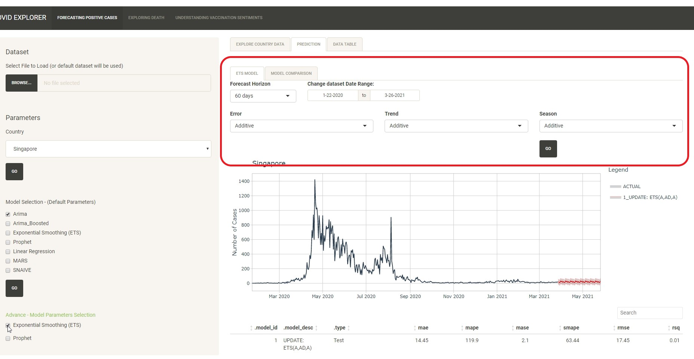

```{r setup, include=FALSE}
knitr::opts_chunk$set(echo = FALSE)
```

# Forecasting Postive Cases

Use this tab to forecast the number of positive cases.

### Explore Country Data Tab

1. Use this tab to explore and visualise the characteristics of the time series dataset.

2. User to select the dataset to use. 3 datasets were downloaded and stored in the data folder for quick reference. More datasets can be downloaded from https://github.com/CSSEGISandData/COVID-19/tree/master/csse_covid_19_data/csse_covid_19_time_series

3. If user did not upload any dataset, the default dataset will be used (covid information caa 27 Mar 2021).<br>

{width=100%} <br> 


4. Users can choose the country that they wish to explore further. The default country chosen is Singapore.

{width=100%} <br> 

5. The following chart would be plotted.
  - Time Series Plot: Allow users to visualise the time series dataset.
  - Anomaly Diagnostics: Allow users to view the anomalies of the data.
  - ACF and PACF Plot: Allow users to detect the ACF and PACF.
  - STL Decomposition Plot. Allow users to visualise the STL Decompostion.
  
  
  
#### Time Series Plot

1. The sliders for the time series plot allow users to navigate the time series chart.

{width=100%} <br>

2. Users are able to view the value of the datapoint by hovering over the record.

{width=100%} <br>

3. The chart also support pan, zoom and toggle spike line functions to allow more interactivity with users.

{width=100%} <br>

#### Anomaly Diagnostics

1. Users are able to view the value of the datapoint by hovering over the record.

{width=100%} <br>
2.  The chart also support pan, zoom, box select, lasso select and toggle spike line functions to allow more interactivity with users.

{width=100%} <br>

#### ACF and PACF Plot


1. Users are able to view the value of the datapoint by hovering over the record.

{width=100%} <br>


2.  The chart also support pan, zoom and toggle spike line functions to allow more interactivity with users.

{width=100%} <br>


### Prediction Tab

1. Use this tab to select models to do forecasting of confirm cases.

2. As per previous tab, Users are able to upload the dataset to be explored and choose the country.

3. If user did not upload any dataset, the default dataset will be used (covid information caa 27 Mar 2021).<br>

4. Users can choose the country that they wish to explore further. The default country chosen is Singapore.

5. Users can choose the models to do the forecasting. After checking the check box of the model, click on Go. The application will calculate the forecast using the dataset and its predefined parameters.

6. A time series plot with the forecast result would be shown. A table on the outcome whould be shown as well.

{width=100%} <br>

7. On the Time Series Forecast chart, the forecasted result is plotted in red. 

{width=100%} <br>

8. User can explore/interact the details by using the zoom, pan and toggles spike lines function. 

{width=100%} <br>

9. User can also click on the model under the legend to show or hide the model from the chart.

{width=100%} <br><br>
{width=100%} <br>

10. Users can also change the forecast period by changing the selection.

{width=100%} <br>

11. Users can also determine the date period to be used for the models. However, the end date could not be used as it is need to do forecast. 

{width=100%} <br>

12. For users who wish to explore more with the parameters of the models, they can click on "Advance - Model Parameters Selection". Users are able to change the parameters for ETS and Prophet.

{width=100%} <br>

13. A new tab ETS MODEL will be shown (if ETS is selected).

{width=100%} <br>

14. Users are able to change the parameters as listed  (forecast horizon, dataset date range, Error, Trend and Season).The model will recalculate and show the updated values. Example shown changes made to Error and Season field.

{width=100%} <br>


### Data Table Tab

1. Use this tab to have a quick overview of the raw data.

2. If dataset was uploaded, the tab will show the uploaded dataset. Else, the default dataset details will be shown.

{width=100%} <br>
