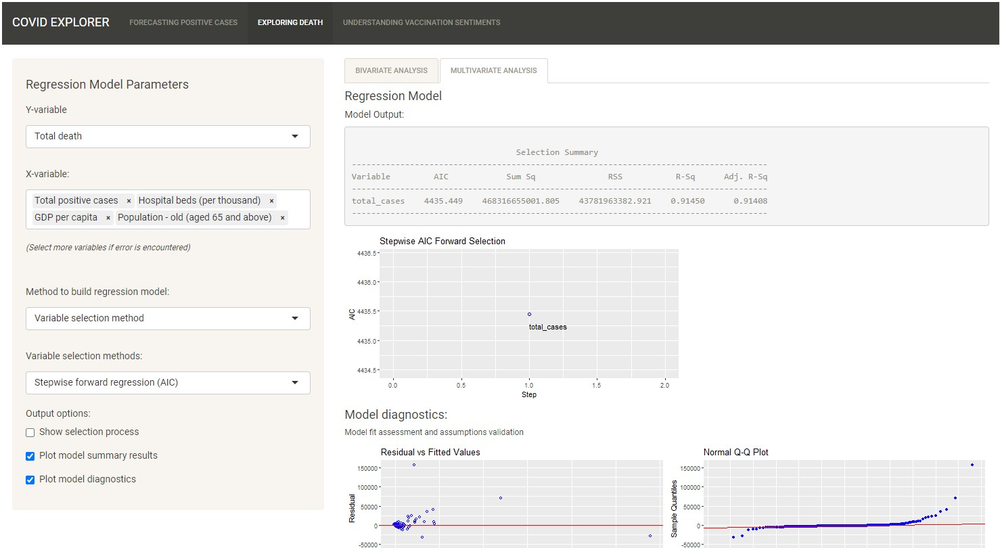
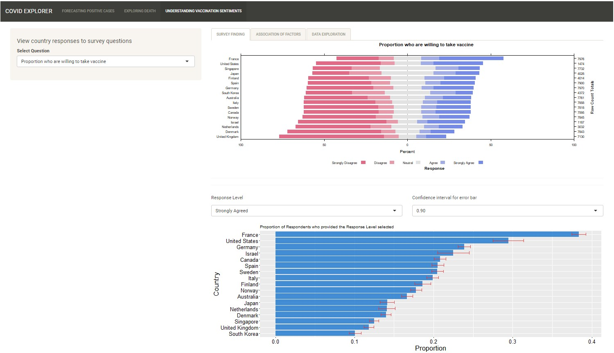

---
# Title Box
title: COVID ExploreR <br>
title_textsize: "70pt"
author_textsize: "30pt"
affiliation_textsize: "45pt"
author:
  - name: <br>Lin Yongyan
    affil: 
    email: yongyan.lin.2020@mitb.smu.edu.sg
  - name: Siow Mun Chai
    affil: 
    email: mcsiow.2020@mitb.smu.edu.sg
  - name: Tan Wei Li Amanda
    affil: 
    email: amandatan.2020@mitb.smu.edu.sg
  - name: <br> Prof Kam Tin Seong (Mentor)
    email: tskam@smu.edu.sg
    main: true
affiliation:
  - num: 
    address: School of Computing and Information Systems, Singapore Management University

logoright_name: smulogovector1.png

logoleft_name: https&#58;//raw.githubusercontent.com/brentthorne/posterdown/master/images/betterhexlogo.png


# Body
poster_height: 841mm 
poster_width: 594mm
column_numbers: 3
body_textsize: "20pt"

output: 
  posterdown::posterdown_html:
  # posterdown::posterdown_betterland:
  # posterdown::posterdown_betterport:
    self_contained: FALSE

---

```{r setup, include=FALSE}
knitr::opts_chunk$set(echo = FALSE)
```

# Introduction and Motivation

**Background**<br>
In the global battle against the Coronavirus (COVID-19), countries seek to understand the virus, its spread, impact and more recently, receptivity towards COVID-19 vaccination. In today's Data Age, there are many COVID-19 related data available across various platforms. Careful examination and derivation of insights from the data will support global efforts to mitigate the spread and impact of the virus.

**Motivation**<br>
To develop a consolidated interactive visualization tool to allow in-depth exploration and analysis of COVID-19 data for the generation of insights on key COVID-19 trends: *(1) new cases; (2) deaths;* and *(3) vaccination receptivity*. 

**Design Principles**<br>
\vspace{-100pt}

- <u>Simplicity and Clarity</u> - Seamless user experience, easy to understand and aesthetically pleasing visualizations and statistical information
\vspace{-100pt}

- <u>Interactivity</u> - Flexibility to allow exploration of data to meet the specific needs of the user
\vspace{-100pt}

- <u>Utility</u> - Tools provided to generate useful and relevant insights from updated data

**Analytical Approach**<br>
Data wrangling and transformation was first carried out on the separate sets of data in preparation for further analysis. 

The following were the main analyses carried out thereafter.<br>
- Predictive analysis of new cases<br>
- Bivariate and multivariate analysis of deaths and death rates with health, economic and population structure indicators<br>
- Exploratory and bivariate analysis of vaccination receptivity with virus perception and demographics

**Data Sources**<br>
(1) Center for Systems Science and Engineering (CSSE) at Johns Hopkins University for COVID-related data; <br>
(2) Our World in Data, World Bank, UNdata, United Nations Development Programme
(UNDP) for health, economic and population structure indicators; and <br>
(3) Imperial College London YouGov COVID-19 Behaviour Tracker Data Hub for survey data on virus perception and vaccination receptivity.

**Tools Used**<br>
```{r pressure1, echo=FALSE, out.width = '100%'}

```
<br>
<br>
<br>
<br>


# Analysis and Insights
\vspace{-100pt}
#### NEW CASES
\vspace{-100pt}
**Exploratory Time-Series Analysis**<br>
The *timetk* package was used to provide diagnostic plots to study trends, seasonality and
remainder, anomalies and lag if present in the time-series.
\vspace{-100pt}
```{r pressure2, echo=FALSE, out.width = '100%'}
knitr::include_graphics("images/cases-etsUI.jpg")
```
\vspace{-100pt}
**Predictive Time-Series Analysis**<br>
The focus here is to allow users to compare and assess the performance of the predictive models
provided. The tool allows the user to explore and compare models available for predictive time-series analysis. The tool also allows advanced users to change more advanced parameters.
\vspace{-100pt}
```{r pressure3, echo=FALSE, out.width = '100%'}
knitr::include_graphics("images/cases-ptsUI.jpg")
```
\vspace{-100pt}

### DEATHS AND DEATH RATES
\vspace{-100pt}
The interactive visualization tool is designed such that the output is dependent on the type of variables selected and how the user plans to conduct the analysis.
\vspace{-100pt}

**Scatterplot**<br>
The scatterplot from *ggstatsplot* package was chosen for the statistical tests conducted on the variables.
\vspace{-100pt}
```{r pressure4, echo=FALSE, out.width = '100%'}
knitr::include_graphics("images/deaths-spUI.jpg")
```
\vspace{-100pt}
**Funnel Plot**<br>
The *ggplot2* package was used to generate the funnel plot, which is more appropriate for death rate analysis.
\vspace{-100pt}

```{r pressure5, echo=FALSE, out.width = '100%'}
knitr::include_graphics("images/deaths-fpUI.jpg")
```
\vspace{-100pt}

**Multiple Linear Regression**<br>
The *olsrr* package was used to generate the UI for the multivariate analysis, which is more appropriate for exploring relationships with multiple independent variables.
\vspace{-100pt}

```{r pressure6, echo=FALSE, out.width = '100%'}

```
\vspace{-100pt}

### VACCINATION RECEPTIVITY
\vspace{-100pt}
**Exploratory Analysis**<br>
The *HH* package was used to generate the diverging stacked bar chart to allow users to view different countries receptivity towards vaccination. Error bars were also used to help users visualize uncertainty.
\vspace{-100pt}
```{r pressure7, echo=FALSE, out.width = '100%'}

```
\vspace{-100pt}
**Association Analysis**<br>
The UpSet plot was used to display associations between vaccination attitudes and other factors.
\vspace{-100pt}
```{r pressure8, echo=FALSE, out.width = '100%'}
knitr::include_graphics("images/vac-assocUI.jpg")
```


# FUTURE WORKS

**1. Scope** <br>
The application can be developed to include other aspects of COVID-19 such as testing, hospitalisation and vaccination rates.<br><br>
**2. Analysis**<br>
More analysis can be included e.g. Trends of New Cases across countries, inclusion of more regression models for COVID-19 Deaths.

```{r echo=FALSE, eval=FALSE}
library(pagedown)

pagedown::chrome_print("Poster.html")

```


